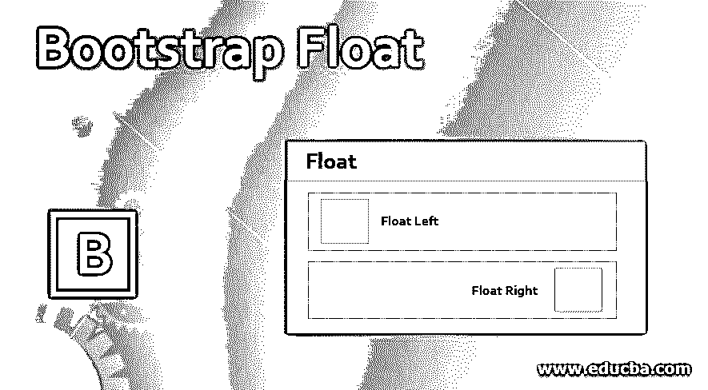
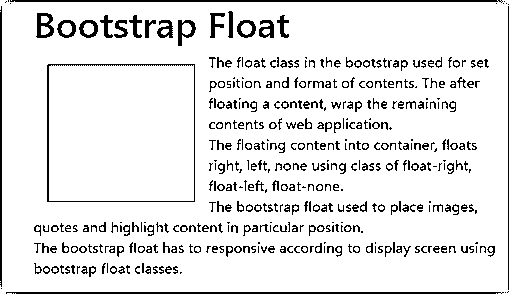
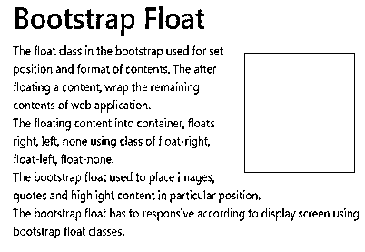
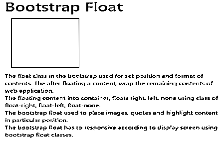
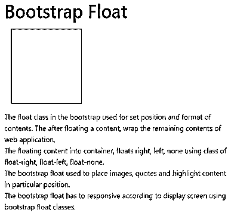

# 引导浮点

> 原文：<https://www.educba.com/bootstrap-float/>




## 自举浮点简介

bootstrap 中的 float 类用于设置内容的位置和格式。浮动内容后，包装 web 应用程序的剩余内容。使用 float-right、float-left、float-none 类将内容浮动到容器中。它在特定位置放置图像、引用和突出显示内容。因此，它必须根据引导浮点类显示屏做出响应。

### 句法

这里有三个主要的类:左、右和无。

<small>网页开发、编程语言、软件测试&其他</small>

| **Bootstrap float 类语法** | **详情** |
| class = "向左浮动" | 内容或元素放在左侧。 |
| class = "向右浮动" | 内容或元素放置在右侧。 |
| class = "浮点型-无" | 内容或元素不能浮动。 |

响应类如下。

| **响应引导浮点类语法** | **详情** |
| class= "float-sm-left " | 内容放在小屏幕尺寸的左侧。 |
| class= "float-sm-right " | 内容放在小屏幕尺寸的右侧。 |
| class= "float-md-left " | 内容放置在中等屏幕尺寸的左侧。 |
| class= "float-md-right " | 内容放置在中等屏幕尺寸的右侧。 |
| class= "float-lg-left " | 内容放在大屏幕尺寸的左侧。 |
| class= "float-lg-right " | 内容放在大屏幕尺寸的右侧。 |
| class= "float-xl-left " | 内容放在超大屏幕尺寸的左侧。 |
| class= "float-xl-right " | 内容放在超大屏幕尺寸的右侧。 |
| class = "float-sm-none " | 当屏幕尺寸较小时，内容不会浮动。 |
| class = "float-md-none " | 当屏幕大小为中等时，内容不会浮动。 |
| class = "float-lg-none " | 当屏幕尺寸较大时，内容不会浮动。 |
| class = "float-xl-none " | 当屏幕尺寸过大时，内容不会浮动。 |

### 引导浮点示例

下面提到了不同的例子:

#### 示例#1

使用 float-left 类将黄色立方体放置在左侧。其他内容都是围绕浮动内容来解决的。

以下示例是带有输出的左侧引导浮点示例。

```
<!DOCTYPE html>
<html>
<head>
<title> bootstrap float </title>
<style>
.float-left{
height: 160px;
width: 160px;
border: 1px solid black;
background: yellow;
margin: 15px;
}
</style>
<link rel= "stylesheet"
href="https://stackpath.bootstrapcdn.com/bootstrap/4.2.1/css/bootstrap.min.css">
</head>
<body>
<div class = "container">
<h1> Bootstrap Float </h1>
<div class = "float-left">
</div>
<p>
The float class in the bootstrap used for set position and format of contents. The after floating a content, wrap the remaining contents of web application.<br>
The floating content into container, floats right, left, none using class of float-right, float-left, float-none.<br>
The bootstrap float used to place images, quotes and highlight content in particular position. <br>
The bootstrap float has to responsive according to display screen using bootstrap float classes.
</p>
</div>
<script src= "https://code.jquery.com/jquery-3.3.1.slim.min.js" >
</script>
<script src= "https://cdnjs.cloudflare.com/ajax/libs/popper.js/1.14.6/umd/popper.min.js" >
</script>
<script src= "https://stackpath.bootstrapcdn.com/bootstrap/4.2.1/js/bootstrap.min.js" >
</script>
</body>
</html>
```

**输出:**




#### 实施例 2

使用 float-right 类将黄色立方体放置在右侧。其他内容都是围绕浮动内容来解决的。

以下示例是带有输出的右侧引导浮点示例。

```
<!DOCTYPE html>
<html>
<head>
<title> bootstrap float </title>
<style>
.float-right{
height: 160px;
width: 160px;
border: 1px solid black;
background: yellow;
margin: 15px;
}
</style>
<link rel= "stylesheet"  href= "https://stackpath.bootstrapcdn.com/bootstrap/4.2.1/css/bootstrap.min.css">
</head>
<body>
<div class = "container">
<h1> Bootstrap Float </h1>
<div class = "float-right">
</div>
<p>
The float class in the bootstrap used for set position and format of contents. The after floating a content, wrap the remaining contents of web application.<br>
The floating content into container, floats right, left, none using class of float-right, float-left, float-none.<br>
The bootstrap float used to place images, quotes and highlight content in particular position. <br>
The bootstrap float has to responsive according to display screen using bootstrap float classes.
</p>
</div>
<script src= "https://code.jquery.com/jquery-3.3.1.slim.min.js" >
</script>
<script src= "https://cdnjs.cloudflare.com/ajax/libs/popper.js/1.14.6/umd/popper.min.js" >
</script>
<script src= "https://stackpath.bootstrapcdn.com/bootstrap/4.2.1/js/bootstrap.min.js" >
</script>
</body>
</html>
```

**输出:**




#### 实施例 3

以下示例是一个带输出的引导浮点无示例。

Float-none 用于根据 web 应用程序容器来解决 cub。

```
<!DOCTYPE html>
<html>
<head>
<title> bootstrap float </title>
<style>
.float-none{
height: 160px;
width: 160px;
border: 1px solid black;
background: yellow;
margin: 15px;
}
</style>
<link rel= "stylesheet"        href="https://stackpath.bootstrapcdn.com/bootstrap/4.2.1/css/bootstrap.min.css">
</head>
<body>
<div class = "container">
<h1> Bootstrap Float </h1>
<div class = "float-none">
</div>
<p>
The float class in the bootstrap used for set position and format of contents. The after floating a content, wrap the remaining contents of web application.<br>
The floating content into container, floats right, left, none using class of float-right, float-left, float-none.<br>
The bootstrap float used to place images, quotes and highlight content in particular position. <br>
The bootstrap float has to responsive according to display screen using bootstrap float classes.
</p>
</div>
```

**输出:**




#### 实施例 4

float-md-left 类用于媒体屏幕上的左侧浮动。

在中屏幕上，内容放在左侧；否则，不设置 float。

以下示例是带有输出的左侧响应引导浮点示例。

```
<!DOCTYPE html>
<html>
<head>
<title> bootstrap float </title>
<style>
.float-md-left{
height: 160px;
width: 160px;
border: 1px solid black;
background: yellow;
margin: 15px;
}
</style>
<link rel= "stylesheet"        href="https://stackpath.bootstrapcdn.com/bootstrap/4.2.1/css/bootstrap.min.css">
</head>
<body>
<div class = "container">
<h1> Bootstrap Float </h1>
<div class = "float-md-left">
</div>
<p>
The float class in the bootstrap used for set position and format of contents. The after floating a content, wrap the remaining contents of web application.<br>
The floating content into container, floats right, left, none using class of float-right, float-left, float-none.<br>
The bootstrap float used to place images, quotes and highlight content in particular position. <br>
The bootstrap float has to responsive according to display screen using bootstrap float classes.
</p>
</div>
<script src= "https://code.jquery.com/jquery-3.3.1.slim.min.js" >
</script>
<script src= "https://cdnjs.cloudflare.com/ajax/libs/popper.js/1.14.6/umd/popper.min.js" >
</script>
<script src= "https://stackpath.bootstrapcdn.com/bootstrap/4.2.1/js/bootstrap.min.js" >
</script>
</body>
</html>
```

**输出:**

中等尺寸屏幕


小尺寸屏幕




### 结论

它用于造型目的。它有助于将图像和重要内容放在特定的位置。然而，它主要用于图像，它们的描述被放置并优雅地相互调整。

### 推荐文章

这是引导浮点运算的指南。在这里，我们讨论了 bootstrap float 有三个主要的类:left、right、none 和 Examples。您也可以看看以下文章，了解更多信息–

1.  [引导面板](https://www.educba.com/bootstrap-panels/)
2.  [引导进度条](https://www.educba.com/bootstrap-progress-bars/)
3.  [什么是自举？](https://www.educba.com/what-is-bootstrap/)
4.  [自举网格系统](https://www.educba.com/bootstrap-grid-system/)


