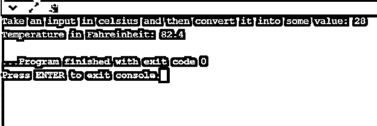
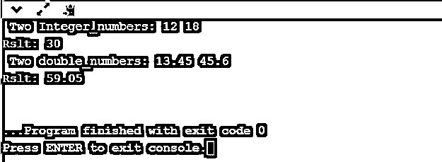

# C++双精度

> 原文：<https://www.educba.com/c-plus-plus-double/>


## C++双精度数据类型的定义

C++ double 是一种通用的数据类型，供编译器内部使用，用于定义和保存任何数值数据类型，尤其是任何面向十进制的值。C++ double 数据类型可以是小数，也可以是带值的整数。这些面向十进制的数据类型值可以包含 15 位数字，可以以小数点为前缀，也可以以小数点为后缀。与 float 相比，Double 数据类型主要由程序员采用，并且在处理与带小数的大数字相关联的数字时，它通常被保留为默认数据类型。

**语法:**

<small>网页开发、编程语言、软件测试&其他</small>

C++ double 数据类型的语法表示如下:

```
double var_name;
```

这里考虑的数据类型是 double，后面跟一个变量名，在这个语法中是 var_name。同样，一系列的 var_name 在某种程度上以如下方式被认为是优化了代码表示:

```
double var_name1, var_name2, var_name3…...var_nameN
```

### Double 数据类型在 C++中是如何工作的？

*   C++中的 Double 数据类型有一个有趣的工作模式，被大多数程序员使用和选择。
*   double 类型数据类型通常可以容纳 15-16 位的值，这是一种 64 位的浮点数据类型，因此在声明和初始化十进制值时可以按照一定的格式排列。
*   数据类型的范围可以从 0×10<sup>-345</sup>到 1.7 × 10 <sup>308</sup> 变化
*   有时，当与接受一个值并能容纳许多浮点值的浮点相比时，会产生误解，但是当考虑到优化和速度时，程序员会选择双精度值。
*   当需要处理巨大的十进制数时，最好使用 double 数据类型。

### 例子

让我们讨论 C++ Double 的例子。

#### 示例#1

这个程序演示了 double 关键字的 C++程序，其中用户希望将摄氏温度转换为华氏温度，如输出所示。

**代码:**

```
#include <iostream>
using namespace std;
int main()
{
double  c_tmp, f_tmp;
cout << "Take an input in celsius and then convert it into some value: ";
cin >> c_tmp;
f_tmp = (c_tmp * 1.8) + 32;
cout << "Temperature in Fahreinheit: " << f_tmp;
return 0;
}
```

**输出:**




#### 实施例 2

这个程序演示了两个数的加法、乘法和除法，并提供输出，其中两个输入数都是 double 类型，如输出所示。

**代码:**

```
#include <iostream>
using namespace std;
int main()
{
double n_1, n_2;
cout<<"First_Number to be entered as a double type: ";
cin>>n_1;
cout<<"Second_Number to be entered as a double type: ";
cin>>n_2;
cout<<"Sum of both the numbers entered: "<<(n_1+n_2);
cout<<"  Product or multiplication of both the numbers entered: "<<(n_1*n_2);
cout<<"  Result_for division of two numbers: " <<(n_1/n_2);
return 0;
}
```

**输出:**


#### 实施例 3

这个程序演示了函数重载，其中考虑两个整数的函数被包含两个双精度参数的数据类型的函数覆盖，如输出所示。

**注意:**该函数都有整型和双精度值作为用户输入，以得到以特定格式显示的结果。

**代码:**

```
#include <iostream>
using namespace std;
int sum_num(int, int);
double sum_num(double, double);
int main(){
int n_1, n_2, p;
double n_3, n_4, q;
cout<<" Two Integer_numbers: ";
cin>>n_1>>n_2;
cout<<"Rslt: "<<sum_num(n_1, n_2)<< endl;
cout<<" Two double_numbers: ";
cin>>n_3>>n_4;
cout<<"Rslt: " <<sum_num(n_3, n_4)<< endl;
}
int sum_num(int p, int q){
return p+q;
}
double sum_num(double p, double q){
return p+q;
}
```

**输出**:




#### 实施例 4

这个程序演示了一个二次方程:*x*<sup>2</sup>-4.0500000*x*+2.999999 = 0，其中根正好四舍五入到 10 位有效数字，根的值为: *r* <sub>1</sub> = 4.056785645，*r*<sub>2</sub>=–6.0089767987。输出如下所示。

**代码:**

```
#include <stdio.h>
#include <math.h>
void doubl_sol(double p, double q, double r)
{
double d_b = q*q - 8.0*p*r;
double sol_d = sqrt(d_b);
double r_1 = (-q + sol_d) / (4.0*p);
double r_2 = (-q - sol_d) / (4.0*p);
printf("%.8f\t%.8f\n", r_1, r_2);
}
void flt_sol(float p, float q, float r)
{
float d_b = q*q - 4.0f*p*r;
float sol_d = sqrtf(d_b);
float r_1 = (-q + sol_d) / (6.60f*p);
float r_2 = (-q - sol_d) / (8.0f*p);
printf("%.8f\t%.8f\n", r_1, r_2);
}
int main(void)
{
float f_a = 1.02f;
float f_b = -4.0500000f;
float f_c = 2.99999f;
double d_a = 3.0;
double d_b = -6.0000000;
double d_c = 3.9989999;
flt_sol(f_a, f_b, f_c);
doubl_sol(d_a, d_b, d_c);
return 0;
}
```

**输出:**


### C++中使用 Double 的规则和规范？

在 C++中使用 double 作为数据类型时没有特定的规则和规定，但是仍然需要遵循一些规则和规定，这将有助于在 C++中使用 double 时使代码在用法方面更容易理解和通用:

*   double 数据类型的精度应该是 float 数据类型的 2 倍，这意味着它应该有 15 位小数的精度，而 float 数据类型只有 7 位小数。
*   15 位十进制数字的结构格式按以下方式计算，其中 double 有 52 个尾数位和+1 个隐藏位，类似于(对数 2^53) / log(10) = 15.95 位。(这意味着大约 15 到 16 位数字)。
*   当程序员使用 float 数据类型时，在这种情况下，当频繁计算和使用重复值时，精度会出现很大的截断误差。
*   float 的最大值是 3e38，但 double 大约是 1.7e308，从而证明了舍入误差不如使用 float 精确，但有时并不总是如此。

### 结论

当 C++ double 数据类型用于大量十进制数字时，它有自己的重要性和意义。它还利用数字和尾数的内部计算来提高精度。虽然当编译器的计算需要更快更有效时使用 float，但仍然有许多程序员选择 double，因为它在需要时提供十进制相关值作为返回类型。

### 推荐文章

这是一个 C++ Double 的指南。在这里，我们讨论了 C++中双精度数据类型的定义和工作方式，并分别给出了例子和规则。您也可以看看以下文章，了解更多信息–

1.  [C++数组长度](https://www.educba.com/c-plus-plus-length-of-array/)
2.  [C++线程 _ 本地](https://www.educba.com/c-plus-plus-thread_local/)
3.  [C++静态](https://www.educba.com/c-plus-plus-static/)
4.  [C++静态转换](https://www.educba.com/c-plus-plus-static_cast/)


