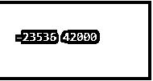
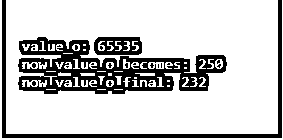
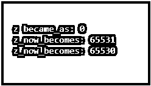

# C++无符号整数

> 原文：<https://www.educba.com/c-plus-plus-unsigned-int/>


## C++无符号整数的定义

C++ unsigned int 是只包含非负整数形式的整数的数据类型。不像 C++有符号整数可以拥有负数和正整数，C++无符号整数只能拥有从 0 到 255 的正整数，因此它可以存储 256 个不同的值，其中一半的有符号整数包含负数。每当需要使用正整数时，C++ unsigned int 是最佳选择，因为它与网络和系统兼容，可以处理网络和系统的内存优化。

### C++无符号整数的语法

C++无符号整数的语法流程如下:

<small>网页开发、编程语言、软件测试&其他</small>

```
unsigned int un_int
```

Unsigned 关键字，后跟一个整数和作为参数传递的值，表示为 un_int。类似地，对于其他数据类型，还有其他方法来声明无符号整数:

```
unsigned short un_s
```

无符号关键字后跟短整型。

```
unsigned long un_lng
```

无符号关键字后跟长整型整数。

```
unsigned long  long un_lng
```

无符号关键字，后跟嵌套的长整型整数。

### 无符号整数在 C++中如何工作？

*   C++中的 unsigned int 是一种数据类型，适用于 0-255 范围内的非负值
*   它用于范围从-128 到 127 的 1 字节有符号整数，用于存储与网络和系统相关要求的负值兼容的值，因为无符号整数由正值组成，在分配和实施时不会占用额外的内存。
*   如果用户试图存储一个大于定义范围的值，那么它会遇到一些错误，因为无符号整数不能溢出。
*   如果分配的值超出范围，那么它将被一个最大的数除，只有余数被保留用于进一步的计算。
*   还有另一种方法，它主要要求使用模包装功能对数字进行包装，然后获得余数作为用于存储该值的值。例如:如果值是 280，完全超出范围，那么它将选择范围的上限，然后对该值进行完全舍入。
*   为无符号整数定义了某些范围，例如 1 字节无符号整数的范围为 0-255，2 字节无符号整数的范围为 0-65535，4 字节无符号整数的范围为 0-4，294，967，295，8 字节无符号整数的范围为 0-18，446，744，073，709，551，657。
*   有时程序员会对有符号和无符号整数感到困惑，因此识别这种差异的简单方法是使用负号，但如果没有正确提供符号，则需要假设数字为正数，然后正确估计和使用这些值。
*   可能程序员还会想到另一种方式，比如应该少用无符号整数，因为它在实现时会导致两种行为和问题，比如有些人经常面临与用负号表示无符号数相关的问题，因为它会给出关于代码库的错误直觉。这种情况出现在根本不符合常规的减法运算中。
*   另一个经常面临的问题是，当程序员用有符号和无符号类型整数的混合方式引入数据类型时，会导致提示符号，这是程序员在处理无符号整数时不接受或不希望的。
*   因此，在某些有趣的领域，用户应该毫不犹豫地使用 C++无符号整数，也就是当用户想要处理位操作时。
*   只要需要开发包含处理器或内存受限活动的嵌入式系统，就只需要 C++无符号整数。
*   最后，当程序员处理数组和数组索引时，它扮演了一个关键的角色，大量的无符号整数会根据需要以某种方式被操作，与有符号整数相比，这就宗教性地利用了 C++无符号整数。

### C++无符号整数示例

下面是一些例子:

#### 示例#1

这个程序演示了有符号整数和无符号整数在执行时的区别和操作，如输出所示。

**代码:**

```
#include <iostream>
using namespace std;
int main() {
short int_m;
long unsigned int_n;
int_n = 42000;
int_m = int_n;
cout << int_m << " " << int_n;
return 0;
}
```

**输出:**




#### 实施例 2

这个程序演示了 unsigned int 溢出，这意味着如果以 unsigned int 形式给出的值大于预期值，则会发生意外的隐式转换，最终转换为输出中显示的其他形式的值。

**代码:**

```
#include <iostream>
int main()
{
unsigned short o{65535};
std::cout << "value_o: " << o << '\n';
o = 65786;
std::cout << "now_value_o_becomes: " << o << '\n';
o = 65768;
std::cout << "now_value_o_final: " << o << '\n';
return 0;
}
```

**输出:**




#### 实施例 3

这个程序演示了无符号 int 值的表示，如果在输出中抛出一些负值，这是不方便的，因此程序员不太喜欢输出中所示的内容。

**代码:**

```
#include <iostream>
int main()
{
unsigned int_lx{ 2 };
unsigned int_my{ 9 };
std::cout << int_lx - int_my << '\n';
return 0;
}
```

**输出:**

**T2】**


 **#### 实施例 4

这个程序演示了无符号整数的表示，其中包装类小心地将输出中显示的负数而不是正数四舍五入。

**代码:**

```
#include <iostream>
int main()
{
unsigned short z{ 0 };
std::cout << "z became_as: " << z << '\n';
z = -5;
std::cout << "z_now_becomes: " << z << '\n';
z = -6;
std::cout << "z_now_becomes: " << z << '\n';
return 0;
}
```

**输出:**




### 结论

无符号整数是程序员喜欢的整数。当处理和操作位时，这种要求与优化和简单的代码有关。每当值需要处理数组和索引数组时，程序员或开发人员都会使用无符号整数。

### 推荐文章

这是一个 C++无符号整型的指南。在这里，我们还讨论了无符号整数的定义和如何在 c++中工作，以及不同的例子和它的代码实现。您也可以看看以下文章，了解更多信息–

1.  [C++绝对值](https://www.educba.com/c-plus-plus-absolute-value/)
2.  [C++ memcpy](https://www.educba.com/c-plus-plus-memcpy/)
3.  [C++ ofstream](https://www.educba.com/c-plus-plus-ofstream/)
4.  [C++数组长度](https://www.educba.com/c-plus-plus-length-of-array/)


**