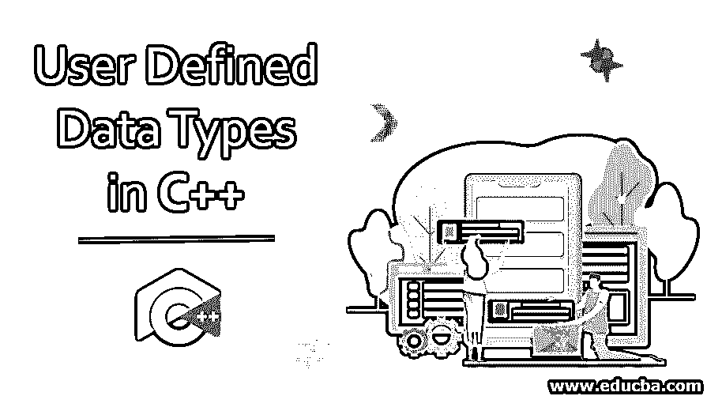

# C++中用户定义的数据类型

> 原文：<https://www.educba.com/user-defined-data-types-in-c-plus-plus/>




## C++中用户定义数据类型介绍

c++中的用户定义数据类型是一种可以用来表示数据的类型。数据的类型将告诉解释器程序员如何使用数据。数据类型可以是预定义的或用户定义的。预定义数据类型的例子有 char、int、float 等。我们将详细讨论用户定义的数据类型。

因为[编程语言允许](https://www.educba.com/best-programming-languages/)用户根据自己的需要创建自己的数据类型。因此，用户定义的数据类型称为用户定义的数据类型。比如说；数组、类、结构、联合、枚举、指针等。这些数据类型比预定义的数据类型更复杂。

<small>网页开发、编程语言、软件测试&其他</small>

### C++中用户定义数据的类型

以下是提到的类型:


#### 1.结构

结构被定义为一个名称下各种类型的相关信息的集合。结构的声明形成了一个模板，结构的变量被称为成员。该结构的所有成员通常是相关的。用于该结构的关键字是“struct”。

比如说；以“姓名”、“班级”、“名册号码”、“地址”为成员的学生身份结构可创建如下:

```
struct stud_id
{
char name[20];
int class;
int roll_number;
char address[30];
};
```

这称为结构的声明，以分号(；).在指定结构声明时，如果委托了结构声明，则不会分配内存。结构定义创建结构变量并为它们分配存储空间。结构变量可以定义如下:

```
stud_id I1, I2;
```

其中 I1，I2 是 stud_id 的两个变量。定义结构后，可以使用点运算符访问其成员，如下所示:

I1 .卷号将访问 I1 的卷号

I2.class 将访问 I2 的类

**举例:**

```
struct stud_id
{
int class, roll_number;
};
int main()
{
struct stud_id entries[10];   // Create an array of structures
entries[0].class = 4;           // Access array members
entries[0].roll_number = 20;
cout <<entries[0].class << ", " << entries[0].roll_number;
return 0;
}
```

#### 2.排列

数组被定义为同类数据的集合。在使用它存储信息之前，应该对它进行定义。该数组可以定义如下:

```
<datatype> <array_name><[size of array]>
int marks[10]
```

上面的语句定义了一个名为 marks 的整型数组，它可以存储 10 个学生的分数。创建数组后，可以通过在数组名称后加上索引来访问数组的任何元素。比如说；从标记中访问第 5 个<sup>元素</sup>的语法如下:

```
marks[5]
```

它将给出存储在数组的第 5 个<sup>位置</sup>的标记。根据元素的规格，数组可以是一维、二维或多维的。

**举例:**

```
int main()
{
int marks[10];
marks[0] = 5;
marks[2] = -10;
cout<<marks[0], marks[2]);
return 0;
}
```

#### 3.联盟

就像结构一样，联合也包含不同数据类型的成员。两者的主要区别在于，union 节省内存，因为 union 的成员共享同一个存储区域，而结构体的成员被分配了自己唯一的存储区域。使用关键字“union”声明联合，如下所示:

```
union employee
{
int id;
double salary;
char name[20];
}
```

并集的变量可以定义为:

```
union employee E;
```

要访问联合的成员，可以按如下方式使用点运算符:

```
E.salary;
```

#### 4.班级

和 C++一样，类是面向对象编程语言的一个重要特征。类被定义为一组具有相同操作和属性的对象。它是使用关键字“class”声明的。语法如下:

```
class <classname>
{
private:
Data_members;
Member_functions;
public:
Data_members;
Member_functions;
};
```

在这种情况下，数据成员的名称应该不同于成员函数。有两个类的访问说明符定义了类成员的范围。这些是私人的和公共的。被指定为私有的成员只能由该特定类的成员函数访问。但是，定义为 public 的成员也可以从类内部和外部访问。默认情况下，没有说明符的成员是私有的。属于一个类的对象称为该类的实例。创建类的对象的语法如下:

```
<classname> <objectname>
```

**举例:**

```
class kids
{
public:                //Access specifier
char name[10];   //Data members
int age;
void print()         //Member function
{
cout<<"name is:"<< name;
}
}
Int main
{
Kids k;                    //object of class kid is created as k
k.name="Eash";
k.print();
return 0;
}
```

#### 5.列举

枚举是通过使用关键字“enum”指定的。它被定义为一组命名的整数常量，这些常量指定了该类型变量可能具有的所有值。例如，一周的枚举可以包含一周中所有七天的名称，如下所示:

**举例:**

```
enum week_days{sun, mon, tues, wed, thur, fri, sat};
int main()
{
enum week_days d;
d = mon;
cout << d;
return 0;
}
```

#### 6.指针

指针是一种用户定义的数据类型，它创建变量来保存其他变量的内存地址。如果一个变量带有另一个变量的地址，那么第一个变量就是另一个变量的指针。相同的语法是:

```
type *ptr_name;
```

这里 type 是指针的任何数据类型，ptr_name 是指针的名称。


**举例:**

```
void main()
{
int a = 10;
int *p;   // pointer variable is declared
p = &a;  // data type of pointer ‘p’ and variable ‘a’ should be same
cout<<"Value at p = ",<<p); // the address of a variable is assigned to a pointer
cout<<"Value at variable a = “,<<a);
cout<<"Value at *p = ",<< *p);
}
```

#### 7.Typedef

使用关键字“typedef”，您可以为现有的数据类型定义新的数据类型名称。它的语法是:

```
typedef <type> <newname>;
typedef float balance;
```

当使用 balance 为 float 创建新名称时，我们可以声明任何 float 类型的变量。

使用 typedef 可以使代码易于阅读，也易于移植到新机器上。

**举例:**

```
typedef  int score;
int main()
{
score s1, s2;
s1 = 80;
cout << " " << b1;
return 0;
}
```

### 结论

如上所述，C++支持不同种类的用户定义数据类型。还有许多其他这样的数据类型，如函数、引用等。它们的使用使编程变得更加容易，它们还帮助我们将不同类型的数据放在一个变量中。

### 推荐文章

这是 C++中用户定义数据类型的指南。这里我们讨论 c++中用户定义的数据类型以及相应的例子。您也可以看看以下文章，了解更多信息–

1.  [Else If in C++](https://www.educba.com/else-if-in-c-plus-plus/)
2.  [c++中的 Deque](https://www.educba.com/deque-in-c-plus-plus/)
3.  [c++中的存储类](https://www.educba.com/storage-class-in-c-plus-plus/)
4.  [C++命令](https://www.educba.com/c-plus-plus-commands/)


