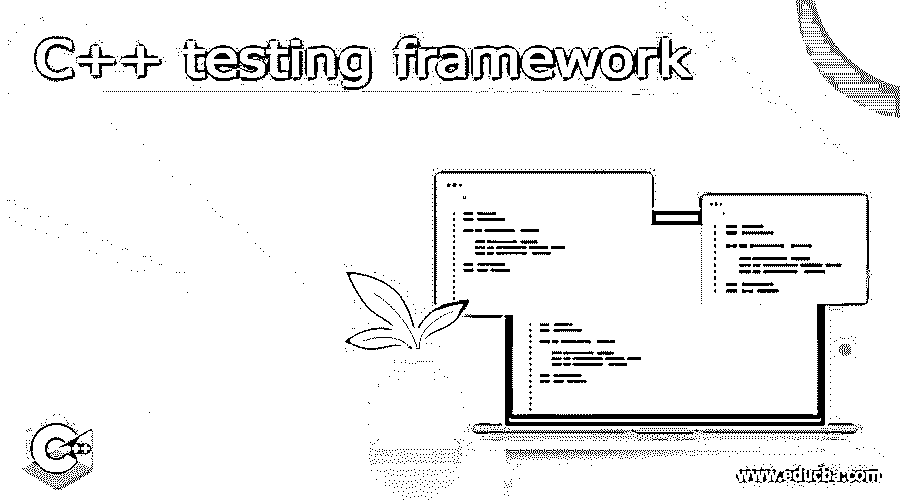

# C++测试框架

> 原文：<https://www.educba.com/c-plus-plus-testing-framework/>

## C++测试框架介绍

C++测试框架被定义为一组规则和指南，使专业人员能够创建和设计测试用例。这个框架使专业人员能够结合实践和工具，以便他们能够有效地测试应用程序。该框架由编码标准、处理测试数据的方法、对象存储库以及最终存储结果组成。使用该框架，人们可以很容易地声称在测试方面有很多好处，因为该框架允许提高测试效率，降低维护成本，最小化人工干预的要求，具有最大的测试覆盖率，以及代码可重用性。测试框架有各种形式、大小和功能，在本文中，我们将讨论在 C++测试框架领域广泛使用的框架，我们需要明确的一点是，本文中讨论的框架可能并不详尽！

### C++测试框架

在 C++测试领域有各种各样的测试框架。可用的框架也属于测试类型的范畴。为了知道测试框架的意图，我们需要知道测试类别的意图，然后查看一些广泛使用的框架。C++的大部分焦点都是在单元测试上，因此你会看到很多框架都提到了同样的问题，尽管我们也有很多其他类别的框架。像验收测试和回归测试这样的类别可能没有工具，但是我们将讨论如何以其他方式解决它。开始在这里列出它们，我们有:

<small>网页开发、编程语言、软件测试&其他</small>

#### 1.单元测试

每个代码都由代码单元或代码块组成，这些代码单元或代码块共同执行一项任务。这个单一的任务可能不是整个应用程序的最终目的，而是实现这个目的的一个步骤。这一类别的测试框架主要着眼于数据的相关控制、使用程序和操作方面，但不仅限于这些方面。在 C++测试框架中，这种类型的测试得到了最多的例子，因为大多数应用程序的构建都依赖于单元测试。

#### 2.集成测试

通常缩写为 I&T，在上述类型的测试中形成单元的模块被集体组合起来作为一个组来执行测试。这将检查所有模块一起使用时系统的合规性，以及作为一个整体遵守应用程序的特定功能。这一步发生在单元测试完成之后。C++中用于集成测试的一些框架(尽管人们应该知道其中大多数也支持单元测试，但主要用于集成测试)是:

#### 3.回归测试

在这种类型的测试中，所有的功能性和非功能性测试都是从先前开发的已经作为特性存在的模块中运行的。我们确信，即使我们扩大了应用程序中功能实现的范围，旧的功能仍然是可用的。在这种情况下，大部分单元测试框架被执行来测试早期编写的测试用例。

#### 4.验收测试

这种类型的测试涉及到评估系统对业务需求的符合性，以便可以评估它是否需要被接受或拒绝。这主要是通过运行一些测试来确保满足合同中的要求。UAT(用户验收测试)通常在这方面执行，以确保最终用户验证并接受该功能。没有太多的框架存在，大部分是根据应用程序的需要编写的。

#### 5.性能试验

既然应用程序已经运行并符合预期，那么同样重要的是，该应用程序要以优化的速度运行，具有高响应性，对稳定性没有干扰，并且应用程序在满负荷的情况下按预期运行。

### 结论

在本文中，我们研究了 C++环境中存在的各种测试类型，以及每种类型中的一个示例，因此，根据需要测试的内容，人们可以参考广泛使用的测试类型列表，或者根据需要在 wiki 上搜索特定的测试类型！

### 推荐文章

这是一个 C++测试框架指南。这里我们讨论了 C++环境中存在的各种测试类型，并给出了一个例子。您也可以看看以下文章，了解更多信息–

1.  [C++ getline()](https://www.educba.com/c-plus-plus-getline/)
2.  [C++本](https://www.educba.com/c-plus-plus-this/)
3.  [C++ replace()](https://www.educba.com/c-plus-plus-replace/)
4.  [C++运算符=()](https://www.educba.com/c-plus-plus-operator-equal/)

