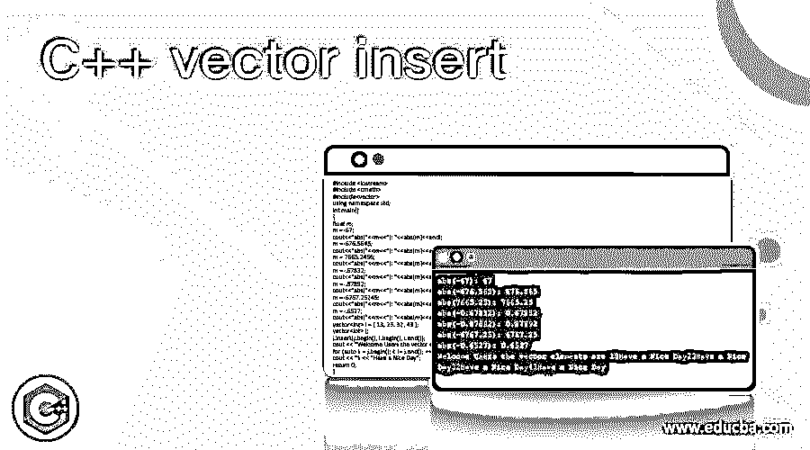
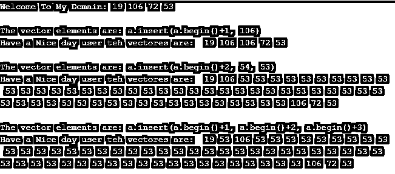

# C++向量插入

> 原文：<https://www.educba.com/c-plus-plus-vector-insert/>




## C++向量插入的定义

C++ vector insert()是用于将元素插入到基于向量的容器中的函数之一，并且它还通过在我们想要插入元素的任何地方插入指向一些指定位置的新元素来扩展。当在容器中插入新元素时，容器大小也自动增加。所以它还会根据实际的 vector 容量自动重新分配存储空间区域，所以 vector 还会通过使用位置来重新定位元素。它会处理旧位置和当前位置。有时，它还会抛出由于容器大小内存空间不足而导致的错误。

**语法:**

<small>网页开发、编程语言、软件测试&其他</small>

在 C++中，每个对象、变量、关键字和函数都有自己的语法和属性，用于在编程代码中声明。根据需求，我们将利用编程库中的特殊关键字、变量、数据类型和函数。vector insert()是 vector 包库中的一个函数，它用于计算用户输入到 vector 容器中的插入量。

```
#include<iostream>
#include<vector>
data type main()
{
std:: vector<data type> object name size declaration;
objectname.insert(parameters);
---some c++ code logics---
}
```

以上代码是创建 vector 对象和调用 insert 方法来插入 vector 容器元素的基本语法。

### 向量插入方法在 C++中是如何工作的？

C++编程有 n 个保留的关键字，这些函数将从实际的名称空间和新的库提供某种程度的抽象，程序员已经在使用它们来允许它更多地关注编码概念。它还使编写编程代码和使用 destroy()或任何其他属于垃圾收集的默认方法清理它们变得更加容易，它是销毁不需要的代码和清理内存空间区域的主要区域。它取决于数据类型，并且必须计算对象创建大小，它为大存储数据类型变量和小存储变量分配内存空间。通常，C++声明、初始化和指令都是与某种内存空间一起使用的，这些内存空间是为函数分配的，用于将它存储在 RAM 中。函数声明和定义将是标准类型的协议，它带来了所有类型的成员，函数被计算到当前和未来的范围内。

使用名称空间 std::vector::insert()，它将通过使用在向量容器中的正确位置插入新元素来扩展向量。元件被插入到容器中。如果元素值被插入到更多的容器中，它会自动增加尺寸。它重新分配了内存空间，并将在容器中扩展。该功能将在内存空间区域自动增加矢量容器。vector.insert(position，value)它传递两种类型的参数，一种是位置，另一种是值。position 参数是一个类型，它指定了类似迭代器的类型，迭代器指向元素的当前位置，插入元素将在容器内存堆栈上完成。第二种类型称为 value，指定将插入容器的用户输入值。

向量库有一组不同的预定义方法；基本上，它是 push，并在这些 vector 容器中弹出堆栈中的元素。此外，新元素被插入到位置区域末尾的向量中，也就是说，在最后一个和当前元素被插入到容器中之后，并且如果容器已满，则在每组元素被插入到向量中时，大小增加 1。

### C++向量插入示例

下面是在 C++中插入矢量的不同例子

#### 示例#1

**代码:**

```
#include <vector>
#include <iostream>
using namespace std;
int main(void)
{
vector <int> a;
vector <int>::iterator i;
a.push_back(19);
a.push_back(106);
a.push_back(72);
a.push_back(53);
cout<<"Welcome To My Domain:";
for(i = a.begin(); i != a.end(); i++)
cout<<" "<<*i;
cout<<endl;
cout<<"\nThe vector elements are: a.insert(a.begin()+1, 106)"<<endl;
a.insert(a.begin()+1, 106);
cout<<"Have a Nice day user teh vectores are: ";
for(i = a.begin(); i != a.end(); i++)
cout<<" "<<*i;
cout<<endl;
cout<<"\nThe vector elements are: a.insert(a.begin()+2, 54, 53)"<<endl;
a.insert(a.begin()+2, 54, 53);
cout<<"Have a Nice day user teh vectores are: ";
for(i = a.begin(); i != a.end(); i++)
cout<<" "<<*i;
cout<<endl;
cout<<"\nThe vector elements are: a.insert(a.begin()+1, a.begin()+2, a.begin()+3)"<<endl;
a.insert(a.begin()+1, a.begin()+2, a.begin()+3);
cout<<"Have a Nice day user teh vectores are: ";
for(i = a.begin(); i != a.end(); i++)
cout<<" "<<*i;
cout<<endl;
return 0;
}
```

**输出:**




#### 实施例 2

**代码:**

```
#include <iostream>
#include <cmath>
#include<vector>
using namespace std;
int main()
{
float m;
m = -67;
cout<<"abs("<<m<<"): "<<abs(m)<<endl;
m = -676.5645;
cout<<"abs("<<m<<"): "<<abs(m)<<endl;
m = 7665.2456;
cout<<"abs("<<m<<"): "<<abs(m)<<endl;
m = -.67832;
cout<<"abs("<<m<<"): "<<abs(m)<<endl;
m = -.87892;
cout<<"abs("<<m<<"): "<<abs(m)<<endl;
m = -6767.25245;
cout<<"abs("<<m<<"): "<<abs(m)<<endl;
m = -.6527;
cout<<"abs("<<m<<"): "<<abs(m)<<endl;
vector<int> i = { 13, 23, 32, 43 };
vector<int> j;
j.insert(j.begin(), i.begin(), i.end());
cout << "Welcome Users the vector elements are ";
for (auto k = j.begin(); k != j.end(); ++k)
cout << *k << "Have a Nice Day";
return 0;
}
```

**输出:**


#### 实施例 3

**代码:**

```
#include <iostream>
#include <vector>
void demo(const std::vector<int>& a)
{
for (auto i: a) {
std::cout << ' ' << i;
}
std::cout << '\n';
}
int main ()
{
std::vector<int> a(4,113);
demo(a);
auto b = a.begin();
b = a.insert(b, 200);
demo(a);
a.insert(b,5,273);
demo(a);
b = a.begin();
std::vector<int> j(6,366);
a.insert(b+2, j.begin(), j.end());
demo(a);
int k[] = { 432,543,654 };
a.insert(a.begin(), k, k+4);
demo(a);
}
```

**输出:**


在上面的例子中，我们用 vector.insert()方法以不同的方式将方法推入和拉出到 vector 容器中。

### 结论

C++的 vector 包和导入库有一组不同的内置函数，这些函数将用于不同的领域。这些函数将主要用于在项目的所需区域插入我们需要的元素，内存区域也用于存储和检索数据。

### 推荐文章

这是一个 C++矢量插入的指南。在这里，我们讨论了向量插入方法在 C++中的工作，以及不同的例子和它的代码实现。您也可以看看以下文章，了解更多信息–

1.  [C++线程 _ 本地](https://www.educba.com/c-plus-plus-thread_local/)
2.  [c++中的变量](https://www.educba.com/variables-in-c-plus-plus/)
3.  [C++数组长度](https://www.educba.com/c-plus-plus-length-of-array/)
4.  [C++静态转换](https://www.educba.com/c-plus-plus-static_cast/)


