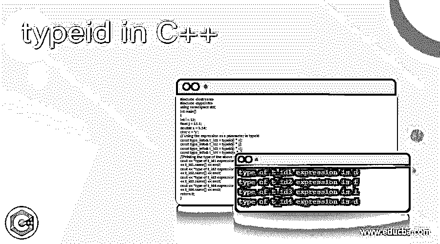
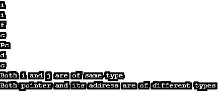

# C++中的 typeid

> 原文：<https://www.educba.com/typeid-in-c-plus-plus/>




## C++中的 typeid 简介

在 C++中，typeid 是一个运算符，用于检索对象的运行时或动态类型信息。对象可以是变量类型、对象类型或表达式类型。要在程序中使用 typeid 操作符，需要包含库头<typeinfo>。它返回 const type_info 类型的左值来表示值的类型。typeid 的表达式是左值表达式(左值具有程序可访问的地址。比如变量名、函数、类成员、并集等。).它基本上适用于无法用提供的静态信息确定真实类型的对象。</typeinfo>

**语法**

<small>网页开发、编程语言、软件测试&其他</small>

下面给出了在 C++程序中使用 typeid 的基本语法:

```
typeid(expression)
```

或者

```
typeid(type)
```

在哪里，

**表达式**:在这里，整个表达式作为一个参数被传递，以检索它的类型的运行时信息。首先计算表达式，然后根据最终结果提供其类型。

**Type** :在这种情况下，变量或对象作为参数传递，以获取其动态类型。里面不需要求值，不像表达式参数。所以直接地，信息的类型作为最终结果被获得。

**返回值:**返回一个对象的运行时或者动态类型信息，是一个 const type_info 类型的左值。如果类型是引用类型，则返回引用类型的 type_info 对象。

### typeid 在 C++中是如何工作的？

下面给出了描述 C++程序中 typeid 工作的一些要点:

*   如果在 typeid 运算符中作为参数传递的表达式属于基类型，但对象属于从基类派生的类型，则结果是派生类的 type_info 引用。
*   如果在 typeid 运算符中作为参数传递的表达式正在取消对指针的引用，并且指针值为 null 或指向 onvalid 对象，则将引发 bad_typeid 错误。
*   如果在 type expression 中传递的表达式既不是解引用指针，也不是基类的对象，它将 type_info 引用作为静态类型的表达式返回。在这种情况下，评估时会忽略引用。
*   在我们只需要类信息的情况下，使用 typeid 而不是 dynamic_cast。
*   当需要查找与运行时信息的计算相关联的表达式类型时，操作数 typeid 非常有用，例如

多态类类型的对象的引用或指针的取消引用。

*   操作数 typeid 不能应用于不完整的类型。因此，如果对象正在被构造或销毁，那么它将返回正在被构造或销毁的类的 std:: type_info。

### C++中的 typeid 示例

下面给出了一些说明在程序中使用 typeid 的例子:

#### 示例#1

获取简单对象的 typeid，如 int、float、char，并比较它们的类型

**代码:**

```
#include <iostream>
#include <typeinfo>
using namespace std;
int main()
{
int i, j;
float f;
char c, *d;
double e;
//Getting the type using the typeid operator and passing the variables
const type_info& ti1 = typeid(i);
const type_info& ti2 = typeid(j);
const type_info& ti3 = typeid(f);
const type_info& ti4 = typeid(c);
const type_info& ti5 = typeid(d);
const type_info& ti6 = typeid(e);
const type_info& ti7 = typeid(*d);
// Printing the types of the variables of different data type on the console
cout << ti1.name() << endl;
cout << ti2.name() << endl;
cout << ti3.name() << endl;
cout << ti4.name() << endl;
cout << ti5.name() << endl;
cout << ti6.name() << endl;
cout << ti7.name() << endl;
//making comparisons in the types retrieved above
if (ti1 == ti2)
{
cout<< "Both i and j are of same type " << endl;
}
else
{
cout << "Both i and j are of different types" << endl;
}
if(ti5== ti7)
{
cout << "Both pointer and its address are of same type" << endl;
}
else
{
cout << "Both pointer and its address are of different types" << endl;
}
return 0;
}
```

**输出:**




#### 实施例 2

使用 typeid 运算符获取多态和非多态基类的对象类型

**代码:**

```
#include <iostream>
#include <typeinfo>
//using polymorphic base class B1
class B1 {
public:
virtual void fun() {}
};
//using non-polymorphic base class B2
class B2 {};
class D1 : public B1 {};
class D2 : public B2 {};
using namespace std;
//main function
int main() {
D1* d1 = new D1;
B1* b1 = d1;
D2* d2 = new D2;
B2* b2 = d2;
//Printing the type of above class objects on the console
cout << typeid( d1 ).name() << endl;
cout << typeid( b1 ).name() << endl;
cout << typeid( *d1 ).name() << endl;
cout << typeid( *b1 ).name() << endl;
cout << typeid( d2 ).name() << endl;
cout << typeid( b2 ).name() << endl;
cout << typeid( *d2 ).name() << endl;
cout << typeid( *b2 ).name() << endl;
}
```

**输出:**


#### 实施例 3

通过计算在 typeid 运算符中用作参数的表达式来获取类型。

**代码:**

```
#include <iostream>
#include <typeinfo>
using namespace std;
int main()
{
int i = 13;
float j = 15.6;
double x = 3.14;
char c = 'y';
// Using the expression as a parameter in typeid
const type_info& t_id1 = typeid(i * x);
const type_info& t_id2 = typeid(i * j);
const type_info& t_id3 = typeid(i * c);
const type_info& t_id4 = typeid(x * c);
//Printing the type of the above calculated expressions on the console
cout << "type of t_id1 expression is "
<< t_id1.name() << endl;
cout << "type of t_id2 expression is "
<< t_id2.name() << endl;
cout << "type of t_id3 expression is "
<< t_id3.name() << endl;
cout << "type of t_id4 expression is "
<< t_id4.name() << endl;
return 0;
}
```

**输出:**


这样，通过将表达式的类型作为参数在 typeid 运算符中传递来计算 typeid。对于简单的数据类型，如 int、float、double 等。的情况下，typeid 在没有任何计算的情况下产生，而在表达式的情况下，首先计算表达式，然后产生它们的类型。

### 结论

上面的描述清楚地解释了什么是 C++中的 typeid，以及如何使用它来查找对象的动态类型。typeid 的返回类型取决于要计算其类型的对象。它抛出许多错误并导致意外的输出。所以在程序中使用这个操作符之前，需要对它有一个很好的理解。

### 推荐文章

这是一个 C++中的 typeid 指南。在这里，我们讨论 typeid 在 C++中是如何工作的，以及代码和输出的例子。您也可以阅读以下文章，了解更多信息——

1.  [C++ ofstream](https://www.educba.com/c-plus-plus-ofstream/)
2.  [C++数组长度](https://www.educba.com/c-plus-plus-length-of-array/)
3.  [C++可变](https://www.educba.com/c-plus-plus-mutable/)
4.  [C++ sort()](https://www.educba.com/c-plus-plus-sort/)


