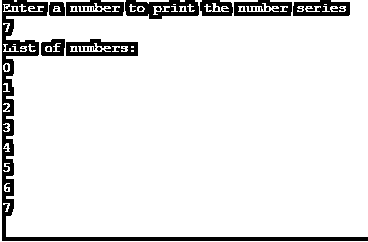
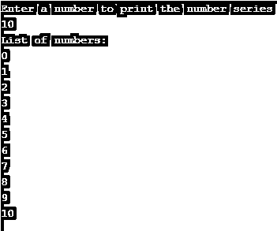
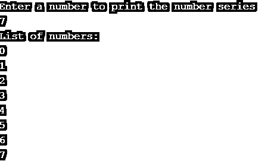
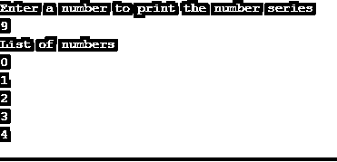
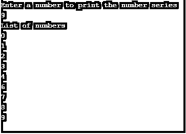
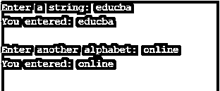

# C++关键字

> 原文：<https://www.educba.com/c-plus-plus-keywords/>


## C++中的关键字介绍

关键字是由编译器定义的用于执行内部操作的保留关键字，以小写形式书写。关键字有一些意义，是由编译器定义的，用来完成代码中的任务，它们不能在编程中作为变量使用。C++提供了 64 个关键字——for、break、continue、switch、int float、double、char、try、catch、while 等。

### C++关键字列表

下面是 C++语言中使用的关键字列表。

<small>网络开发、编程语言、软件测试&其他</small>

(Auto、double、int、struct、Break、else、long、switch、Case、enum、register、typedef、Char、extern、return、union、Const、float、short、unsigned、Continue、for、signed、void、Default、goto、sizeof、volatile、Do、if、static、while、Asm、dynamic_cast、namespace、reinterpret_cast、Bool、explicit、new、static_cast、Catch false、operator、template、Class、friend、private、this、Const_cast、inline、public、

### 关键词示例

在上一节中，我们已经看到了关键字列表。我们不能在编程中将它们作为变量使用。在这一节中，我们将借助一些例子来讨论其中的一些。

#### 1.如果

该关键字用于检查条件。如果条件为真，则执行 If 后面的语句。

If 关键字的植入程序如下:

```
#include<iostream>
using namespace std;
int main()
{
int n;
cout << "Enter number:" << endl;
cin >> n;
if(n > 0)
{
cout << "You have entered positive number";
}
return 0;
}
```

**输出如下:**


#### 2.其他

该关键字[与 if 语句](https://www.educba.com/if-statement-in-r/)一起使用。如果条件为假，将执行 else 后面的语句。

植入 else 关键字的程序如下:

```
#include<iostream>
using namespace std;
int main()
{
int n;
cout << "Enter number:" << endl;
cin >> n;
if(n %2 == 0)
{
cout << "You have entered even number";
}
else
{
cout << "You have entered odd number";
}
return 0;
}
```

**输出如下:**


#### 3.转换

该关键字用于测试变量的值，并与不同的大小写进行比较。基于案例，它执行语句。在第一个输出中，输入的数字在事例中，因此它执行流匹配事例的语句。在第二个输出中，我们可以看到，输入的数字与大小写不匹配，因此它执行 default 关键字后面的语句。

植入开关关键字的程序如下:

```
#include<iostream>
using namespace std;
int main()
{
int n;
cout << "Enter number between 1 to 3" << endl;
cin >> n;
switch(n)
{
case 1:
cout << "You have entered 1";
break;
case 2:
cout << "You have entered 2";
break;
case 3:
cout << "You have entered 3";
break;
default:
cout << "Please enter valid number";
break;
}
return 0;
}
```

**输出如下:**


#### 4.在…期间

该关键字用于控制执行流程。首先，它检查条件，如果条件匹配，将执行下面的 while 语句。

while 关键字的植入程序如下:

```
#include<iostream>
using namespace std;
int main()
{
int n, i = 0;
cout << "Enter a number to print the number series" << endl;
cin >> n;
cout << "List of numbers:" << endl;
while(i <= n)
{
cout << i << endl;
i++;
}
return 0;
}
```

**输出如下:**




#### 5.做

do 关键字与 while 关键字一起使用。do 的工作方式是一样的，唯一的区别就是先执行语句然后检查条件，反之，先检查条件再执行语句。

do 关键字植入程序如下:

```
#include<iostream>
using namespace std;
int main()
{
int n, i = 0;
cout << "Enter a number to print the number series" << endl;
cin >> n;
cout << "List of numbers:" << endl;
do
{
cout << i << endl;
i++;
}while(i <= n);
return 0;
}
```

**输出如下:**




#### 6.为

for 关键字用于控制循环。它是一个循环[控制语句，执行](https://www.educba.com/control-statements-in-c/)循环，直到给定的条件匹配。

for 关键字的植入程序如下:

```
#include<iostream>
using namespace std;
int main()
{
int n, i;
cout << "Enter a number to print the number series" << endl;
cin >> n;
cout << "List of numbers:" << endl;
for(i = 0; i <= n; i++)
{
cout << i << endl;
}
return 0;
}
```

**输出如下:**




#### 7.破裂

该关键字用于中断语句。根据条件，它打破了循环。关键字 break 也可以与 switch 语句一起使用[来中断循环。](https://www.educba.com/switch-statement-in-c-sharp/)

break 关键字的植入程序如下:

```
#include<iostream>
using namespace std;
int main()
{
int n, i;
cout << "Enter a number to print the number series" << endl;
cin >> n;
cout << "List of numbers" <<endl;
for(i = 0; i <= n; i++)
{
if(i == 5)
{
break;
}
cout << i << endl;
}
return 0;
}
```

**输出如下:**




#### 8.继续

continue 关键字用于跳过这一行。与[的 break 语句](https://www.educba.com/break-statement-in-javascript/)正好相反。Continue 语句将继续执行循环，它只跳过提到它的那一行。

continue 关键字的植入程序如下:

```
#include<iostream>
using namespace std;
int main()
{
int n, i;
cout << "Enter a number to print the number series" << endl;
cin >> n;
cout << "List of numbers" <<endl;
for(i = 0; i <= n; i++)
{
if(i == 5)
{
continue;
}
cout << i << endl;
}
return 0;
}
```

**输出如下:**




#### 9.转到

goto 关键字用于将控制流转移到另一个标签。在下面给出的程序中，我们创建了两个标签偶数和奇数来转移控制流。

goto 关键字的植入程序如下所示:

```
#include<iostream>
using namespace std;
void checkevenodd()
{
int n;
cout << "Enter number:" << endl;
cin >> n;
if(n %2 == 0)
goto even;
else
goto odd;
even:
cout << "You have entered even number";
return;
odd:
cout << "You have entered odd number";
}
int main()
{
checkevenodd();
return 0;
}
```

**输出如下:**


#### 10.常数

该关键字用于固定变量的值。声明为 const 的变量保持不变。常量变量的值不能更改。在第一个程序中，你可以看到 I 的值被改变了。在第二个程序中，当我们要改变常量的值时，它会抛出错误。

const 关键字的植入程序如下:

```
#include<iostream>
using namespace std;
int main()
{
int i = 7;
i = 5;
cout << i;
return 0;
}
```

**输出如下:**


下面是另一个植入 else 关键字的程序如下

```
#include<iostream>
using namespace std;
int main()
{
const int i = 7;
i = 5;
cout << i;
return 0;
}
```

**输出如下:**


#### 11.结构

该关键字用于创建数据类型。它声明一个组中的所有变量都跟在 struct 关键字后面。在创建结构的对象之后，所有的变量都被检索。

struct 关键字植入程序如下:

```
#include<iostream>
using namespace std;
struct student
{
string first_name, last_name;
int roll_no;
};
int main()
{
struct student stu;
stu.first_name = "EDU";
stu.last_name = "CBA";
stu.roll_no = 5;
cout << "First Name:" << stu.first_name << endl;
cout << "Last Name:" << stu.last_name << endl;
cout << "Roll No:" << stu.roll_no << endl;
return 0;
}
```

**输出如下:**


#### 12.茶

这个关键字用于声明一个字符变量。比如 char 拼写；所以在这里，拼写是一个字符类型变量。

char 关键字植入程序如下:

```
#include <iostream>
using namespace std;
int main()
{
char alphabet[100];
cout << "Enter a string: ";
cin >> alphabet ;
cout << "You entered: " << alphabet << endl;
cout << "\nEnter another alphabet: ";
cin >> alphabet;
cout << "You entered: "<<alphabet<<endl;
return 0;
}
```

**输出如下:**




#### 13.（同 Internationalorganizations）国际组织

该关键字用于存储整数值。您可以看到，即使在赋值 float 值之后，它也给出唯一的整数作为输出。

int 关键字植入程序如下:

```
#include<iostream>
using namespace std;
int main()
{
int a = 3.14;
cout << a;
return 0;
}
```

**输出如下:**


#### 14.漂浮物

该关键字用于存储十进制值。

float 关键字的植入程序如下:

```
#include<iostream>
using namespace std;
int main()
{
float a = 3.14;
cout << a;
return 0;
}
```

**输出如下:**


#### 15.班级

这个关键字用于创建一个类。一个类包含程序中将要用到的数据和函数。一个类可以由三个关键字管理——public、protected 和 private。可以在类外部访问类的成员和函数。私有类的成员和函数不能在类外部访问。

植入类关键字的程序如下:

```
#include<iostream>
using namespace std;
class student
{
public:
string first_name, last_name;
int roll_no;
};
int main()
{
student stu;
stu.first_name = "EDU";
stu.last_name = "CBA";
stu.roll_no = 5;
cout << "First Name:" << stu.first_name << endl;
cout << "Last Name:" << stu.last_name << endl;
cout << "Roll No:" << stu.roll_no << endl;
return 0;
}
```

**输出如下:**


### 结论

在本文中，我们已经看到了 C++中的各种关键字，以及如何使用一些示例来实现这些关键字。我希望这篇文章对你有所帮助。

### 推荐文章

这是一个 C++关键字的指南。这里我们已经讨论了什么是 C++关键字，C++关键字列表以及后面的代码和输出示例。您也可以浏览我们推荐的其他文章，了解更多信息——

1.  [最佳 C++编译器](https://www.educba.com/best-c-plus-plus-compiler/)
2.  [c++中的对象](https://www.educba.com/object-in-c-plus-plus/)
3.  [C++替代品](https://www.educba.com/c-plus-plus-alternatives/)
4.  [C++与 Visual C++](https://www.educba.com/c-plus-plus-vs-visual-c-plus-plus/)


