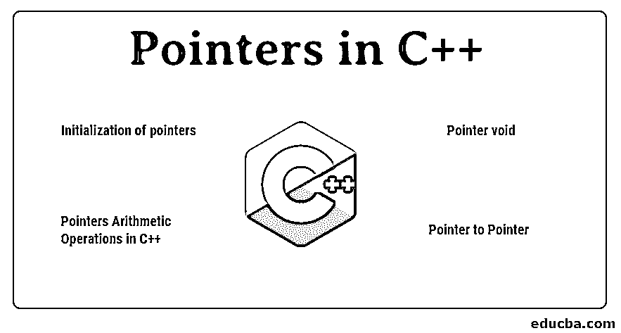
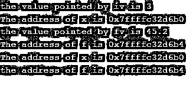
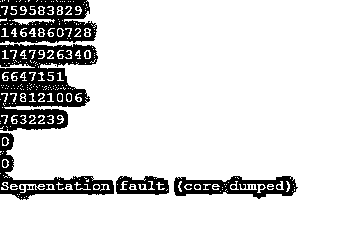

# C++中的指针

> 原文：<https://www.educba.com/pointers-in-c-plus-plus/>




## C++中的指针是什么？

指针是 c++中最强大的工具；它帮助程序员直接访问和操作内存。例如，当一个变量被创建时，编译器的工作就是分配内存来存储变量的值。并且使用分配给数据的变量名来检索该值。C++具有从内存中存储和检索数据的兼容性，引用存储数据的内存位置的地址。C++甚至在指针上执行指针。

**语法:**

<small>网页开发、编程语言、软件测试&其他</small>

指针声明的一般格式是:

```
Data_type * pointer -variable-name
```

注意指针变量前面应该有一个星号(*)。

**举例:**

**代码:**

```
int * xptr;
```

变量 xptr 是一个指向整数的指针。指针变量一般可以指向整数变量、字符变量、数组、文件和函数。

### C++中为什么需要指针？

*   在 C++中，使用指针使动态内存分配变得简单，指针最突出的重要性是它们在处理不同的数据类型时更有效。
*   此外，当函数返回一个值时，它们可以提高执行速度，并帮助访问函数外部定义的变量。
*   最常见的用法包括数据管理和访问类成员函数。

### 如何在 C++中创建指针？

以下是在 C++中创建指针的步骤:

#### 步骤 1:指针的初始化

建议一声明指针变量就初始化它们。由于指针变量存储地址，它们可以寻址内存的任何部分。

**代码:**

```
int    *a; // pointer to an integer
double *da; // pointer to a double
float *fa; // pointer to afloat
char   *ch   // character pointer
```

**考虑下面的例子:**

int p，* pi//此语句指示编译器在内存中为变量 p 保留一个空间来存放整数值。

pi= &a; //将整型变量 p 的地址赋给指针变量。例如，如果 p 的地址是 4581，那么*pi 中的值将等于 4581。

#### 步骤 2:指针无效

这里，指针变量可以指向任何数据类型，这种类型用于将指针传递给独立于所指向的数据类型工作的函数。

**语法:**

```
void * pointer variable;
```

**举例:**

**代码:**

```
#include<iostream.h>
#include <iostream>
using namespace std;
int main ()
{
int x, *iv;
float f, *fv;
void *vp;
x=3;
f=45.2;
iv=&x;
fv=&f;
vp=&x;
cout<< "the value pointed by iv is "<<*iv<< endl;
cout<< "The address of x is "<<iv <<endl;
cout<< "the value pointed by fv is "<<*fv<< endl;
cout<< "The address of f is "<<fv <<endl;
cout<< "The address of x is "<<vp <<endl;
vp= &f;
cout<< "the address of f is "<<vp<<endl;
}
```

**输出:**




#### 步骤 3:c++中的指针算术运算

指针算法是用数组执行的。

可以对指针执行以下操作。

*   增量(++)
*   减量(–)
*   指针加法
*   指示字减法

当我们给指针加 1 时，它指定增加指针指向的大小。

下面的程序指定了指针算法；它一直工作到数组的末尾。

**代码:**

```
#include <iostream>
#include <string>
using namespace std;
void pointerarithmetic(int a[], int size)
{
int *e, *t; //Declaring two int pointers variables
e = a; //assigning e to point the arrays initial element a[0]
t = a + size; // assigning variable t to the array last element
while(e != t)
{
cout << *e << endl; //displays the e
e++; // incrementing ( next element)
}
}
int main()
{
int a[] = {2, 4, 6, 8, 10, 12, 14, 16, 18, 20};
pointerarithmetic (a, 20);
return 0;
}
```

**输出:**




#### 第四步:指针对指针

*   **浮动* * fpp:**表示两级指针(多重间接)。它是一个指向另一个指针的变量，这个指针进一步指向一个内存位置中指定的对象。例如，fpp 是当前指向存储器地址 2001 的浮点指针，浮点的大小是 8 字节，那么由
*   **fpp++；:**表示指向地址 2009 的 fpp。类似地，当变量减 1 时，它将指向其基类型在地址 1993 的前一个位置。

#### 步骤 5:指向函数的指针

当指针作为参数传递给函数时，与这些指针变量相关的数据项在函数内被改变，然后返回给调用程序；这些更改将保留在调用程序中。当指针作为参数传递时，相应的数据项在被调用的函数中被全局改变。指针是通过引用传递的。

函数可以以不同的方式在指针中执行:

*   通过传递引用调用的函数。
*   通过传递指针调用的函数。

**通过传递引用调用的函数:**

在这种情况下，地址是作为参数而不是值传递的。

**举例:**

**代码:**

```
#include <iostream>
using namespace std;
void changefn(int*, int*);
int main()
{
int n = 5, m = 6;
cout << "Before change" << endl;
cout << "n = " << n << endl;
cout << "m = " << m << endl;
changefn(&n, &m);
cout << "\nAfter change" << endl;
cout << "n = " << n << endl;
cout << "m = " << m << endl;
return 0;
}
void changefn(int* x1, int* x2) {
int s1;
s1 = *x1;
*x1 = *x2;
*x2 = s1;
}
```

**输出:**


### 结论

本文试图用一个简单的例子来更新关于如何在 C++中使用指针的知识以及它们的基本主题。指针也被称为定位器，减少代码语句以获得更高的性能。指针在实现链表等数据结构和系统级编程中起着至关重要的作用。它们是嵌入式系统中的首选语言，因为它们是使用指针直接访问内存的好方法。

### 推荐文章

这是 C++中的指针指南。这里我们讨论基本概念，为什么我们需要它，以及如何用适当的例子和输出在 C++中创建指针。您也可以阅读以下文章，了解更多信息——

1.  [Python 中的指针](https://www.educba.com/pointers-in-python/)
2.  [c++中的数组](https://www.educba.com/arrays-in-c-plus-plus/)
3.  [c++中的星形模式](https://www.educba.com/star-patterns-in-c-plus-plus/)
4.  [c#中的指针](https://www.educba.com/pointers-in-c-sharp/)


