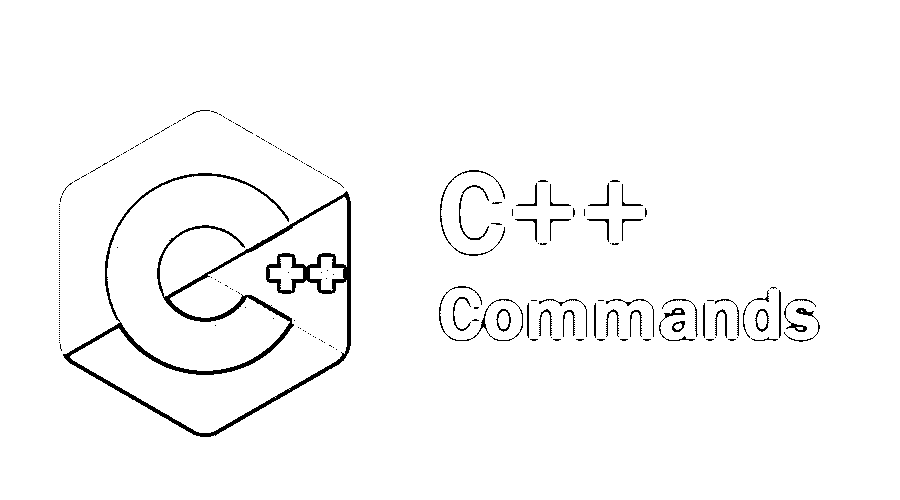
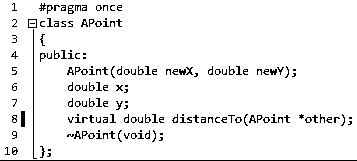
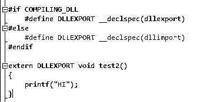
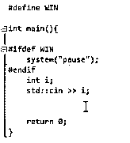

# C++命令

> 原文：<https://www.educba.com/c-plus-plus-commands/>

## C++命令简介

C++是由比雅尼·斯特劳斯特鲁普开发的一种面向对象的语言。是中等水平；既支持高级语言功能又支持低级语言功能的语言。它被认为是 C 语言的超集，支持 C 语言的所有特性。它[提供了所有面向对象编程](https://www.educba.com/object-oriented-programming-in-java/)的特性，比如封装、数据隐藏、继承和多态。它也有所有的标准库作为构建模块。让我们先看一下基础，慢慢走向 C++ Command 提供的高级功能。

### 基本 C++命令

基本命令如下。

<small>网页开发、编程语言、软件测试&其他</small>

#### 1.#定义

这个 C++命令可以用来在它所在的整个文件中替换一个特定的值。这有助于编译器检查整个文件，并用定义的值替换创建的宏的名称。该字符串的替换在该行的末尾停止。

#### 2.#错误

该命令有助于显示定义的错误消息，并指示编译器在遇到该命令时停止。当编译器遇到这个命令时，编译器会显示行号和提到的消息。这有助于程序员轻松调试。

#### 3.#包括

这个 includes 命令有助于将提到的文件包含在代码中并加以利用。它有两种用途:

*   #包括<filename></filename>
*   #包含“文件名”

当文件需要在标准库目录中搜索或包含时，使用尖括号。如果指定了引号，则表示需要在当前目录中搜索该文件名。

#### 4.#杂注

通过使用这个 C++命令，程序员能够让编译器知道要做什么不同的事情。#pragma 通常是特定于实现的，它的用法可能因编译器而异。有不同的选项可以使用，其中之一是跟踪程序执行。

#### 5.#线

这个 C++命令用于改变 __LINE__ 和 __FILE__ 变量的值。这些变量显示当前文件以及从中读取文件的行。

#### 6.#如果

该命令有助于指定要遵循的条件。它使用户能够简单地应用逻辑控制，如果条件为真，则代码将立即遵循将被编译的命令。

#### 7.#ifdef

这个 C++命令对于检查宏是否被#define 语句定义非常有用。如果它在执行下一条语句时已经定义了。

#### 8.标准输出

当用户想要打印一些文本或之前定义的任何变量的值时，就使用 cout。它在屏幕上显示所有值。

#### 9.Cin

为了接受来自用户的值并把它赋给一个特定的变量，开发者必须利用 cin 变量。用户可以接受任何值，并将其赋给所创建的任何数据类型的变量。

#### 10.__ 文件 _ _

该变量有助于表示正在处理的当前文件。它可以在整个代码中定义和使用。

### 中间 C++命令

以下是应该在中级水平上理解的 C++命令。

#### 1.变量定义

一个[变量可以被定义为](https://www.educba.com/variables-in-c-plus-plus/)，并让编译器知道在哪里创建一个变量。它还让编译器知道需要多少存储空间。这个定义需要一个特定的数据类型，还可以包含一个或多个变量的列表，这些变量可以跟在数据类型后面。数据类型可以是 char、int、float、double、bool 等。

#### 2.左值和右值

值表达式可以引用任何称为“左值”的内存位置。它可以出现在作业的左边或右边。当数据值存储在内存中的某个地址时，使用右值。它不能有可赋值的值，它将出现在赋值的右边。

#### 3.变量的范围

变量的范围可以是局部的，也可以是全局的。如果作用域是局部的，那么它只能在定义变量的函数或块中被访问。如果变量是在所有函数之外定义的，那么它们就是全局变量，可以在代码中的任何地方访问。

#### 4.文字

[文字可以定义为](https://www.educba.com/c-plus-plus-literals/)程序不能改变的值。这些可以是常量，可以分为整数、浮点数、字符、字符串和布尔值。

#### 5.修饰语

修饰符可用于更改基本数据类型的含义，并在不同的情况下更准确地使用它。数据修饰符有:有符号、无符号、[长整型和短整型](https://www.educba.com/long-term-vs-short-term-capital-gains/)。这些可以应用于整数基类型。

#### 6.预选赛

限定符提供了关于它们前面的变量的额外信息。C++提供了其中的三个。也就是说，它们是常量、易变的和受限的。

#### 7.存储类

这定义了函数中变量的作用域和生命周期。C++提供的[存储类](https://www.educba.com/storage-class-in-c-plus-plus/)有 auto、register、static、extern 和 mutable。

#### 8.经营者

这个 C++命令提供了 C 支持的所有[操作符。举几个例子，它支持算术运算符、关系运算符、逻辑运算符、按位运算符、赋值运算符和杂项运算符。](https://www.educba.com/introduction-to-c/)

#### 9.环

为了执行重复执行的任务 [C++](https://www.educba.com/c-plus-plus-alternatives/) 提供了循环函数。这些有助于重复执行一组指令，直到满足特定条件。这些循环是 while，for，do..while 和[嵌套循环](https://www.educba.com/nested-loop-in-javascript/)。

#### 10.数组

数组是一个[数据结构，用于存储](https://www.educba.com/data-structure-interview-questions/)属于同一类型的元素的固定大小的顺序集合。数组存储数据的集合，并用作同一类型的变量。

### 高级 C++命令

以下是下面提到的高级命令。

#### 1.C++文件

为了处理文件，C++提供了 fstream 库。它有三种新的数据类型-stream、stream 和 f stream。使用这些可以分别指定数据类型是输出文件流、输入文件流还是任何文件流

#### 2.异常处理

为了处理运行时出现的错误，C++提供了异常处理机制。它试过抓积木和扔积木。使用这些可以处理所有发生的异常。

### 提示和技巧

*   不要混淆赋值运算符(=)和 for 等式运算符(==)。
*   使用较小的程序时，使用“using”语句。
*   除了函数间的通信，不要使用全局变量
*   在 for 语句中使用局部变量
*   尽可能多地使用类和对象。

### 结论

因此使用 C++命令是非常有益的，因为它是一种面向对象的语言。它有助于继承，因此有助于代码的重用。C++提供了 C 的所有功能以及这些功能。作为学习其他面向对象语言的基础，学习 C++命令是非常重要的。

### 推荐文章

这是 C++命令的指南。在这里，我们讨论了概念、基本、中级和高级 C++命令以及提示和技巧。您也可以阅读以下文章，了解更多信息——

1.  [Tableau 命令](https://www.educba.com/tableau-commands/)
2.  [HBase 命令](https://www.educba.com/hbase-commands/)
3.  [MongoDB 命令](https://www.educba.com/mongodb-commands/)
4.  [猪命令](https://www.educba.com/pig-commands/)

