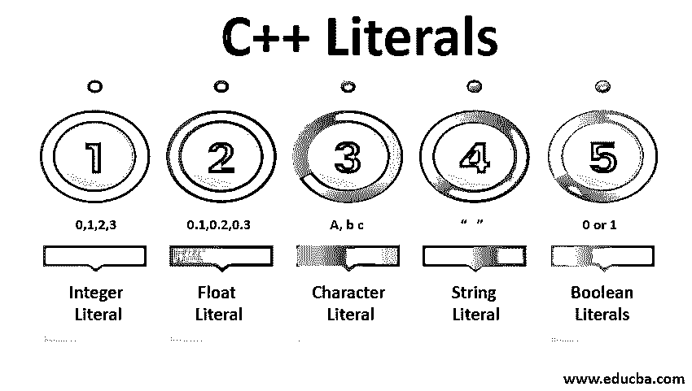

# c++文字

> 原文：<https://www.educba.com/c-plus-plus-literals/>




## C++文字简介

赋给常量变量的值称为文字。常数值可以用不同的文字命名。例如，“const int value= 15”将常量整数值 15 赋给 value，它是一个整数文字。在本文中，我们将通过一个例子来解释 C++中不同类型的文字。

### C++文字的类型

如下所述，在 C++中有五种不同类型的文字可以使用:

<small>网页开发、编程语言、软件测试&其他</small>

*   **整数文字**:用来表示整数常量。
*   **浮点文字**:用来表示浮点常量。
*   **字符文字**:用来表示单个字符。
*   **字符串文字**:用来表示字符序列(字符串)。
*   **布尔文字**:用于表示布尔(真或假)。

下面解释了上面提到的每种不同类型的文字及其示例代码:

#### 1.整数文字

C++中的整数文字表示整数常数值。整数文字主要以两种方式表示:前缀和后缀。

##### 前缀

整数文本中的前缀表示表示整数文本的基数。

**1。以 10 为基数的十进制文字:**这表示十进制(0，1，2，3，4，5，6，7，8，9)位数的值。该值必须以非零十进制数字开头。

**代码:**

```
// For representing decimal integer literal in base 10
const int value= 95;
const int value= 76;
const int value= 7;
```

**2。以 2 为基数的二进制文字:**这表示二进制(0，1)数字的值。该值必须以前缀 0b 或 0B 开头。

**代码:**

```
// For representing binary integer literal in base 2
const int value= 0b101;
const int value= 0B001;
const int value= 0B1111;
```

**3。以 8 为基数的八进制文字:**这表示八进制(0，1，2，3，4，5，6，7)位数的值。该值必须以前缀 0 开头。

**代码:**

```
// For representing octal integer literal in base 8
const int value= 0356;
const int value= 0732;
const int value= 0137;
```

**4。十六进制:**这表示十六进制(0，1，2，3，4，5，6，7，8，9，A，A，B，B，C，C，D，D，E，E，F，F)位数的值。该值必须以前缀 0x 或 0X 开头。

**代码:**

```
// For representing hex integer literal in base 16
const int value= 0xA3;
const int value= 0X38C;
const int value= 0XFFFF;
```

##### 后缀

存储整数文字的类型由后缀表示。

| **字尾** | **类型** |
| U 还是 U | 无符号整数 |
| L 还是 L | 长整型 |
| ul or UL | 无符号长整型 |
| ll 还是 LL | 长整型 |
| ull or ULL | 无符号长整型 |
| 好吧，后缀 | （同 Internationalorganizations）国际组织 |

**代码:**

```
// include required header files
#include <iostream>
int main()
{
// Body of main()
const int val_decimal = 79; // assigning decimal integer
const int val_hex = 0xA; // assigning hex integer literal
const int val_binary = 0b100; // assigning binary integer literal
std::cout << "Integer literal decimal base: "<< val_decimal << "\n";
std::cout << "Integer literal hex base: "<< val_hex << "\n";
std::cout << "Integer literal binary base: "<< val_binary << "\n";
return 0;
}
```

**输出:**


#### 2.浮点文字

浮点文字用于表示实数。主要有两种方法来表示浮点文字。它可以以十进制格式或指数格式存储。

*   在十进制格式中，浮点文字用小数点和指数部分表示。
*   在指数格式中，浮点文字用整数和小数部分表示。

**语法:**

```
// For representing float literals using decimal format and exponential format
const float float_leteral1 = 34.876
const float float_leteral1 = 34876E-3
```

**代码:**

```
// include required header files
#include <iostream>
int main()
{   // Body of main()
// float literal
const float float_leteral1 = 34.876;
const float float_leteral2 = 34876E-3;
// both float_leteral1 and float_leteral2 are same only representation is different
std::cout << "Float literal 1 value is : "<< float_leteral1 << "\n";
std::cout << "Float literal 2 value is : "<< float_leteral2 << "\n";
return 0;
}
```

**输出:**


#### 3.字符文字

字符文字用于存储单个字符。单个字符用单引号表示。宽字符文字用 wchar_t 表示，如下例所示。要分配宽字符文字的值，在单个字符前使用 L。

**语法:**

```
// For representing character literal
const char character_literal = 'A';
//For representing wide character literal
const wchar_t character_literal = L'A';
```

**代码:**

```
// include required header files
#include "iostream"
int main()
{
// Body of main()
// character literal
const char char_literal = 'H'; //’H’ is assigned to char_literal
std::cout << "Character literal value is : "<< char_literal << "\n";
return 0;
}
```

**输出:**


#### 4.字符串文字

字符串文字用于表示字符串(字符序列)。该字符串用双引号表示。

**语法:**

```
// For representing string literal
const char string_literal[] = "mystring";
```

**代码:**

```
// include required header files
#include "iostream"
int main()
{
// Body of main()
// string literal
const char string_literal[] = "mystring"; //”mystring” is assigned to string_literal
std::cout << "String literal value is : "<< string_literal << "\n";
return 0;
}
```

**输出:**


#### 5.布尔文字

布尔文字表示布尔常量值。这种文字类型只能接受两个布尔值(真/假)。

**语法:**

```
// For representing boolean literal
const bool bool_literal1 = true;
Const bool bool_literal2 = false;
```

**代码:**

```
// include required header files
#include "iostream"
using namespace std;
int main()
{
// Body of main()
// assigning Boolean values to Boolean literals bool_literal1 and bool_literal2
const bool bool_literal1 = true; // assigning true to Boolean literal bool_literal1
const bool bool_literal2 = false; // assigning fasle to Boolean literal bool_literal2
cout << "Boolean literal 1 is : "<< bool_literal1 << "\n";
cout << "Boolean literal 2 is : "<< bool_literal2 << "\n";
return 0;
}
```

**输出:**


### 结论

在本教程中，解释了不同类型的 C++文字以及示例代码。本教程将有助于在 C++中使用文字。

### 推荐文章

这是一个 C++文字指南。这里我们讨论 C++中的五种不同类型的文字，以及例子和适当的语法。您也可以浏览我们的其他相关文章，了解更多信息——

1.  [c++中的 strcat()](https://www.educba.com/strcat-in-c-plus-plus/)
2.  [c++中的算术运算符](https://www.educba.com/arithmetic-operators-in-c-plus-plus/)
3.  [c++中的存储类](https://www.educba.com/storage-class-in-c-plus-plus/)
4.  [C 文字量](https://www.educba.com/c-literals/)


