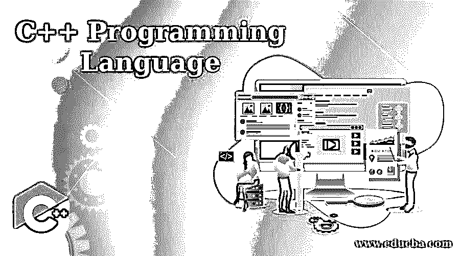
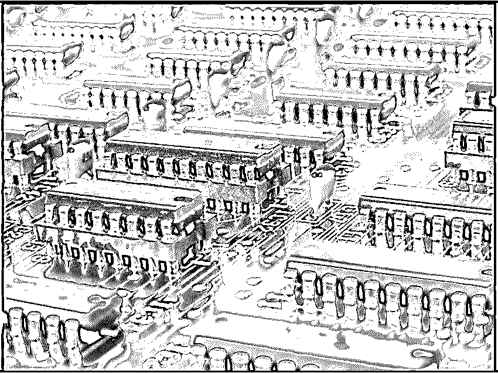
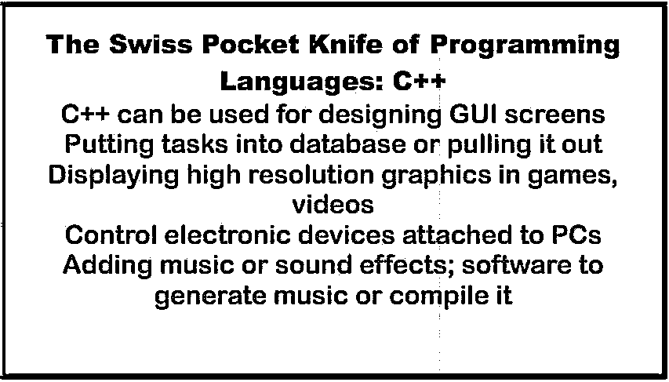
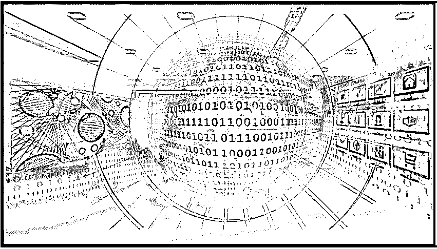
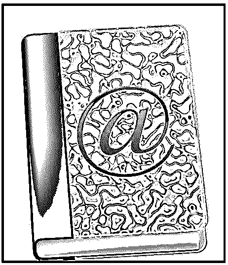
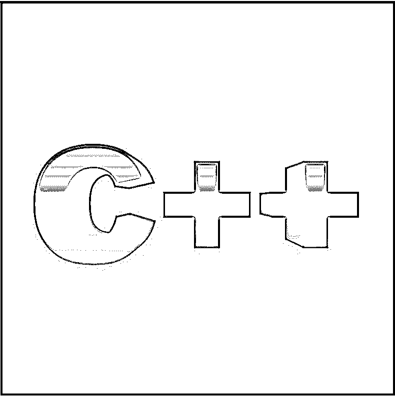
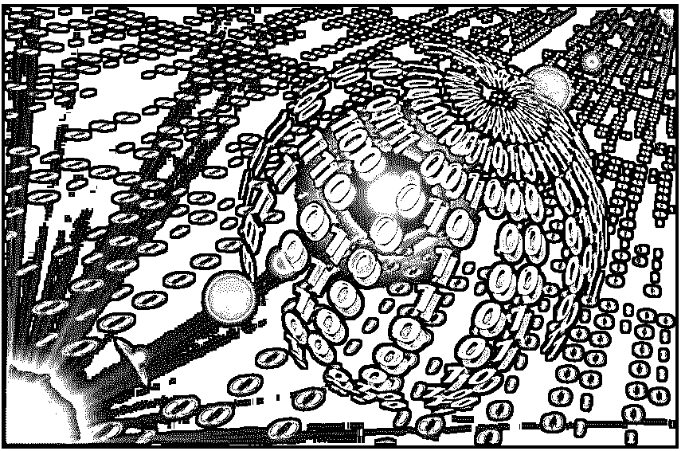
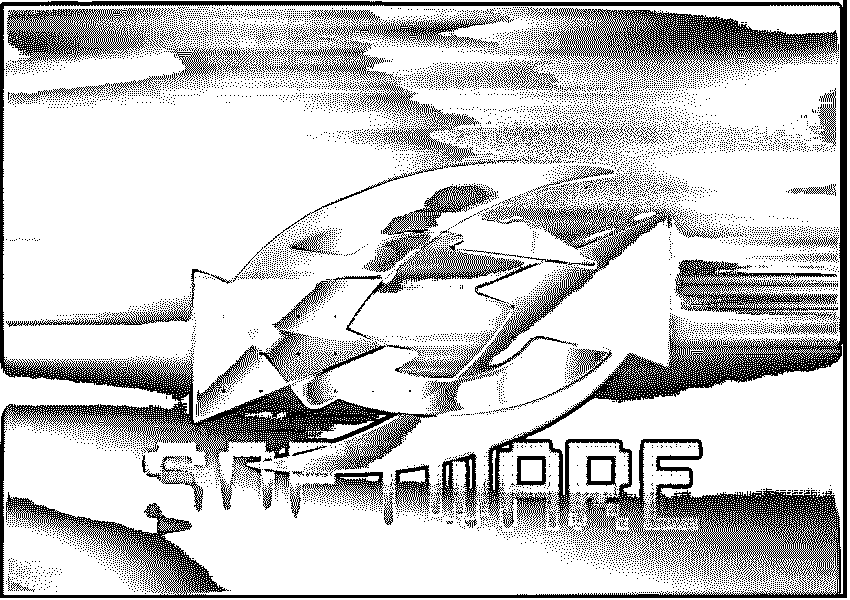
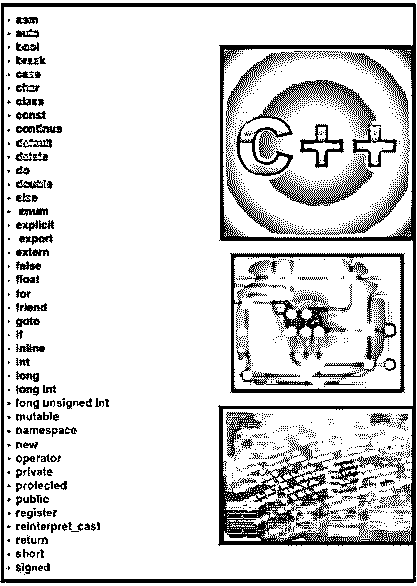

# C++编程语言

> 原文：<https://www.educba.com/c-programming-language-basics/>

## C++编程简介

C++编程语言提供了从函数编程到元编程的无限可能性。使用这种神奇的语言，在虚拟世界中扬帆远航，驶向新的彼岸。如果你想知道 [C++](https://www.educba.com/course/learn-c-programming-beginner-advanced/ "Comprehensive C++ Training") 是做什么的，这里是这种独特编程语言的终极备忘单。

### C++编程语言:添加到 C 上，匹配 Java

*   C++是一种面向对象的编程语言或 OOP。
*   这种语言是由比雅尼·斯特劳斯特鲁普开发的
*   它被称为 C ++，因为它是 C 语言的扩展
*   C++是一种混合语言——它可以用任何一种方式编码
*   这是一种中级语言(它具有高级和低级语言的特点)
*   它早先被称为“带类的 C ”,并在 1983 年被重新命名为 C++。
*   C++是 Simula 和 c 的混合体。

### C++是怎么用的？

*   C++用于从计算机游戏到操作系统和编译器的各种应用程序。
*   C++是一种在每个平台上都可以使用的编程语言，它没有很多与 Java 相关的问题。
*   这种语言是在 20 世纪 80 年代早期由贝尔实验室发明的
*   这种编程语言是对 C 编程语言的补充，包括现代编程
*   C++与 C 兼容得如此之好，以至于它可以编译超过 99%的 C 程序，而不需要修改哪怕一个源代码
*   任何计算机可以物理执行的事情，从处理数字到文本，都可以用 C++编程

<small>网页开发、编程语言、软件测试&其他</small>

*图片来源:pixabay.com*

### C++:编程没有限制

有了 C++，你可以做更多的事情。那么，C++的初衷是什么呢？嗯，Java 是为了控制烤面包机而设计的，C 是为了编程操作系统，Pascal 是为了传授好的编程方法，然而 C++是万能的，可以在广泛的应用中使用。

这也是为什么大部分电脑都有 C++的原因。它是一种通用编程语言，可以在各种类型的微型计算机中找到。每种操作系统都有 C++编译器。商业版和免费版都有，包括 Borland 的 Turbo C++ Explorer、Watcom C++编译器等等。这些编译器将帮助你编辑、编译和调试[应用](https://www.educba.com/bundle/mobile-apps-full-courses-bundle/ "Apps Full")。

### 开源软件用 C++写过吗？

很多开源软件都是用 C++写的。与商业应用程序的源代码不同，开放源代码很容易获得。C++是世界上最流行的编程语言之一。

*图片来源:pixabay.com*

### 解码 C++

*   C++使用[系统/应用软件](https://www.educba.com/system-software-tools/ "What is Application Software and System Software?")、驱动程序、客户端-服务器应用程序以及嵌入式固件。
*   C++是预定义的类的集合，这些数据类型可以被实例化多次。这种语言增强了用户定义的类的减速能力，以容纳执行特定功能的成员函数。
*   可以定义某个类的许多对象来实现其中的功能
*   对象是在运行时创建的实例。C++的特别之处在于，类也可以被新的类所继承，这些新的类获得了公共的和受保护的功能。这种编程语言包括几个运算符，如比较算术、[位操作](https://www.educba.com/bit-manipulation-in-java/)和逻辑运算符。编译器是在高级程序中创建的，这使得理解不同的编程语言变得更容易——它们也被称为解释器或汇编器，被内置于各种编程应用程序中。C++是一种编译语言。
*   C++ programs can be compiled through the use of Integrated Development Environment which integrates development tools such as text editors and tools for direct compilation.

    **推荐课程**

    *   [专业 UNIX & Linux OS 课程](https://www.educba.com/software-development/courses/linux-training-certification/)
    *   HTML 5 在线认证课程

### C++:看到好处

C++优势明显。这种中级语言有以下特点:

*   静态类型化和编译
*   通用
*   区分大小写
*   自由形式编程语言

支持过程化、面向对象和泛型编程

C++是 C 的超集，完全支持封装、数据隐藏、继承和多态。

### C++的构建模块

C++由三部分组成:核心语言、C++标准库和标准模板库。核心语言包括变量、数据类型和文字。C++标准库包括操作字符串、文件等的函数。STL 或标准模板库提供了大量的数据结构操作方法。

#### ANSI:黄金标准

ANSI 标准确保 C++是可移植的，并且用于微软编译器的代码将在 Mac、UNIX、Alpha 或 Windows Box 上无错误地工作。主要的 C++编译器支持 ANSI 标准。

#### C++:多种编程风格，不同的头像

这种独特的编程语言支持多种风格，包括 Fortran、C、Smalltalk 等等。每种风格都有自己的运行时间和空间效率。

C++实际上用于每一个应用领域，它还被用于编写设备驱动程序和软件，这些驱动程序和软件是基于在实时约束下对硬件的直接操作。这种编程语言既用于教学，也用于研究。

不管你用的是苹果的苹果电脑还是 Windows 电脑，C++都是 T2 用户界面的基础。最常用和可用的编译器是 GNU C++编译器，也可以选择 HP 或 Solaris 编译器。

**Note:** [Become a C++ Developer](https://www.educba.com/career-tracks/become-a-c-developer/)
Learn to design and customize programs for various platforms. Code, test, debug, and implement software applications. Develop skills to ensure applications run smoothly.

### C++:基础知识

C++中的注释可以是单行或多行，以/*开头，以*/结尾。注释也可以以//开头，延伸到行尾。

下面列出了 C++中的内置数据类型和用户定义的数据类型:

| 类型 | 关键字 |
| --- | --- |
| 布尔代数学体系的 | 弯曲件 |
| 字符 | 茶 |
| 整数 | （同 Internationalorganizations）国际组织 |
| 浮点 | 漂浮物 |
| 双浮点 | 两倍 |
| 不足道的 | 空的 |
| 宽字符 | wchar_t |

### C++中的变量

范围是指程序的区域。C++中有三种方法可以将[变量声明为](https://www.educba.com/variables-in-c-plus-plus/)，即在函数或块内(局部变量)、函数参数定义内(形参)和函数外(称为全局变量)。

### C++中的常量/文字

这些是固定值，不能在程序中更改。它们也被称为文字。根据定义，不能修改它们的值。

 

*图片来源:pixabay.com*

### C++中的修饰符类型

C++中的 Char、int 和 double 数据类型前面有修饰符。修饰符改变了基类型的精确含义以适应不同的情况。

数据类型修饰符包括:

*   签名
*   无符号的
*   长的
*   短的

### C++存储类

存储类定义了 C++中变量和/或函数的生命周期和范围。说明符位于被修改的类型之前。C++程序中的存储类包括:

*   汽车
*   静态
*   注册
*   走读生
*   易变的

### C++中的运算符

运算符是一个符号，它使编译器能够执行数学或逻辑功能。C++有以下类型的运算符:

*   关系运算符
*   算术运算符
*   逻辑运算符
*   赋值运算符
*   按位运算符
*   杂项运算符

### C++中的循环类型

为了处理循环需求，C++中提供了以下选项:

*   在…期间
*   为
*   做…在…期间
*   嵌套的

### C++中的决策制定

这是基于以下任何一种类型的陈述:

*   如果语句
*   如果…else 语句
*   [开关语句](https://www.educba.com/switch-statement-in-c-plus-plus/)
*   [嵌套 if 语句](https://www.educba.com/nested-if-statements-in-java/)
*   嵌套 switch 语句

### C++函数

这包括函数头和函数体。函数包含以下部分:

*   返回类型
*   函数名
*   因素
*   功能体

C++类和对象:类定义从关键字 Class 和 class name 以及 class body 开始。类定义应该后跟分号或声明列表。类提供了对象的蓝图。对象从类中诞生。类的对象的公共数据成员可以通过直接成员访问操作符来访问。

### 继承和重载:C++如何发展

面向对象编程中一个最重要的概念是继承，它让一个派生类或新类继承现有类或基类的成员。类可以从多个类派生，并且可以从许多基类继承数据和函数。重载允许用户为函数名或运算符指定多个定义，分别称为函数和运算符重载。

 

*图片来源:pixabay.com*

### C++中的多态性

C++多态性表明对成员函数的调用将导致不同函数的执行，这取决于调用该函数的对象的性质。

#### C++抽象和封装

数据抽象是向外界提供基本信息，并保留背景细节以仅表示所需的数据。这是一种基于接口和实现分离的编程技术。

C++程序由以下元素组成:

*   代码或程序语句
*   程序数据

封装是一种面向对象的编程技术，它绑定数据和操作数据的函数。这就引出了数据隐藏的概念。封装和数据隐藏是通过用户定义的类创建的，这些类可以包含私有、公共和受保护的成员。

 

*图片来源:pixabay.com*

这种通用编程语言的目标是更好的 C 语言，具有数据抽象、通用和面向对象的编程。

#### C++的标准化:最新趋势

最初，C++的正式标准化开始于 20 世纪 90 年代，由美国国家标准协会和国际标准组织于 1998 年制定了国际标准。(C++，1998)。C++旨在通过提高灵活性和效率，确保 Simula 的高级编程技术可用于系统编程领域。

C++面向严肃的程序员，由真实问题驱动。它专注于此时此地的有用性，为可以很好实现的编程风格和特性提供支持。

C++旨在确保在时间和空间的限制下，每一种语言特性都可以在代码中使用，这依赖于对硬件的直接操作。C++代码支持可维护性，易于扩展和测试。

专业使用 C++的领域包括:

*   银行业务
*   [交易](https://www.educba.com/free-online-trading-with-non-conventional-techniques-training/ "Free Online Trading with Non-conventional Techniques Training")
*   保险
*   电信
*   军事应用

C++可以用于局域网和广域网、图形、数字、用户交互和数据库访问，它也可以与代码片段和用其他编程语言编写的程序共存。C++可用于各种开发、执行环境和教授高级概念。C++也有一个稳定的、明确的标准库支持。

#### c++中的保留字 **+**

C++里也有很多保留字，列在前面。运算符也可以重载和重定义。

 

### C++和 C:相似之处

C++和 C 区分大小写。C/C++也是自由形式；这意味着一条线没有特殊的意义。C 和 C++都提供了几种整数数据类型，让程序员可以密切控制如何使用内存。其他一些相似之处如下。两种编程语言的执行流程都是自顶向下的，并且都允许过程化编程。C 和 C++不允许反射。在这两种编程语言中，代码是在本机可执行二进制文件中编译的。两种语言的行内注释分隔符为//，块注释分隔符为/*和*/。语句以“；”结尾用 C++和 C 两种语言。这两种编程语言都支持多维数组。在 C 和 C++中，数组不是动态调整大小的，两者的平台都必须有编译器。C 和 C++提供了处理包含几个值的几个内存区域的方法。

### C++和 C:区别

可以声明几个变量。它们中的一些被分配在内存的静态区域中，也就是那些变量声明被写在函数之外的区域。

要声明 T 类型的变量 x，您需要编写:

t x；

在 C 语言中，变量只能在函数或函数或块的开始之外声明。变量也可以在块中声明。

在 C 中，类型规则是静态/弱的，而在 C++中，类型规则是静态/强的、不安全的和主格的。c 遵循命令式/过程式系统实现语言。另一方面，C++是多范例的、通用的、过程的、函数的、面向对象的和元的。

C 已经影响了 C++，C#，BitC，Objective-C，Concurrent C，JavaScript，Java，PHP，Peral，Limbo。

C++也影响了 Java、PHP 和 C#，但相似之处也仅限于此。C++影响了 D，合气道，Ada 95。

C 和 C++一样受 ALGOL 68 的影响。但是 B/BPCL、CPL 和汇编都与 C 有关，而对 C++的其他影响包括 Simula、C 本身、Ada 83、CLU 和 ML

C 的主要实现包括 CGG、Watcom C、Borland C 和 MSVC。对于 C++，实现是通过 Borland C++，Builder，LLVM/Clang，Microsoft Visual C++，GNU 编译器集合和 Intel C++编译器。C 出现得更早(1972 年)，而 C++出现在 1985 年。手动；允许更好地管理内存。C 应用程序的编译和执行速度比 C++快，增加了 5%的优势。但是由于成熟的编译器，两种语言的性能几乎相当。

C++中常用的文件扩展名。抄送，。cxx，。h，。hh、. hpp、. cpp

在 C 语言中，通常的文件扩展名是. C。

虽然 OOP 内置于 C++中，但在 C 中却不是这样，C 可以自由地建立结构来执行与对象相同的操作。缺点是 C 没有声明封装的能力。C 使用结构，从而为使用内部设计元素提供了更多的选择，而 C++使用类和结构。C 是一种面向过程的语言，而 C++是一种多范例面向对象的语言。C 不提供泛型编程，而 C++提供。另一方面，C 允许函数式编程，而 C++只是部分允许。然而，C++允许元编程，而 C 不允许。

### 结论

 

*图片来源:pixabay.com*

C++是一种精确的语言，有着无限的应用，开辟了无限可能性的广阔无垠的海洋。在广泛的应用中使用 C++，程序员增加了人类关于网络世界语言的知识和理解。无论你的专业领域是学习、研究、培训还是编程，这门语言都提供了其他语言无法复制或超越的额外优势。C++增加了虚拟世界中人的能力，以克服实时限制并创建可行的解决方案。

### 推荐文章

这是一本 C++编程语言指南。这里我们讨论了基本概念，C++是如何使用的？，分别使用循环。您也可以看看以下文章，了解更多信息–

1.  [C++面试问题](https://www.educba.com/c-plus-plus-interview-questions/)
2.  [R 编程语言](https://www.educba.com/r-programming-language/)
3.  [R 编程职业](https://www.educba.com/careers-in-r-programming/)

