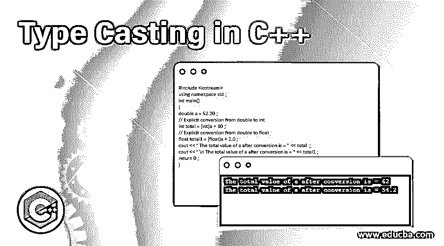

# C++中的类型转换

> 原文：<https://www.educba.com/type-casting-in-c-plus-plus/>




## C++中的类型转换介绍

顾名思义，类型转换意味着将变量类型转换成另一种类型。换句话说，让一个整型变量在需要的时候像另一个如字符一样进行一组操作。所以基本上在 C++中有两种类型的转换。一种是隐式类型转换，另一种是显式类型转换。隐式转换也称为自动类型转换，因为它是由编译器自己完成的，无需任何用户干预。如果存在多种数据类型，隐式将起作用。

让我们看看在 C++中定义类型转换的语法:

<small>网页开发、编程语言、软件测试&其他</small>

**语法:**

```
int num1;
float num2;
num2 = (float) num1;
```

在上面的语法中，num1 的值已经从 int 直接提升到 float，这也称为标准转换。

C++中还有一种类型转换，即使用 cast 运算符的转换，它类似于一元运算符，也可以从一种数据类型转换为另一种数据类型。在 cast 操作符中基本上有 4 个子类型的转换。

*   **静态造型**:用于将基类的指针造型为派生类。
*   **动态强制转换**:用于运行时强制转换。
*   **常量强制转换**:用于在强制转换中显式覆盖常量。
*   **重新解释转换**:用于将一个指针改变为任何其他类型的指针。

### C++中的类型转换示例

现在我们将通过 C++程序详细解释 C++中隐式和显式类型转换的工作原理。

#### 示例#1

下面是演示隐式和显式类型转换的 c++程序:

**代码:**

```
#include <iostream>
using namespace std ;
int main()
{
int a = 15 ;
char b = 'c' ;
a = a + b ;  // implicitly conversion of a.
float z = a + 3.0 ; // implicitly conversion of z
cout << " The Value of a is = " << a << endl
<< " The Value of b is = " << b << endl
<< " The Value of z is = " << z << endl ;
return 0 ;
}
```

**输出:**


正如您在上面的代码中看到的，我们主要声明了一个值等于 15 的整数，然后声明了一个值等于 C 的字符 b。之后，我们将 a 的值更改为 a 加 b，这是隐式类型转换的一个示例，在第二部分中，我们向声明的整数 a 添加了一个浮点值 3.0，这也是 C 编程中隐式类型转换的一个示例。最后，我们在用户屏幕上打印 a、b 和 z 的转换值。

#### 实施例 2

下面是演示显式类型转换工作的 c++程序:

**代码:**

```
#include <iostream>
using namespace std ;
int main()
{
double a = 52.20 ;
// Explicit conversion from double to int
int total = (int)a + 10 ;
// Explicit conversion from double to float
float total1 = (float)a + 2.0 ;
cout << " The total value of a after conversion is = " << total  ;
cout << " \n The total value of a after conversion is = " << total1 ;
return 0 ;
}
```

**输出:**


如你所见，在上面的代码中，我们声明了一个 double“a ”,其值等于 52.20，然后声明了一个名为“total”的整数变量，这将有助于将 double 值显式转换为 integer 值。之后，用“total1”这个名称声明一个 float，这也有助于类型转换，但是是从 double 到 float。之后，我们将 total 的值更改为+10，这是显式类型转换的一个示例，在第二部分中，我们将 float 值 2.0 添加到 total1。最后，我们在用户屏幕上打印转换后的值。

#### 实施例 3

下面的 c++程序演示了显式类型转换的工作原理:

**代码:**

```
#include <iostream>
using namespace std ;
class school
{
private :
int id_number ;
public :
school( int r ) : id_number( r )
{
}
void function() const
{
( const_cast <school*> (this) )->id_number = 92 ;
}
int getid_number()
{
return id_number ;
}
};
int main(void)
{
school sc( 2 ) ;
cout << " The previous id_number number is : " << sc.getid_number() << endl ;
sc.function() ;
cout << " The current id_number number is : " << sc.getid_number() << endl ;
return 0 ;
}
```

**输出:**


正如你在上面的代码中看到的，我们声明了一个名为“id_number”的私有整数变量，它将有助于在函数调用过程中显式转换值。之后，我们用相同的类名“school”声明了一个公共构造函数，在这个构造函数中，我们传递了一个名为“r”的整数数据类型的参数。之后，我们声明一个名为“function()”的常量函数，用于在 const_cast 的帮助下更改 id_number 的值。然后我们通过 int getid_number()函数返回 id_number 的 casted 值。最后，我们通过创建 class school 的对象“sc ”,通过 int main 在用户屏幕上打印 id_number 的转换值。我们打印两个 id_number 值，其中第一个是最旧的值，第二个是当前的 id_number 值，在使用 cout 函数进行类型转换后显示。

### 结论

无论使用何种编程语言，类型转换在编程中都起着重要的作用，因为当我们想要一次又一次地执行相同的操作，但针对不同的数据类型时，类型转换可以节省大量的执行时间，并有助于计算包含不同数据类型变量的表达式。

### 推荐文章

这是一个 C++类型转换的指南。在这里，我们还将讨论 c++中类型转换的介绍和工作原理。以及不同的示例及其代码实现。您也可以看看以下文章，了解更多信息–

1.  [c++中的抽象](https://www.educba.com/abstraction-in-c-plus-plus/)
2.  [c++中的 ifstream](https://www.educba.com/ifstream-in-c-plus-plus/)
3.  [c++中的运算符优先级](https://www.educba.com/operator-precedence-in-c-plus-plus/)
4.  [c++中的递归](https://www.educba.com/recursion-in-c-plus-plus/)


