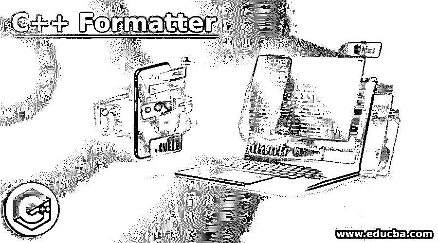

# C++格式化程序

> 原文：<https://www.educba.com/c-plus-plus-formatter/>




## C++格式化程序的定义

C++ formatter 基本上是市场上可用的工具或软件，用于将 C++源代码格式化/美化为所需的格式。C++格式化程序软件提供了许多编码风格方案，这些方案有助于以各种风格或根据程序员的特定要求对源代码进行适当的缩进格式化。这些代码格式器在市场上也被称为美化工具。源代码的格式化是必须的，因为它有助于理解和改进 bug 查找，从而节省大量的时间和金钱。

### 源代码中需要 C++格式化程序

让我们借助一个例子来理解 C++格式化程序的需要:

<small>网页开发、编程语言、软件测试&其他</small>

**代码:**

```
#include <iostream>
using namespace std;
intmain()
{
int num1, num2, add;
cout<< "Enter the first integer";
cin>> num1;
cout<< "Enter the second integer";
cin>> num2;
add = num1 + num2;
// Printing the addition result
cout<< "The result is " <<add ;
return 0;
}
```

上面的代码是两个整数的简单相加。但是它的书写方式让人很不舒服或者很难理解。需要适当的缩进，代码中需要空格。“{”之后的代码应该适当缩进，以显示所需的代码块是它的一部分。它的格式应该如下所示:

```
#include <iostream>
using namespace std;
intmain() {
int num1, num2, add;
cout<< "Enter the first integer";
cin>> num1;
cout<< "Enter the second integer";
cin>> num2;
add = num1 + num2;
// Printing the addition result
cout<< "The result is " << add;
return 0;
}
```

在实时项目中，代码非常长，因此有许多函数、方法、特定块、循环、嵌套循环等。在代码中多次开始和结束。此外，有特定的开发人员、测试人员和维护人员团队在访问相同的代码。所以代码应该以一种清晰易懂的方式编写。

### C++格式化程序的类型

市场上有很多格式器/美化器。让我们详细了解一些常用的格式化程序:

#### 1.叮当声格式

Clang-format 是最流行和最常用的开源格式化程序之一，用于格式化 C、C++和 Objective C 源代码。它自动格式化 C++代码，并帮助更好地理解代码。用 C++和 Python 语言编程。为了根据 e c++自动格式化源代码，我们需要运行以下命令:

```
clang-format -i file_path.cc
```

用户还可以根据特定的要求(除了默认可用的要求)通过在'中插入样式来执行代码的格式化。' clang-format '文件或使用 option -style = "{key:value，…。}".

#### 2.艺术风格

Artistic Styler 是一个众所周知的格式化程序和美化程序，用于缩进 C、C++、CLI 和 Java 语言的源代码。为了解决许多格式化程序在制表符位置插入空格的问题(无法在源代码中区分制表符和空格)，Artistic Style 于 2013 年 4 月开发。它是用 C++语言编写的，能够适当地重新缩进和重新格式化各种语言的源代码。它可以被程序员/测试人员直接用作命令行，也可以包含在现有程序的库中。这个美化器也适用于 Windows、Linux 和 Mac。

#### 3.漂亮的打印机

漂亮的打印机和美化器是用 C++这样的编程语言编码时必不可少的工具。它接受源代码文件，并根据各自的语法和控制语句生成另一个具有适当格式和缩进的等效代码文件。PrettyPrinter 的主要用途是代码的适当缩进，这有助于揭示函数的嵌套，以及带有适当的左括号和右括号的循环。可以使用各自的函数将长行折叠成较小的行，这有助于提高代码的可读性。它有助于向程序员揭示许多语法错误。

#### 4.金登特

Jindent 是最强大和最常用的工具之一，用于美化 Java、C 和 C++语言的源代码。它根据语法和正确的编码惯例自动缩进代码，这有助于发现代码中的错误并节省时间。Jindent 的一个很酷的特性是它为几乎所有流行的 IDE 提供了插件，比如 Visual Studio、Eclipse、Netbeans 等等，这样程序员/测试人员就可以很容易地使用它。它允许从 shell 脚本中调用它。Jindent 为所有操作系统提供支持，无论是 Windows、Mac 还是 Linux。它是用纯 Java 语言开发的，需要有一个 Java 运行时环境才能在上面正常工作。Jindent 对用户非常友好，因为它提供了 GUI，用户可以非常容易地执行格式化设置、更改环境变量等操作。

#### 5.荧光笔

它也是最常用的格式化程序之一，用于格式化 C++、Perl、HTML 以及其他一些语言的源代码。它非常用户友好，因此使用起来非常简单。用户只需将源代码复制到所需的文本字段中，选择 C++语言，并对下拉菜单进行样式设置，即可获得所需的格式。它还提供了其他有趣的功能，比如你可以选择在代码的左边看到行号，可以直接在 HTML 页面中插入源代码，而不需要添加任何外部 CSS 和 JavaScript 文件。

### 结论–c++格式化程序

上面的描述清楚地解释了市场上用于格式化 C++程序的源代码的各种格式化器/美化器。在处理实时项目时，正确的格式和缩进是必须的，因为它有助于清楚地理解代码，容易地找到 bug 和隐藏的错误，尤其是语法错误。这也有助于维护团队正确地维护代码，并相应地进一步处理。

### 推荐文章

这是一个 C++格式化程序的指南。在这里，我们还讨论了 c++格式化程序的定义和需求，以及各种类型和示例。您也可以看看以下文章，了解更多信息–

1.  [C++读取文件](https://www.educba.com/c-plus-plus-read-file/)
2.  [C++ push_back](https://www.educba.com/c-plus-plus-push_back/)
3.  [C++流](https://www.educba.com/c-plus-plus-stream/)
4.  [C++ endl](https://www.educba.com/c-plus-plus-endl/)


