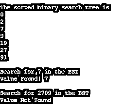
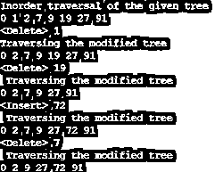

# 二叉查找树 C++

> 原文：<https://www.educba.com/binary-search-tree-c-plus-plus/>


## 二叉查找树 C++简介

C++中的二叉查找树被定义为由基于节点的二叉树组成的数据结构，其中每个节点最多由被称为子节点的 2 个节点组成。这种树也称为有序或排序树。使用这个概念，可以以有组织的方式存储数字，二叉树有助于对数据集执行快速搜索、添加和/或删除操作。使用这个概念可以实现动态集合和查找表。二叉树的结构使得能够跳过剩余树的一半，从而导致更好的时间复杂度，对于搜索、添加和/或删除操作，平均时间复杂度为 O(log n)。由于其改进的时间复杂性，该方法优于线性搜索。在本文中，我们将非常详细地研究添加、搜索和删除的所有概念。

**语法**

<small>网页开发、编程语言、软件测试&其他</small>

检索二叉查找树中根的值:

```
root->key
```

指向二叉查找树中根的左侧:

```
root->left
```

指向二叉查找树中根的右侧:

```
root->right
```

### 二叉查找树是如何在 C++中工作的？

到目前为止，我们知道二叉查找树(BST)有一个根节点和最多 2 个子节点，或者在左侧，或者在右侧，或者在左侧和右侧。BST 中的算法通过比较根节点中的值进行运算，随后值变小或变大，树中的导航相应地发生。在二叉查找树的工作中，执行 3 个操作，即:

*   **插入**:在这个操作中，如果树是空的，插入的第一个值总是根节点，现在当插入下一个值时，比较该值是否大于根节点。如果大于，它将被插入到右侧，如果不是，它将移动到左侧。如果在插入时已经有一个左边存在，它检查直到最后一个节点被命中，随后根据它或多或少，被插入到节点的相应位置。
*   **Search** :这是一个相当简单的操作，将需要搜索的数字与当前的节点值进行比较。如果需要搜索的值大于节点值，则搜索树的右侧，反之亦然。这样，我们可以避开不需要搜索的另一半树，因为二叉树是有序的。直到最后，如果节点为空，我们返回没有找到值。
*   删除:终于到了删除，这是三个中最难的一个，但是在这里我们为你简化它。当我们删除时，我们可能有 3 种可能性，我们将在下面逐一讨论:

**情况 1** :叶节点被删除。当需要删除的数字位于叶中时，这意味着没有其他值作为分支，我们只需导航到该位置并删除叶节点。

**情况二**:一个叶子节点附着在根节点上。在这里，我们导航到包含一个叶节点的节点，删除该节点并将该叶节点指定为根节点。

**情况 3** :需要删除的节点有 2 个叶子节点与之相连。这里我们找到节点的有序后继，然后复制有序后继的所有内容，接着用有序后继替换被删除的节点，并将有序后继的内容粘贴到替换被删除节点的节点。有序后继值是从删除该值的节点开始的树右侧的最大值。

理解了上述 3 个过程后，现在看一些例子，获得我们刚刚学到的理论的实践经验就更容易了。

### 例子

下面是下面提到的例子:

#### 示例#1

在 C++中插入二叉查找树

**语法**

```
#include <iostream>
using namespace std;
class nodeBST
{
int key;
nodeBST *lft, *rgt;
public:
nodeBST();
nodeBST(int);
nodeBST* insertFunc(nodeBST*, int);
void traverseInOrder(nodeBST*);
};
nodeBST ::nodeBST()
: key(0)
, lft(NULL)
, rgt(NULL)
{
}
nodeBST ::nodeBST(int value)
{
key = value;
lft = rgt = NULL;
}
nodeBST* nodeBST ::insertFunc(nodeBST* root, int value)
{
if (!root)
{
return new nodeBST(value);
}
if (value > root->key)
{
root->rgt = insertFunc(root->rgt, value);
}
else
{
root->lft = insertFunc(root->lft, value);
}
return root;
}
void nodeBST ::traverseInOrder(nodeBST* root)
{
if (!root) {
return;
}
traverseInOrder(root->lft);
cout << root->key << endl;
traverseInOrder(root->rgt);
}
int main()
{
nodeBST node, *root = NULL;
root = node.insertFunc(root, 0);
node.insertFunc(root, 27);
node.insertFunc(root, 9);
node.insertFunc(root, 19);
node.insertFunc(root, 91);
node.insertFunc(root, 2);
node.insertFunc(root, 7);
cout<<"\nThe sorted binary search tree is  "<< endl;
node.traverseInOrder(root);
return 0;
}
```

**输出:**


#### 实施例 2

用 C++在二叉查找树搜索。

**语法**

```
#include <iostream>
using namespace std;
class nodeBST
{
public:
int key;
nodeBST *lft, *rgt;
nodeBST();
nodeBST(int);
nodeBST* insertFunc(nodeBST*, int);
nodeBST* searchFunc(nodeBST*, int);
void traverseInOrder(nodeBST*);
};
nodeBST ::nodeBST()
: key(0)
, lft(NULL)
, rgt(NULL)
{
}
nodeBST ::nodeBST(int value)
{
key = value;
lft = rgt = NULL;
}
nodeBST* nodeBST ::insertFunc(nodeBST* root, int value)
{
if (!root)
{
return new nodeBST(value);
}
if (value > root->key)
{
root->rgt = insertFunc(root->rgt, value);
}
else
{
root->lft = insertFunc(root->lft, value);
}
return root;
}
nodeBST* nodeBST ::searchFunc(nodeBST* root, int key)
{
if (root == NULL || root->key == key)
return root;
if (root->key < key)
return searchFunc(root->rgt, key);
return searchFunc(root->lft, key);
}
void nodeBST ::traverseInOrder(nodeBST* root)
{
if (!root) {
return;
}
traverseInOrder(root->lft);
cout << root->key << endl;
traverseInOrder(root->rgt);
}
int main()
{
nodeBST node, *root = NULL, *searchRoot = NULL;
root = node.insertFunc(root, 0);
node.insertFunc(root, 27);
node.insertFunc(root, 9);
node.insertFunc(root, 19);
node.insertFunc(root, 91);
node.insertFunc(root, 2);
node.insertFunc(root, 7);
cout<<"\nThe sorted binary search tree is  "<< endl;
node.traverseInOrder(root);
cout<<"\nSearch for 7 in the BST  "<< endl;
searchRoot = node.searchFunc(root, 7);
if(searchRoot == NULL)
{
cout<<"Value Not Found\n";
}
else
{
cout << "Value Found! "<<searchRoot->key<<"\n";
}
cout<<"\nSearch for 2709 in the BST  "<< endl;
*searchRoot = NULL;
searchRoot = node.searchFunc(root, 2709);
if(searchRoot == NULL)
{
cout<<"Value Not Found\n";
}
else
{
cout << "Value Found! "<<searchRoot->key<<"\n";
}
return 0;
}
```

**输出:**




#### 实施例 3

在 C++中删除二叉查找树。

**语法**

```
#include <bits/stdc++.h>
using namespace std;
struct node {
int key;
struct node *lft, *rgt;
};
struct node* newNode(int item)
{
struct node* temp
= (struct node*)malloc(sizeof(struct node));
temp->key = item;
temp->lft = temp->rgt = NULL;
return temp;
}
void inorder(struct node* root)
{
if (root != NULL) {
inorder(root->lft);
cout << root->key << " ";
inorder(root->rgt);
}
}
struct node* insertFunc(struct node* node, int val)
{
if (!node)
{
return newNode(val);
}
if (val > node->key)
{
node->rgt = insertFunc(node->rgt, val);
}
else
{
node->lft = insertFunc(node->lft, val);
}
return node;
}
struct node* minValueNode(struct node* node)
{
struct node* current = node;
while (current && current->lft != NULL)
current = current->lft;
return current;
}
struct node* deleteFunc(struct node* root, int key)
{
if (root == NULL)
return root;
if (key < root->key)
root->lft = deleteFunc(root->lft, key);
else if (key > root->key)
root->rgt = deleteFunc(root->rgt, key);
else {
if (root->lft==NULL and root->rgt==NULL)
return NULL;
else if (root->lft == NULL) {
struct node* temp = root->rgt;
free(root);
return temp;
}
else if (root->rgt == NULL) {
struct node* temp = root->lft;
free(root);
return temp;
}
struct node* temp = minValueNode(root->rgt);
root->key = temp->key;
root->rgt = deleteFunc(root->rgt, temp->key);
}
return root;
}
int main()
{
struct node* root = NULL;
root = insertFunc(root, 27);
root = insertFunc(root, 9);
root = insertFunc(root, 19);
root = insertFunc(root, 91);
root = insertFunc(root, 2);
root = insertFunc(root, 7);
root = insertFunc(root, 0);
root = insertFunc(root, 1);
cout << "Inorder traversal of the given tree \n";
inorder(root);
cout << "\n<Delete> 1\n";
root = deleteFunc(root, 1);
cout << "Traversing the modified tree \n";
inorder(root);
cout << "\n<Delete> 19\n";
root = deleteFunc(root, 19);
cout << " Traversing the modified tree \n";
inorder(root);
cout << "\n<Insert> 72\n";
root = insertFunc(root, 72);
cout << " Traversing the modified tree \n";
inorder(root);
cout << "\n<Delete> 7\n";
root = deleteFunc(root, 7);
cout << " Traversing the modified tree \n";
inorder(root);
return 0;
}
```

**输出:**




### 结论

在本文中，我们研究了使用二叉查找树可能实现的操作，以及理论上相应的方法，并通过 3 个示例研究了它的实践方面，涵盖了二叉查找树的整个学习空间。

### 推荐文章

这是一个二叉查找树 C++的指南。这里我们讨论使用二叉查找树可能的操作，以及理论上相应的方法。您也可以看看以下文章，了解更多信息–

1.  [Trie 数据结构 C++](https://www.educba.com/trie-data-structure-c-plus-plus/)
2.  [C++本](https://www.educba.com/c-plus-plus-this/)
3.  [c++中的新功能](https://www.educba.com/new-in-c-plus-plus/)
4.  [C++移动语义](https://www.educba.com/c-plus-plus-move-semantics/)


