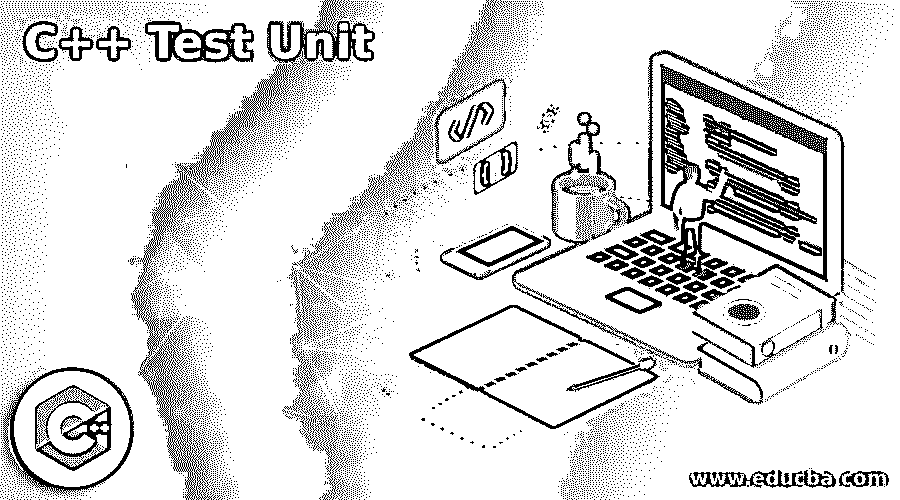
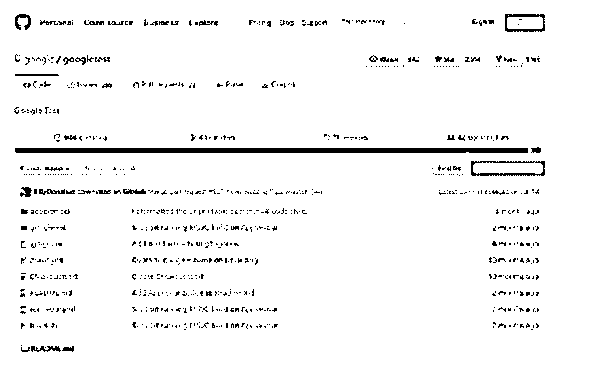
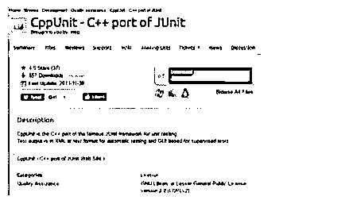

# C++测试单元

> 原文：<https://www.educba.com/c-plus-plus-test-unit/>

## C++测试单元简介

C++测试单元被定义为，它是一种为 C++中的方法或函数编写测试的方式。在这种情况下，它只能测试选定对象内部的固定代码，并且我们可以说，单元测试意味着交流能够证实应用程序或库的独立部分或单元的代码。一个单元可以是一个应用程序的单一可测试部分，其中单元测试可以评估一个单独部分中的代码，单元测试是一个可以证实代码单元性质的测试级别。

### 什么是 C++测试单元？

单元测试的主要目的是分离测试的代码，并按照计划确定。这是开发过程中的主要步骤，因为它有助于在早期阶段发现错误，而这在以后是很难发现的。这也意味着，为了编写能够描述任何应用程序的单独部分或单元的代码，可测试部分的一小部分被称为测试单元，在 C++中，可以为方法和函数编写测试，在这些方法和函数中，只能在单个对象内部进行测试。

<small>网页开发、编程语言、软件测试&其他</small>

### 为什么要使用 C++测试单元？

下面给出了为什么要使用 C++测试单元:

*   及早发现愚蠢的错误:单元测试可以在集成测试之前发现错误，同样，我们也不能在产品化之后发现错误，因此，我们可以说单元测试就像一个安全网，在这个安全网中，编写错误的每个方法或函数都需要时间，我们可以在创建错误时捕捉到它们。
*   为了避免回归:所有的错误并不愚蠢，但有些非常聪明，所以可以称之为回归，如果我们的系统已经在生产中工作了很长时间，我们需要添加新功能，然后我们需要修改代码，然后我们需要推出新版本。
*   获得早期反馈:使用 C++的单元测试可以提供早期反馈，有时反馈就像我们没有创建一个新的回归，我们可以说早期反馈就像信心。
*   更好的设计:对代码进行单元测试就像编写一个被分成不同单元的代码，可测试的代码是灵活的，因为不同的测试单元是松散耦合的。

### C++测试单元框架

下面给出了 C++测试单元框架:

#### 1.谷歌测试

这个框架是 Google 为他们的内部使用而开发的，现在它是最流行的 C++测试框架，易于使用，能够描述用测试结果生成 ML 报告的过程。

#### 2.增强测试库

它是流行的 C++单元测试框架，由 C++委员会的一些人创建，在文档和异常处理方面非常出色。

#### 3.共产党人

根据 Java 的 Junit 测试框架，Cppunit 可以着手匹配 C++的收益，这可以由使用过 Junit 或者我们可以说类似测试工具的开发人员使用。

### C++测试测试工具

下面给出了一些测试工具:

#### 1\. NUnit

*   这是一个可以免费使用的工具，它可以允许交互式地解释测试脚本，但不能冲动。
*   它的执行过程与 Junit 为 Java 工作的过程类似。
*   它可以辅助数据驱动的测试，并相应地通过测试。
*   此外，它可以利用控制台转轮来填充和执行测试。

#### 2.JMockit

*   它是一个开源工具，可以用于单元测试，有一组工具和 API。
*   这个工具已经被开发人员和 API 使用，用来在 TestNG 或 Junit 的帮助下解释测试。
*   它可以作为标准使用模拟对象的替代物进行仔细检查。
*   它可以有三种类型的代码覆盖率，行覆盖率，路径覆盖率和数据覆盖率。

#### 3.女子名

*   它是一个开源工具，可以计算 java 代码覆盖率。
*   它可以让每个开发人员快速覆盖代码。
*   它可以帮助类、行、方法和基本块覆盖以及报告类型，如文本、HTML 和 XML。
*   它完全依赖于 Java。

#### 4.被子 HTTP

*   它是一个自由的跨平台软件，依赖于软件的优势。
*   它在语句覆盖率的帮助下，帮助计算单元测试中 Java 程序的覆盖率。
*   它可以集成 Junit，也有一些方法来管理流程图，还可以轻松地生成报告。

#### 5.html 格式

*   它可以管理 JavaScript，也可以提供 GUI 属性，如表单、链接、表格等。
*   它可以用作 Java 单元测试框架来测试框架中使用的 web 应用程序，如 Junit 和 TestNG。

#### 6.Embunit

*   它的概述与 Junit 相同，它可以用有组织的形式描述测试用例来创建源代码。
*   它可以减少关于保留在类似测试套件中的测试用例的单元测试的定制。

#### 7.简单测试

*   它是一个开源的单元测试框架，专门用于 PHP 编程语言。
*   其中的测试用例类可以通过方法和代码从基本测试类扩展而来。

### 结论

在本文中，我们得出结论，C++单元测试是测试一个方法或函数的方法，其中我们也看到了为什么要测试单元，它的框架，以及 C++的测试工具，所以本文将有助于理解 C++单元测试的概念。

### 推荐文章

这是一个 C++测试单元指南。这里我们讨论一下入门，为什么要用 C++测试单元？框架和工具。您也可以看看以下文章，了解更多信息–

1.  [C++用户输入](https://www.educba.com/c-plus-plus-user-input/)
2.  [C++线程睡眠](https://www.educba.com/c-plus-plus-thread-sleep/)
3.  [C++ Fill()](https://www.educba.com/c-plus-plus-fill/)
4.  [C++反向插入器](https://www.educba.com/c-plus-plus-back_inserter/)

