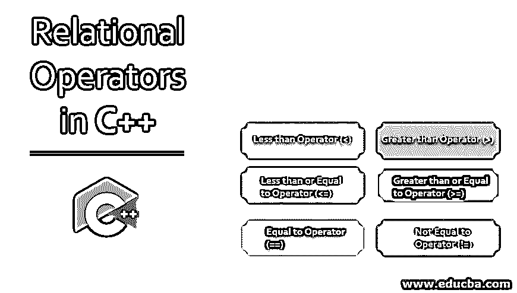

# C++中的关系运算符

> 原文：<https://www.educba.com/relational-operators-in-c-plus-plus/>




## C++中的关系运算符简介

关系运算符也称为比较运算符。关系运算符用于关联条件，即比较两个值并输出结果。在本文中，我们将借助例子来看看 C++中的那些关系运算符。

### C++中不同的关系运算符

总共有 6 个关系运算符==，！=，，<=, > =解释如下:

<small>网页开发、编程语言、软件测试&其他</small>

#### 1.小于运算符(

这个运算符称为小于运算符。它检查左操作数的值是否小于右操作数的值。如果它满足条件，那么它返回真值，否则返回假值。

#### 2.大于运算符(>)

这个运算符称为“大于”运算符。它检查左操作数的值是否大于右操作数的值。如果满足条件，则返回值为真，否则返回假。

#### 3.小于或等于运算符(< =)

这个运算符称为小于或等于运算符。它检查左操作数的值是否小于或等于右操作数的值。如果满足条件，则返回值为真，否则返回假。

#### 4.大于或等于运算符(> =)

该运算符被称为大于或等于运算符。它检查左操作数的值是否大于或等于右操作数的值。如果满足条件，则返回值为真，否则返回假。

#### 5.等于运算符(==)

这个运算符被称为，因为它等于运算符。它检查左操作数的值是否等于右操作数的值。如果满足条件，则返回值为真，否则返回假。

#### 6.不等于运算符(！=)

调用此运算符是因为它不等于运算符。它检查左操作数的值是否不等于右操作数的值。如果满足条件，则返回值为真，否则返回假。

### C++中关系运算符的例子

下面是 C++中关系运算符的不同例子:

#### 示例#1

实现大于运算符的示例如下。

**代码:**

```
#include <iostream>
using namespace std;
int main()
{
int X, Y;
cout << "Enter the value of X: ";
cin >> X;
cout << "Enter the value of Y: ";
cin >> Y;
if(X > Y)
{
cout << "X is greater than Y";
}
else
{
cout << "Y is greater than X";
}
return 0;
}
```

**输出:**


#### 实施例 2

实现小于运算符的示例如下。

**代码:**

```
#include <iostream>
using namespace std;
int main()
{
int X, Y;
cout << "Enter the value of X: ";
cin >> X;
cout << "Enter the value of Y: ";
cin >> Y;
if(X < Y)
{
cout << "X is less than Y";
}
else
{
cout << "Y is less than X";
}
return 0;
}
```

**输出:**


#### 实施例 3

实现大于或等于运算符的示例如下。

**代码:**

```
#include <iostream>
using namespace std;
int main()
{
int X, Y;
cout << "Enter the value of X: ";
cin >> X;
cout << "Enter the value of Y: ";
cin >> Y;
if(X >= Y)
{
cout << "X is greater than or equal to Y";
}
else
{
cout << "Y is greater than or equal to X";
}
return 0;
}
```

**输出:**


#### 实施例 4

实现小于或等于运算符的示例如下。

**代码:**

```
#include <iostream>
using namespace std;
int main()
{
int X, Y;
cout << "Enter the value of X: ";
cin >> X;
cout << "Enter the value of Y: ";
cin >> Y;
if(X <= Y)
{
cout << "X is less than or equal Y";
}
else
{
cout << "Y is less than or equal to X";
}
return 0;
}
```

**输出:**


#### 实施例 5

实现等于运算符的示例如下。

**代码:**

```
#include <iostream>
using namespace std;
int main()
{
int X, Y;
cout << "Enter the value of X: ";
cin >> X;
cout << "Enter the value of Y: ";
cin >> Y;
if(X == Y)
{
cout << "X is equal to Y";
}
else
{
cout << " X is not equal to y";
}
return 0;
}
```

**输出:**


#### 实施例 6

实现不等于运算符的示例如下。

**代码:**

```
#include <iostream>
using namespace std;
int main()
{
int X, Y;
cout << "Enter the value of X: ";
cin >> X;
cout << "Enter the value of Y: ";
cin >> Y;
if(X != Y)
{
cout << "Condition is true";
}
else
{
cout << "condition is false";
}
return 0;
}
```

**输出:**


### 推荐文章

这是 C++中关系运算符的指南。在这里，我们将讨论基本概念、C++中的 6 大关系运算符以及示例和代码实现。您也可以浏览我们推荐的文章，了解更多信息——

1.  [C++算法](https://www.educba.com/c-plus-plus-algorithm/)
2.  [C++编译器](https://www.educba.com/best-c-plus-plus-compiler/)
3.  [C++替代品](https://www.educba.com/c-plus-plus-alternatives/)
4.  [c++中的类型转换](https://www.educba.com/type-casting-in-c-plus-plus/)


