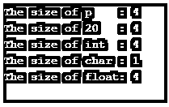
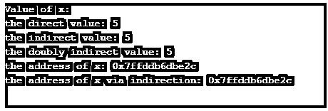
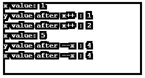

# C++中的一元运算符

> 原文：<https://www.educba.com/unary-operators-in-c-plus-plus/>


## C++中一元运算符简介

一元运算符是对单个操作数进行运算以给出特定结果的运算符。要对这些运算符执行运算，我们只需使用单个操作数。C++提供了各种一元运算符，如一元加运算符、一元减运算符、递增运算符、递减运算符、运算符地址、运算符大小、逻辑非、取值运算符和按位非运算符。这些运算符具有左右结合性，语法类似于后缀运算符。

### C++中一元的不同运算符

C++编程语言中有九种一元运算符，如下所述:

<small>网页开发、编程语言、软件测试&其他</small>

#### **1。一元加号**

一元加号运算符由符号“+”表示，该运算符不对操作数值进行任何更改。它总是代表操作数的值。

**语法:**

```
+
```

**代码:**

```
#include<iostream>
using namespace std;
int main()
{ int y = + 10;
printf("y = %d \n" , y);
return 0;
}
```

**输出:**


#### 2.一元**米** **国大**

一元减运算符用符号“-”表示，该运算符对操作数值进行修改，结果是给定值为负。将正值转换为负值，将负值转换为正值。它总是代表操作数的值。

**语法:**

```
-
```

**代码:**

```
#include<iostream>
using namespace std;
int main() {
int y;
float x = 2.34;
y = (int) x;
x = -x;
cout << x;
return 0;
}
```

**输出:**


#### 3.增量运算符

增量运算符用符号“++”表示。增量运算符总是将值增加 1。通常有两种类型后递增和前递增运算符。

**语法:**

```
++
```

**代码:**

```
#include <stdio.h>
using namespace std;
int main()
{
int p=10;
int q=20;
printf("The value of p: %d\n",++p);
printf("The value of q: %d\n",q++);
return 0;
}
```

**输出:**


#### 4.减量运算符

减量运算符用符号“-”表示。减量运算符总是将值减 1。通常有两种类型后减量和前减量运算符。

**语法:**

```
--
```

**代码:**

```
#include <stdio.h>
using namespace std;
int main()
{
int p=10;
int q=20;
printf("The value of p: %d\n",--p);
printf("The value of q: %d\n",q--);
return 0;
}
```

**输出:**


#### 5.运营商的地址

运算符的地址用符号“&”表示。该运算符返回任何变量的地址。因为它通常采用其操作数的地址。运算符地址的操作数可以是函数，也可以是驻留在对象中的整数值。

**语法:**

```
&
```

**代码:**

```
#include <stdio.h>
using namespace std;
int main()
{
int x, p=20;
printf("Value of p: %d\n",x);
printf("Address of p: %X\n",&p);
return 0;
}
```

**输出:**


#### 6.操作员的规模

运算符的大小由符号“size of()”表示。操作符的大小就像一个函数。该运算符总是返回变量和对象占用的大小。该运算符还返回任何数据类型的大小。它也称为编译时一元运算符。

**语法:**

```
sizeof()
```

**代码:**

```
#include <stdio.h>
using namespace std;
int main()
{
int p=20;
printf("The size of p    : %d\n",sizeof(p));
printf("The size of 20   : %d\n",sizeof(20));
printf("The size of int  : %d\n",sizeof(int));
printf("The size of char : %d\n",sizeof(char));
printf("The size of float: %d\n",sizeof(float));
return 0;
}
```

**输出:**




#### 7.解引用运算符

解引用运算符用符号“*”表示。该运算符返回一个等于指针地址值的整数值。该运算符也称为间接运算符。

**语法:**

```
*
```

**代号:** 

```
#include <iostream>
using namespace std;
int main() {
int x = 5;
int *yx = &x;
int **yyx = &yx;
cout  << "Value of x:\n"
<< "the direct value: " << x << endl
<< "the indirect value: " << *yx << endl
<< "the doubly indirect value: " << **yyx << endl
<< "the address of x: " << yx << endl
<< "the address of x via indirection: " << *yyx << endl;
}
```

**输出:**




#### 8.逻辑非

逻辑 NOT 运算符用符号“！”表示.该运算符反转其操作数的含义。该运算符也称为逻辑否定运算符。操作数将隐式转换为布尔数据类型。

**语法:**

```
!
```

**代码:**

```
#include <iostream>
using namespace std;
int main() {
int x = 0;
if (!x)
cout << "x is zero" << endl;
}
```

**输出:**


#### 9.逐位非/某人的恭维

按位 NOT 运算符用符号“~”表示。该运算符产生操作数的按位一补码。这个运算符也称为补码运算符。这意味着每一个 1 都将被转换为 0。

**语法**:

```
~
```

**代码:**

```
#include <iostream>
using namespace std;
int main () {
unsigned short x = 0xFFFF;
cout << std::hex << x << endl;
x = ~x;
cout << std::hex << x << endl;
}
```

**输出:**


让我们再举一个例子，通过[单个 C++代码](https://www.educba.com/what-is-c-plus-plus/)来表示一元运算符的功能:

```
#include <iostream>
using namespace std;
int main()
{
int x = 1;
cout << "x value: " << x << endl;
int y = x++; // post increment
cout << "y value after x++ : " << y << endl;
cout << "x value after x++ : " << x << endl;
x = 5;
cout << "x value: "<< x<<endl;
y = --x;
cout << "y value after --x : " << y << endl;
cout << "x value after --x : " << x << endl;
return 0;
}
```

**输出:**




### 结论

一元运算符对于在尽可能短的时间内执行各种计算和类型转换非常有用。使用这些一元操作符可以提高代码效率，因为您不需要为操作符可以在一点时间内完成的基本任务创建函数。

### 推荐文章

这是 C++中一元运算符的指南。在这里，我们还讨论了 c++中前 9 个一元运算符的基本概念。您也可以看看以下文章，了解更多信息–

1.  [Python 运算符](https://www.educba.com/python-operators/)
2.  [c++中的正则表达式](https://www.educba.com/regular-expressions-in-c-plus-plus/)
3.  [Windows 操作人员](https://www.educba.com/windows-operators/)
4.  [Java 中的一元运算符](https://www.educba.com/unary-operators-in-java/)


