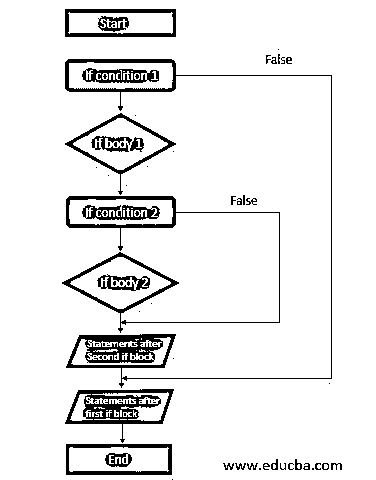

# 在 C++中嵌套 if

> 原文：<https://www.educba.com/nested-if-in-c-plus-plus/>


## C++中嵌套 if 介绍

C++中的嵌套 if 在同一范围内使用了多个 if 语句。if 语句是一个决策语句，允许根据指定的条件做出决策。当有多个条件并且它们相互依赖时，if 语句可以嵌套。嵌套的 if 语句允许逐个检查多个条件。嵌套 if 语句是通过将一个 if 语句用于另一个 if 语句而形成的。使用它们的次数没有限制，但是内部 if 语句只有在外部 if 语句为真时才会执行。

**语法:**

<small>网页开发、编程语言、软件测试&其他</small>

```
if ( condition1 ) {
// statement 1
if (condition 2 ) {
. . . and so on
// statement 2
}
}
```

### 流程图




### C++中嵌套 if 的使用

*   在上图中，我们展示了带有两个 if 条件的嵌套 if 的流程图。
*   将首先检查第一个 if 条件，如果它为假，则程序将退出第一个 if 块，并转到第一个 if 块之后的后续语句。
*   在第一个 if 条件为真的情况下，程序将进入第一个 if 的主体。在第一个 if 的主体中，我们有第二个 if 条件。
*   现在将检查该条件，然后执行第二个 if 块。
*   在 second if 条件为假的情况下，将不执行 second if 块，程序将转到 second if 块之后的语句。
*   注意，第二个 if 只有在第一个 if 为真的情况下才会执行。
*   类似地，当我们有两个以上嵌套的 if 时，只要连续的 if 语句为真，程序就会进入内部。
*   如果 if 语句为 false，则不会执行相应的 if 块。

### C++中嵌套 if 的例子

下面是一些例子:

#### 示例#1

所有如果条件为真。

**代码**:

```
#include<iostream>
using namespace std;
int main()
{
int a = 10; // Declare and assign values to variables
int b = 20;
if (a == 10) { // first if condition : variable a is checked
cout << " value of a is: " << a << endl;
if ( b == 20) { // second if condition : variable b is checked
cout << " value of b is: " << b << endl;
}
}
return 0;
}
```

**输出**:


这里，我们嵌套了两个 if 条件。第一个 if 条件是检查变量 a 的值。如果值匹配，那么将打印第一条语句。然后将检查第二个 if 条件，如果第二个条件满足，将打印第二条语句。在输出中，可以看到当条件以要求的顺序满足时，两个语句都被打印出来。

#### 实施例 2

仅当条件为真时为外部。

**代码:**

```
#include <iostream>
using namespace std;
int main()
{
int a = 10; // Declare and assign values to variables
int b = 20;
if (a == 10) { // first if condition : variable a is checked
cout << " value of a is: " << a << endl;
if ( b == 30) { // second if condition : variable b is checked with wrong value
cout << " value of b is: " << b << endl;
}
}
return 0;
}
```

**输出:**


这里，打印第一条语句，因为只有外部 if 条件为真。当程序转到第二个 if 条件时，它变为 false，因此第二条语句不被打印。

#### 实施例 3

如果条件为真，则为内部；如果条件为假，则为外部。

**代码**:

```
#include <iostream>
using namespace std;
int main()
{
int a = 10; // Declare and assign values to variables
int b = 20;
if (a == 50) { // first if condition : variable a is checked with wrong value
cout << "value of a is: " << a << endl;
if ( b == 20) { // second if condition : variable b is checked
cout << " value of b is: " << b << endl;
}
}
cout << " End of program... " << endl;
return 0;
}
```

**输出:**


这里，即使内部 if 条件为真，也不会检查它，因为外部 if 条件本身为假。作为第一个，如果条件为 false，则不执行第一个 if 块中的代码，并且不会在控制台输出中打印上述两个语句。

#### 实施例 4

多个 if 语句。

**代码:**

```
#include <iostream>
using namespace std;
int main()
{
int a = 10; // Declare and assign values to variables
int b = 20;
int c = 30;
if ( a < b ) { // first if condition : variable a is checked with variable b
cout << " a is less than b " << endl;
if ( b < c ) { // second if condition : variable b is checked with variable c
cout << " b is less than c " << endl;
if ( a < c ) { // third if condition : variable a is checked with variable c
cout << " a is less than c " << endl;
}
}
}
cout << " End of program... " << endl;
return 0;
}
```

**输出:**


这里我们嵌套了三个 if 条件语句。有三个变量 a、b 和 c。根据它们的值对它们进行比较。我们认为所有的条件都是真实的，但是在现实世界的应用中，它们可以是任何东西。注意这里嵌套 if 语句的使用，因为我们可以按顺序逐个检查条件。

### 结论

C++中的嵌套 if 语句允许检查多个条件。将按顺序逐一检查多个条件。如果任何外部 If 条件为假，则不会执行子序列内部 if 语句。

### 推荐文章

这是一个 C++中嵌套 if 的指南。在这里，我们讨论 C++中嵌套 if 的介绍，以及工作和相应的例子。您也可以看看以下文章，了解更多信息–

1.  [Python 中的 if else 语句](https://www.educba.com/if-else-statement-in-python/)
2.  [嵌套在 R 中的 For 循环](https://www.educba.com/nested-for-loop-in-r/)
3.  [在 JavaScript 中嵌套 if](https://www.educba.com/nested-if-in-javascript/)
4.  [c++中的类型转换](https://www.educba.com/type-casting-in-c-plus-plus/)


