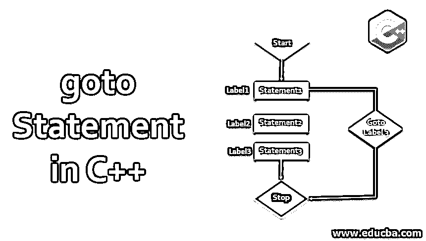
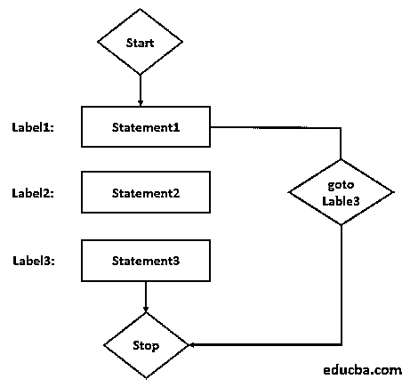

# C++中的 goto 语句

> 原文：<https://www.educba.com/goto-statement-in-c-plus-plus/>




## C++中 goto 语句介绍

goto 语句是一个跳转控制语句，它利用 goto 关键字，通过跳转到函数内标签名后面的其他语句来控制程序的流程。 [goto 语句使用](https://www.educba.com/goto-statement-in-c-sharp/)标签名跳转到其他语句，标签名是用户定义的标识符，使用冒号来区分标签名。

goto 语句中有两种语法是首选的:

<small>网页开发、编程语言、软件测试&其他</small>

**语法#1:**

```
goto label;
.
.
.
label:
```

上面语法中的 Label 表示用户定义的输入，它告诉编译器跳过该代码段或代码块进行任何操作。在标签可以放置在 goto 标签之前的意义上，标签和 goto 标签的颠倒也是可能的。将在如下的第二语法中描述它:

**语法#2:**

```
label:
.
.
.
goto label;
```

这个语法 2 的工作方式与语法 1 相似，只是在结构遵循和操作上有细微的差别。目标是找到目标并在代码之间执行跳转。

### C++中 goto 语句的流程图

下面给出了 C++中 goto 语句的流程图和解释。




**解释:**它的执行流程是这样工作的，假设程序员给出输入，然后执行语句或代码片段，然后想跳到程序中的某个地方，他或她将试图找到目标标签，一旦找到，这些语句将被执行，然后是 goto 语句，最后执行停止。

另一种方法是，在执行之后，我们可以在执行之后首先去目标标签，然后通过从目标标签移动到 goto 语句来进行上下文切换。因此，执行的流程可以是任何东西，但是 goto 语句的特殊特性使得遍历和跳转更容易，这符合程序员的兴趣水平。

goto 语句也有一些缺点。只关注积极的方面根本不是一个好主意。

*   它创建了一个非常复杂的代码结构，就像 ALTRAN、FORTRAN 等早期语言的代码结构一样。
*   主要问题是年后打开代码看懂代码。
*   如果 goto 语句在 go-to 调用之上，它会进入一个无限循环，这就变得非常乏味。

因此，我们想到的下一个问题是如何避免这些 goto 语句，答案是它们是不可避免的，替代它们的是连续和中断语句，它们的工作和功能也与 goto 语句相同，但使用起来仍不如使用 goto 语句有利。

### goto 语句在 C++中是如何工作的？

尽管 goto 语句被认为对所有程序员都非常有利，因为它使他们能够轻松地从一个代码块平滑地跳转到另一个代码块。让我们看看它有多少种表现方式。

#### 类型 1:基于语法#1

许多计划使用 goto 语句的程序员最喜欢使用语法 1，但这不是使用语法 1 的强制条件，语法 1 包括标签定义，后跟 goto 语句。为此，它可以包括任何可行的方式，这取决于用户及其定制。

**示例:**假设我们想找出一个数字是偶数还是奇数，并使用 goto 语句相应地打印输出。这个代码片段或示例将给出一个解释:

**代码:**

```
#include <iostream>
using namespace std;
void CheckEvenOrOdd (int x)
{
if (x % 2 == 0)
goto even;
else
goto odd;
cout << x << " is even";
return;
odd:
cout << x << " is odd";
return;
even:
cout << x << " is even";
return;
}
int
main ()
{
int x = 26;
CheckEvenOrOdd (x);
return 0;
}
```

**输出:**


#### 类型 2:基于语法#2

**示例:**在此示例中，我们将遵循语法 2，它与语法 1 相反，带有一个标签，后跟 going 语句。从两者都仅作为代码转换方式(即上下文切换)的意义上来说，没有太大的区别。

在此示例中，我们可以推断出这样一个事实，即在方法表示和定义之后，可以精确定位 goes to label，然后调用它，然后将目标指定给 point，使上下文切换变得容易，也就是说，它有助于用户根据需求轻松给出和定制他们的定义。

**代码:**

```
#include <iostream>
using namespace std;
void printAllNumbers ()
{
int a = 1;
label:
cout << a << " ";
a++;
if (a <= 10)
goto label;
}
int main ()
{
printAllNumbers ();
return 0;
}
```

**输出:**


### C++中 goto 语句的例子

以下是 C++中 goto 语句的示例:

#### 示例#1

**代码:**

```
#include<iostream>
using namespace std;
void checkGreater()
{
int s, t;
s=2; t=5;
if(s>t)
goto sGreater;
else
goto tGreater;
sGreater:
cout<<s<<" is greater";
return;
tGreater:
cout<<t<<" is greater";
}
int main ()
{
checkGreater ();
return 0;
}
```

**输出:**


#### 实施例 2

**代码:**

```
#include <iostream>
using namespace std;
void printAllNumbers ()
{
int d = 1;
print:
cout << d << " ";
d++;
if (d <= 5)
goto print;
}
int main ()
{
printAllNumbers ();
return 0;
}
```

**输出:**


### 结论

毫无疑问，goto 语句非常有用，它为程序员提供了灵活性和多功能性，可以在同一程序内以及程序外从一个代码段跳转到另一个代码段。但是每次程序员都不能用古老的游牧式编程方式来束缚自己。根据遵循结构代码或代码结构执行的现代方式，像连续和中断语句这样的替代方案被用来满足上述缺点。人们总是认为，我们应该让代码不那么复杂，易于理解，交付质量不能通过使用 goto 语句来实现，但可以通过使用 continuous 和 break 语句来轻松实现。

### 推荐文章

这是一个 C++中 goto 语句的指南。在这里，我们通过例子和代码实现来讨论 goto 语句在 C++中是如何工作的。你也可以看看下面的文章来了解更多-

1.  [c++中的控制语句](https://www.educba.com/control-statement-in-c-plus-plus/)
2.  [c++中的 Switch 语句？](https://www.educba.com/switch-statement-in-c-plus-plus/)
3.  [c++中的多重映射](https://www.educba.com/multimap-in-c-plus-plus/)
4.  [c++中用户定义的数据类型](https://www.educba.com/user-defined-data-types-in-c-plus-plus/)


