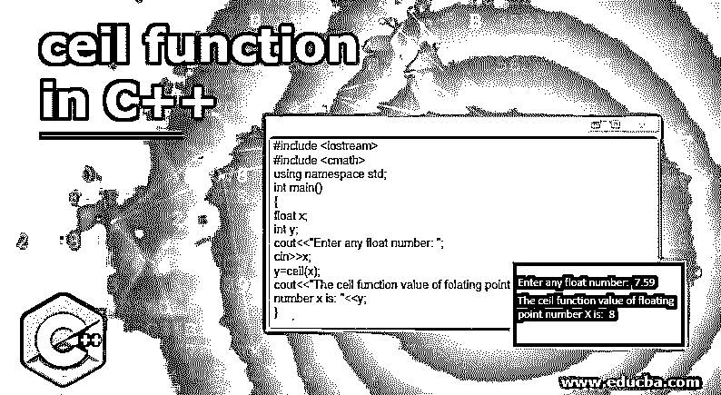

# C++中的 ceil 函数

> 原文：<https://www.educba.com/ceil-function-in-c-plus-plus/>




## C++中的 ceil 函数介绍

ceil 是一个函数，它将下一个可能的大于或等于整数的数作为输出提供给以参数形式作为输入提供的随机数。该功能一般定义在库:<cmath>下。这个函数代表上限。在许多情况下，我们需要获得一个函数或值的上限和下限，通过应用这个函数可以很容易地做到这一点。</cmath>

### 句法

这个函数是标准库中的默认函数。ceil 的语法类似于一个简单的函数。将有一个参数值传递到 ceil 函数内部，以获得大于或等于参数值的最低可能值。

<small>网页开发、编程语言、软件测试&其他</small>

```
Data_type ceil(data_type variable_number);
```

它将单个参数值作为其参数，并返回一个整数值。一般来说，有许多函数存在，这使得许多问题陈述更容易解决。其中一个功能是“Ceil”。

并且，通常，ceil 函数与 floor 函数并行使用。这些函数精确地给出了与参数中给出的浮点数的较低值和较高值相关的整数值。

### C++中 ceil 函数的例子

让我们看看不同的例子来了解“ceil”函数:

#### 示例#1

**代码:**

```
#include <iostream>
#include <cmath>
using namespace std;
int main()
{
float x;
int y;
cout<<"Enter any float number: ";
cin>>x;
y=ceil(x);
cout<<"The ceil function value of folating point number x is: "<<y;
}
```

**输出:**


#### 实施例 2

现在，让我们看一个参数中整数值的例子。

**代码:**

```
#include <iostream>
#include <cmath>
using namespace std;
int main()
{
int x;
int y;
cout<<"Enter any integer number: ";
cin>>x;
y=ceil(x);
cout<<"The ceil function value of integer point number x is: "<<y;
}
```

**输出:**


#### 实施例 3

下面，让我们以天花板和地板功能为例。

**代码:**

```
#include <iostream>
#include <cmath>
using namespace std;
int main()
{
float x;
float y,z;
cout<<"Enter any integer number: ";
cin>>x;
y=ceil(x);
z=floor(x);
cout<<"The ceil function value of integer point number x is: "<<y<<endl;
cout<<"The floor function value of integer point number x is: "<<z;
}
```

**输出:**


在这里，我们可以清楚地看到，通过使用 ceil 函数，值 20.5 被设为 21，如果使用 floor 函数，则被减少到 20。

#### 实施例 4

我们使用数据类型作为整数而不是浮点。

**代码:**

```
#include <iostream>
#include <cmath>
using namespace std;
int main()
{
int x;
float y,z;
cout<<"Enter any integer number: "
cin>>x;
y=ceil(x);
z=floor(x);
cout<<"The ceil function value of integer point number x is: "<<y<<endl;
cout<<"The floor function value of integer point number x is: "<<z;
}
```

**输出:**


上面和下面编写的程序的唯一区别在于突出显示的数据类型。

因为，在下面的程序中，输入值是整数数据类型，虽然我们以十进制格式给出输入，但编译器只将其存储为整数值。这就是我们为作为数据类型 integer 的输入给出的数据获得相同的上限值和下限值的原因。

#### 实施例 5

现在，为了提供整数的上限值，我们可以使用“double”来代替“int”数据类型。

**代码:**

```
#include <iostream>
#include <cmath>
using namespace std;
int main()
{
double x;
float y,z;
cout<<"Enter any integer number: ";
cin>>x;
y=ceil(x);
cout<<"The ceil function value of integer point number x is: "<<y<<endl;
}
```

**输出:**


#### 实施例 6

这里，让我们检查一个负输入值的例子。

**代码:**

```
#include <iostream>
#include <cmath>
using namespace std;
int main()
{
float x;
float y,z;
cout<<"Enter any integer number: ";
cin>>x;
y=ceil(x);
cout<<"The ceil function value of integer point number x is: "<<y<<endl;
}
```

**输出:**


作为练习，尝试提供不同的数据类型和任何其他场景来了解 ceil 函数*。*

### 结论

以上面讨论的方式，我们已经定义了 ceil 函数，并且我们已经通过 C++编程语言成功地实现了它。我们还检查了 floor 和 ceil 函数之间的主要区别，以及编译器如何基于所使用的数据类型以及在负面场景中返回输出。

### 推荐文章

这是一个 C++中 ceil 函数的指南。这里我们讨论 C++中 ceil 函数的介绍和各种例子以及代码实现。您也可以看看以下文章，了解更多信息–

1.  [C++ any()](https://www.educba.com/c-plus-plus-any/)
2.  [c++中的类型转换](https://www.educba.com/type-casting-in-c-plus-plus/)
3.  [C++设定精度](https://www.educba.com/c-plus-plus-setprecision/)
4.  [c++中的抽象](https://www.educba.com/abstraction-in-c-plus-plus/)


