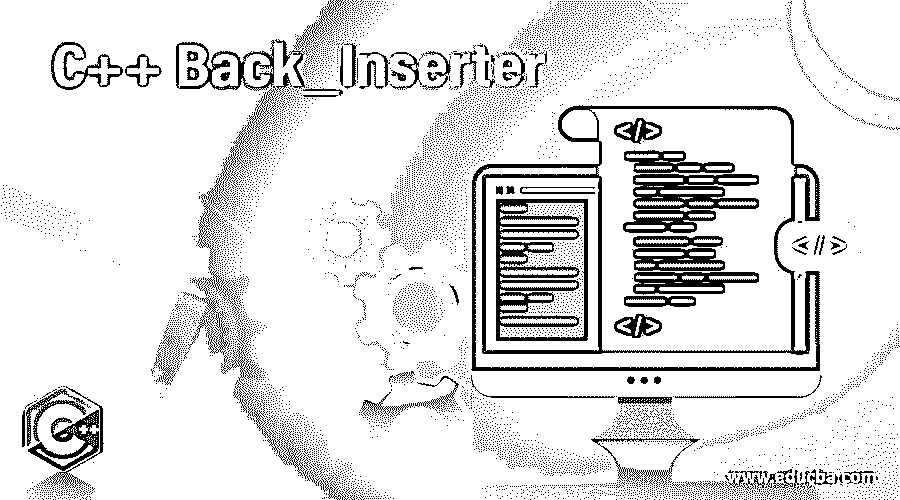

# c++ Back _ insert

> 原文：<https://www.educba.com/c-plus-plus-back_inserter/>




## c++ Back _ insert 简介

C++中的 back_inserter 方法用于构造迭代器，迭代器负责在“x”或容器的末尾插入新元素，该方法应用于该容器，该方法在程序的头文件中定义。在 C++中，这是一种特殊类型的输出迭代器，旨在让算法覆盖任何元素，而不是强制插入新元素。

**语法**

<small>网页开发、编程语言、软件测试&其他</small>

现在我们已经理解了这个 C++ back_inserter 方法是什么，让我们学习语法并理解它。back_inserter 的语法如下:

```
std::back_inserter ( Container & x );
```

当我们必须在容器末尾插入新元素时，我们在参数中传递容器，这就是我们在语法中看到的容器。所以这个方法返回的是插入到容器末尾的元素列表。接下来，我们将看看所解释的方法是如何工作的。

### Back_Inserter 方法在 C++中是如何工作的？

理解 back_inserter 方法的工作方式很重要，它的工作方式是创建一个回插迭代器，负责向列表中添加或插入新元素。这个反向插入迭代器是一种特殊的迭代器，它允许算法覆盖元素。继续，我们现在将理解示例并演示 back_inserter 的工作方式。

### C++ Back_Inserter 示例

下面提到了不同的例子:

#### 示例#1

我们的第一个例子是 back_inserter 的简单工作；这里，我们将元素添加到列表的末尾。代码如下:

**代码:**

```
#include <iostream>
#include <vector>
#include <algorithm>
#include <iterator>
int main()
{
std::vector<int> v{1, 2, 3, 4, 5, 6, 7, 8, 9, 10};
std::fill_n(std::back_inserter(v), 3, -1);
std::cout << "\n The output for the code is: ";
for (int n : v)
std::cout  <<  n  << ' ';
}
```

**代码解释:**

简单地从导入重要的系统文件开始，然后进入我们的主代码。然后我们有了我们的 std，它是程序的名称空间，接下来是定义作用域；我们有一个整数数据类型的向量，值为 1 到 10。然后我们使用 back_inserter 语句，将容器作为 n 传递，就像我们学习语法一样，后跟 x 参数。

然后我们有了第一个输出 print 语句，它只是打印一个字符串语句，back_inserter 结果会跟在它后面。最后，我们有我们的语句，其中我们传递我们的向量，将数字作为 n，然后传递下一行，如果我们的最终输出语句以负的形式打印 vector 中的数字。请参考下面附上的截图，以正确理解输出。

**输出:**


正如所料，输出以 print 语句开始，然后是数字列表。最后的这些数字包括 back_inserter 的结果，是负数，现在，继续下一个例子。

#### 实施例 2

我们的第二个例子处理分配容器的大小。我们有一个包含 3 个值的容器，然后我们创建另一个没有任何特定大小的容器。让我们看看它是如何工作的。代码如下:

**代码:**

```
#include <iostream>
#include <iterator>
#include <vector>
#include <algorithm>
using namespace std;
int main()  {
vector<int> v1 = { 7, 8, 9 };
vector<int> v2;
std::copy(v1.begin(), v1.end(), std::back_inserter(v2));
cout << "\n Elements of Container 1 are : ";
int i;
for (i = 0; i < 3; ++i) {
cout << v1[i] << " ";
}
cout << "\n Elements of Container 2 are : ";
for (i = 0; i < 5; ++i) {
cout << v2[i] << " ";
}
return 0;
}
```

**代码解释:**

从所有需要的系统文件开始，然后初始化 main。然后，我们有一个整数数据类型的第一个向量，它包含 3 个值，还有一个相同类型的第二个向量，但没有特定的大小或值。然后开始复制操作，复制 vector 1 的开头和结尾部分，并为 vector 2 实现 back_inserter。

现在我们开始打印向量包含的值的列表。首先是一个 cout 语句，后面是 for 语句，我们在其中计算并打印向量的每个元素。对于我们的第一个向量，这个 For 语句将只打印 3 个值，仅此而已。转到我们的第二个向量，在 for 内，我们希望它打印 5 个值。这里我们将有 2 个新值，它们将是零，但被添加到向量的最后一部分。请参考下面附加的屏幕截图，以正确理解输出。

**输出:**


正如预期的那样，我们有两个带有 2 个向量值的打印语句。

#### 实施例 3

继续我们的下一个例子，我们将看到我们的第三个例子。让我们看看它是如何工作的。代码如下:

**代码:**

```
#include <iostream>
#include <iterator>
#include <vector>
#include <algorithm>
int main () {
std::vector<int> dab,bar;
for (int i=1; i<=5; i++){
dab.push_back(i); bar.push_back(i*5); }
std::copy (bar.begin(),bar.end(),back_inserter(dab));
std::cout << "\n Our Container contains: ";
for ( std::vector<int>::iterator it = dab.begin(); it!= dab.end(); ++it )
std::cout << ' ' << *it;
std::cout << '\n';
return 0;
}
```

**代码解释:**

与我们之前的例子相似，我们有系统文件，然后声明两个整数类型的向量。然后我们有 for 语句，向列表中添加新的值，下一个语句有 push_back 和 us 乘以列表中的值。这些事情发生在我们的第一个向量中，然后我们将所有的值复制到第二个向量中。然后是我们的 print 语句和 for 语句，用于正确地打印值。参考下面附上的截图。

**输出:**


### 优势

一个主要的优势是当我们不知道容器的大小时。因此，当我们不得不插入新元素，但不知道可以插入的新元素的大小和数量时，我们的操作就不可能成功。但是使用 back_inserter，不需要声明容器的任何大小，这意味着容器以后可以扩展到任何限制。

除了这些优点，我们还需要理解 back_inserter 只能用于已经有 push_back 方法的容器。

### 结论

back_inserter 在 C++编程语言中提供了一个方法，该方法构造一个迭代器，并执行通过末尾向列表中插入新元素的操作。使用 back_inserter 的好处是我们不需要有一个合适的列表数。此外，我们理解了示例和代码的实现。

### 推荐文章

这是一个 C++ Back_Inserter 的指南。这里我们讨论 Back_Inserter 方法在 C++中是如何工作的，以及代码和输出的例子。您也可以看看以下文章，了解更多信息–

1.  [C++位集](https://www.educba.com/c-plus-plus-bitset/)
2.  [C++设定精度](https://www.educba.com/c-plus-plus-setprecision/)
3.  [c++中的正则表达式](https://www.educba.com/regular-expressions-in-c-plus-plus/)
4.  [c++中的类型转换](https://www.educba.com/type-casting-in-c-plus-plus/)


