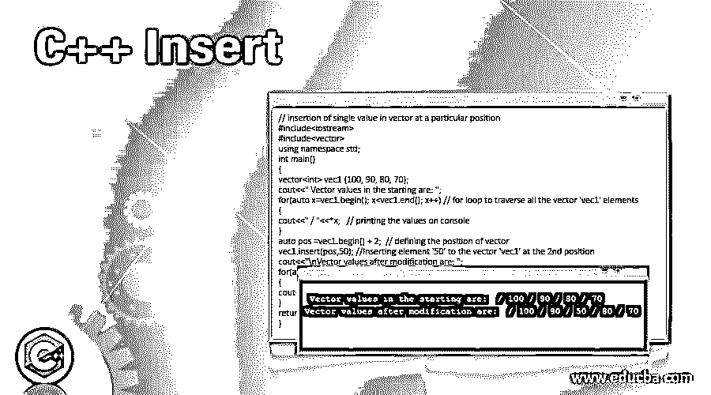

# C++插入

> 原文：<https://www.educba.com/c-plus-plus-insert/>




## C++简介插入

正如我们已经知道的，向量就像一个用来存储元素的动态数组，但是它有一种特殊的能力，可以根据插入或删除的元素来调整大小。c++中的 Insert 函数用于在 vector 中插入元素。可以在特定位置插入元素，也可以将整个向量插入另一个向量。使用 insert 函数在向量中插入元素允许自动重新分配内存。如果元素总数超过了总容量，它会将大小增加/减少到正常容量。

**语法**

<small>网页开发、编程语言、软件测试&其他</small>

下面给出了 C++中 Insert 函数正常插入元素的基本语法:

```
iterator s_name.insert(element)
```

使用 C++中的 insert 函数在所需位置插入元素的语法:

```
iterator s_name.insert(position, element)
```

在所需位置插入多个元素或一系列元素的语法:

```
iterator s_name.insert(position, iterator_first, iterator_last)
```

在哪里，

**s_name:** 它是将要插入元素的集合名称。

**element:** 强制参数，包含给定集合中需要插入的元素或元素列表。

**位置:**定义元素在集合中需要插入的位置数。

**返回值:**使用插入函数时，返回‘迭代器’，指向插入值的第一个元素。

**first，last:** 定义了要插入到第一个和最后一个之间的元素的范围，包括“第一个”元素，但不包括指向“最后一个”的元素

### C++中的 Insert 函数是如何工作的？

正如我们上面已经说过的，C++中的 insert()函数将元素插入到 vector 中。它根据参数中提供的参数值工作，这些参数值说明了插入是正常进行还是在特定位置进行。让我们通过下面给出的例子来理解 insert()函数的不同工作方式:

#### 示例#1

C++中在 Vector 中插入单个值

**代码:**

```
// insertion of a single value in the vector
#include<iostream>
#include<vector>
using namespace std;
int main()
{
vector<int> vec1 {100, 90, 80, 70};
cout<<" Vector values in the starting are: ";
for(auto x=vec1.begin(); x<vec1.end(); x++) //for loop to traverse all the vector 'vec1' elements
{
cout<<" / "<<*x;   //printing the values on console
}
vec1.insert(vec1.end(),60); //Inserting element '60' to the vector 'vec1' at the end
cout<<"\nVector values after modification are: ";
for(auto x=vec1.begin(); x<vec1.end(); x++) //for loop to traverse all the vector elements
{
cout<<" / "<<*x;
}
return 0;
}
```

**输出:**


**说明:**

在上面的例子中，我们正在初始化 vector 'vec1 '的元素。为了插入元素，使用了 insert(vec1.end()，element)。在这个函数中，vec1.end()用于开始在 vec1 的最后插入元素。第二个参数是要插入的元素。最后，在控制台上打印出插入了新值的最终向量。

#### 实施例 2

在另一个向量中插入多个值或向量数组

**代码:**

```
// insertion of single value in vector at a particular position
#include<iostream>
#include<vector>
using namespace std;
int main()
{
vector<int> vec1 {100, 90, 80, 70};
cout<<" Vector values in the starting are: ";
for(auto x=vec1.begin(); x<vec1.end(); x++) // for loop to traverse all the vector 'vec1' elements
{
cout<<" / "<<*x;   // printing the values on console
}
auto pos =vec1.begin() + 2;  // defining the position of vector
vec1.insert(pos,50); //Inserting element '50' to the vector 'vec1' at the 2nd position
cout<<"\nVector values after modification are: ";
for(auto x=vec1.begin(); x<vec1.end(); x++) // for loop to traverse all the vector elements
{
cout<<" / "<<*x;
}
return 0;
}
```

**输出:**


**说明:**

在上面的例子中，我们正在初始化向量“vec1”的值。为了区分，我们首先打印 vec1 的原始元素。要在特定位置插入元素，使用变量“pos”来定义位置，然后使用 insert 函数在“pos”位置插入参数(pos，element)用于定义位置和要在该位置插入的元素。

#### 实施例 3

在向量的特定位置插入元素

**代号:**

```
// insertion of single value in vector
#include<iostream>
#include<vector>
using namespace std;
int main()
{
vector<int> vec1 {100, 90,80, 70};
vector<int> vec2 {10, 9, 8, 7};
cout<<" Vector values in the vec1 are: ";
for(auto x=vec1.begin(); x<vec1.end(); x++) // for loop to traverse all the vector 'vec1' elements
{
cout<<" / "<<*x;   // printing the values on console
}
cout<<" \nVector values in the vec2 are: ";
for(auto x=vec2.begin(); x<vec2.end(); x++) // for loop to traverse all the vector 'vec2' elements
{
cout<<" / "<<*x;   // printing the values on console
}
// Inserting the vec1 values in vec2 in the end
vec2.insert(vec2.end(), vec1.begin(), vec1.end()); //Inserting elements of vector 'vec1' into the vector 'vec2' at the end
cout<<"\nVector values after modification are: ";
for(auto x=vec2.begin(); x<vec2.end(); x++) // for loop to traverse all the vector elements
{
cout<<" / "<<*x;
}
return 0;
}
```

**输出:**


**说明:**

在上面的例子中，我们声明了两个向量‘ve C1’和‘ve C2’。首先，我们打印两个向量元素的原始值。然后，使用 insert()函数将 vec1 的元素插入 vec2。它采用参数(vec2.end()、vec1.begin()、vec1.end())，这意味着插入应该从向量“vec2”的结尾开始，并采用从 vec1 的开头到结尾的范围。

### 结论

上面的描述清楚地解释了什么是 C++中的插入函数，以及在用 C++编程时如何使用它。除了上面解释的一个以外，字符串插入函数被用来在特定的位置之前或之后插入一个字符。它的语法为 str.insert(position，str_to_insert)。insert()是最重要的函数之一，程序员在使用它之前应该彻底理解它。

### 推荐文章

这是一个 C++插入指南。在这里，我们讨论了插入函数在 C++中是如何工作的，以及代码和输出的例子。您也可以看看以下文章，了解更多信息–

1.  [C++标识符](https://www.educba.com/c-identifiers-plus-plus/)
2.  [C++头文件](https://www.educba.com/c-plus-plus-header-files/)
3.  [C++位集](https://www.educba.com/c-plus-plus-bitset/)
4.  [C++设定精度](https://www.educba.com/c-plus-plus-setprecision/)


