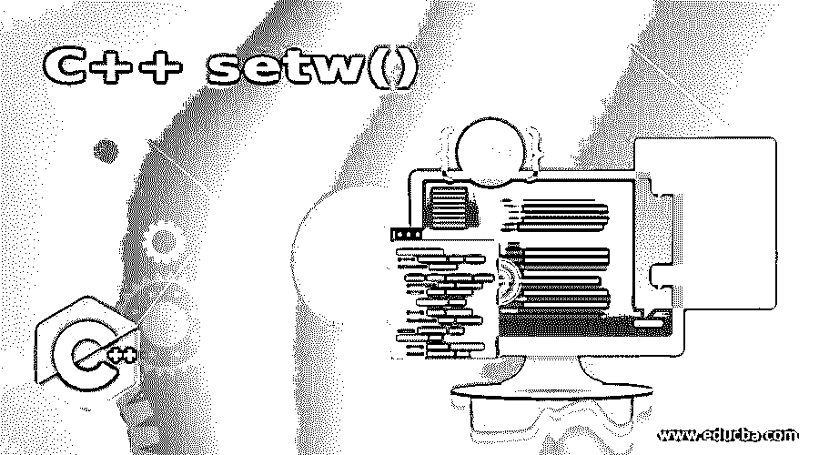
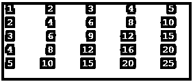

# C++ setw()

> 原文：<https://www.educba.com/c-plus-plus-setw/>




## C++ setw()函数介绍

像 C++中的不同函数一样，setw()函数帮助设置将在输出操作中使用的字段宽度。每当该函数作为参数被调用时，它将接受成员宽度。它需要一个流来插入或操作这个字段。该函数将把流出或流入的宽度参数设置为 n 倍。它将接受参数，该参数将是必须设置的宽度的新值。

**语法:**

<small>网页开发、编程语言、软件测试&其他</small>

```
setw(num)
```

setw()函数可以与表达式一起使用，而输出可以通过使用 out << setw(num) and it can be taken as an input as well by using in > > setw(num)来设置。

### setw()方法在 C++中是如何工作的？

setw()函数帮助用括号中指定的数字设置字段的宽度。下面的代码将帮助我们更好地理解这一点。

**代码:**

```
#include <iostream>
#include <iomanip>
int main () {
std::cout << std::setw(10);
std::cout <<546<< std::endl;
return 0;
}
```

**输出:**

_ _ _ _ _ _ _ 5 4 6

**解释:**在上面的代码中，我们知道我们使用了标准库。一个是输入输出流，另一个是 setw()函数所属的输入输出操作库。除非导入此库，否则此功能将不起作用。然后，main 函数使用 setw()函数来设置输出字段的宽度。我们将其设置为 10，然后将数字输出为 546。它首先将这个字段重置为 0，当指定了数字时，它被设置为 10。它将以下面的方式工作。

它将保留前 7 位为空，因为字符串的长度是 3。最后 3 位是我们作为输出使用的数字。

### 实现 C++ setw()函数的例子

我们现在将看到一些例子，帮助我们更好地理解这个功能。

#### 示例#1

将宽度从 0 设置为一个数字，然后将其重置。

**代码:**

```
// Example to see the working of std::setw manipulator
#include <iostream>
#include <iomanip> // this library stored the std::setw
int main()
{
// set initial width of 10
std::cout << std::setw(10);
std::cout << 500 << std::endl;
std::string str = "EduCBA";
// changing width to 12
std::cout << std::setw(12);
std::cout << str << std::endl;
return 0;
}
```

**输出:**


**解释:**上面的代码帮助我们理解 setw 函数的工作原理。我们已经导入了 iomanip 库。之后，我们将该字段的值设置为 10。它从 0 开始自动复位。然后我们发送一个数字作为输出。稍后，我们再次使用 setw()函数来增加宽度。在那之前我们已经声明了一个字符串 str。我们改变宽度，然后发送这个字符串作为我们的新输出。它将显示两个输出，您也可以观察到间距的变化。请查看上面的截图，这有助于我们更好地理解该计划。

#### 实施例 2

将宽度设置为小于输出中使用的字符数。

**代码:**

```
#include <iostream>
#include<iomanip>
#include<string>
using std::cout;
using std::string;
using std::endl;
int main() {
string shrtstr="Hello EduCBA! Lets set the width";
cout<<std::setw(5)<<shrtstr<<endl;
return 0;
}
```

**输出:**


**说明:**上述程序与例 1 中的程序相似。我们声明了一个存储字符串的变量 shrtsrt。我们已经使用 setw()函数将宽度设置为 5。这里绳子的长度，比绳子本身大很多。setw()函数的特殊之处在于，当定义的长度或宽度较小时，它不会截断字符串。它将显示整个字符串并将的设置为默认值 0。尽管发送给函数的参数小于字符串，并且输出具有更大的宽度，但函数仍会将整个字符串显示为输出。请检查上面的输出，以便更好地理解。

#### 示例 3–带有 for 循环的 setw()函数

我们也可以将该函数与如下循环函数一起使用:

**代码:**

```
#include 
#include 
using namespace std;
int main()
{
const int maxDisplayCount = 5;
const int width = 7;
int row;
int i;
for(row=1;row<=5;row++)
{
for(i = 1; i <= maxDisplayCount; i++)
{
cout << setw(width) << row * i;
}
cout << endl;
}
return 0;
} 
```

**输出:**




解释:在上面的程序中，我们使用了 for 循环和 setw()函数。这里我们取了一个设置为 5 的常量整数。我们还声明了一个值设置为 7 的变量。在 for 循环中，我们设置了 row 小于 5 的条件，send for 检查迭代次数，直到达到 maxDisplayCount 的值。内部 for 将一直运行，直到“I”的值达到 5。它将这些值相乘。在将这些值相乘之前，它会在每次将相乘的结果发送到屏幕之前设置宽度。这有助于通过使用此功能来设置选项卡。不需要显式指定' \t '，因为 setw()函数可以完成这项工作。外部 for 将一直运行，直到行变量达到 5。这两个 for 将保持运行，并给我们期望的输出，这将是每个数字及其倍数，直到他们达到 5。由于每次在显示结果之前使用 setw()函数，输出将是系统的。下面是上面函数的输出，它表明 setw()函数可以很容易地用于循环结构。

### 结论

setw()函数是包含操纵器函数的 iomanip 库的一部分。它有助于设置输出或输入字段的宽度。即使定义的宽度小于字符串的长度，该函数也不会截断字符串。setw()函数使代码和输出具有可读性和系统性，这有助于获得格式化的输出。

### 推荐文章

这是一个 C ++ setw()的指南。这里我们讨论 C ++ setw()函数的介绍及其示例，以及代码实现和输出。您也可以浏览我们推荐的文章，了解更多信息——

1.  [c++中的递归函数(示例)](https://www.educba.com/recursive-function-in-c-plus-plus/)
2.  [c++的 11 大特性](https://www.educba.com/features-of-c-plus-plus/)
3.  [机器学习 C++库](https://www.educba.com/machine-learning-c-plus-plus-library/)
4.  [C 语言中类型为](https://www.educba.com/hashing-function-in-c/)的哈希函数


