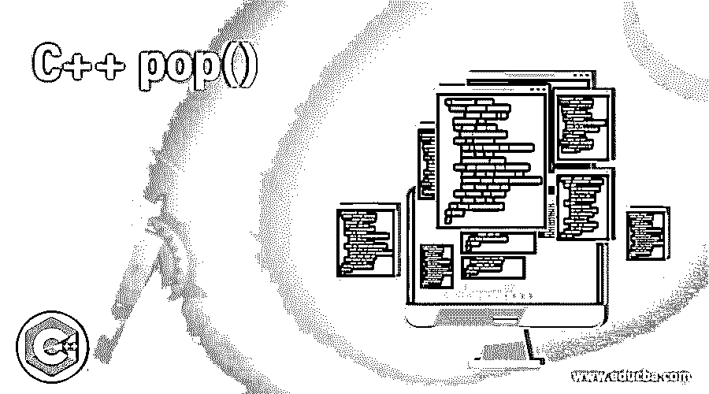

# C++ pop()

> 原文：<https://www.educba.com/c-plus-plus-pop/>




## C++ pop 简介()

C++ pop()方法是 C++堆栈数据结构的一部分，主要用于移除堆栈的顶层元素。stack 中的这个 pop()方法充当删除操作。堆栈中的删除操作以后进先出的方式执行，即 LIFO 顺序。栈中的删除总是从栈顶开始执行，这意味着最先插入的元素将被视为最先从整个栈中删除的元素。从逻辑上讲，如果最后插入的元素是最先从堆栈中删除的元素，那么堆栈大小将减少 1。

**语法**

<small>网页开发、编程语言、软件测试&其他</small>

C++ pop()的语法流程如下:

```
Name_of_Stack.pop()
```

*   **Name_of_stack:** 表示元素按顺序出现的堆栈。
*   **Pop:** 这是一个方法名，当整个堆栈由元素排列时，这个方法名被调用来将堆栈的大小减一。

**参数:**该函数不考虑任何参数，而是删除堆栈中的最后一个元素，并使堆栈的大小减一，因为最后一个元素是第一个被删除的元素。

C++ pop()函数没有返回值，因为它仅用于从堆栈中移除元素，其中最后一个元素是从堆栈中移除的第一个元素。因此，函数的返回类型为 null。

### pop()方法在 C++中是如何工作的？

*   pop()方法是堆栈数据结构的一部分，其主要目的是以某种方式从堆栈中移除最顶层的元素。该元素从堆栈容器中移除，并且由于该元素的移除，堆栈大小减少 1。pop()方法的复杂性也是不变的，因为除了从堆栈顶部移除元素之外，没有对堆栈数据结构执行重大更改。
*   甚至元素的移除也是从栈顶开始的，这不会给栈的值带来更多的变化。栈内元素的修改不会产生很大的差别，但是它执行非常微小的差别，就像它执行删除操作一样，删除操作用于反映栈顶元素的变化，即它通过反映栈顶位置来改变栈元素的最顶端位置，但是栈内的元素减少了一个大小。
*   可以认为并且说，元素移除的后进先出方式与 pop()方法结合得很好。C++中的 Pop()方法也会出现一些错误和异常，例如，如果值作为参数从方法中传递，它将会出错，尽管这不是让函数输入参数的传统方式，如果这样做，它肯定会抛出错误。
*   此外，有时也不能保证会有一些异常，或者参数会用方法的值抛出一些异常。栈推入和栈弹出是两种完全相反的方法，它们支持栈作为数据结构，但是处理后进先出顺序的整个 pop()函数不支持遵循 FIFO 的栈推入方法(先进先出方法)。
*   大多数情况下，pop()方法的返回类型是 void，因为它不执行任何关键函数，而是只执行与堆栈相关的函数，以便从堆栈中移除最顶层的元素。默认情况下，与 pop()方法相关的所有操作都将应用于堆栈顶部，这是一个约定。元素的 pop()方法有一些优点，就像堆栈中不需要的元素通过一些操作和删除操作被移除，从而使堆栈的总大小保持在所需的元素数量。
*   此外，元素检索的复杂性不是很大，因为它只是从堆栈中删除元素，而不是将堆栈中的整个元素集与不需要的元素合并。就复杂性而言，pop()方法作为一个函数没有太大的区别，因为它只是在元素之上进行更改和操作。

### 实现 C++ pop()的示例

下面是提到的例子:

#### 示例#1

这个程序演示了 C++ pop()方法的用法，该方法从堆栈中移除最顶端的元素，如输出所示。

**代码:**

```
#include <iostream>
#include <stack>
int main()
{
std::stack<int> n_stck;
for(int h=0; h<6; h++)
n_stck.push(h);
std::cout <<"Pop_Out_Elements : ";
while (!n_stck.empty () )
{
std::cout <<" " << n_stck.top();
n_stck.pop();
}
std::cout<<"\n";
return 0;
}
```

**输出:**


#### 实施例 2

这个程序演示了 C++ pop()方法，在这个方法中，顶部的元素从堆栈中删除，如输出所示。

**代码:**

```
#include <iostream>
#include <stack>
using namespace std;
int main()
{
stack<int> m_stck;
m_stck.push(5);
m_stck.push(8);
m_stck.push(7);
m_stck.push(2);
m_stck.push(11);
m_stck.push(10);
m_stck.pop();
m_stck.pop();
m_stck.pop();
while (!m_stck.empty()) {
cout << ' ' << m_stck.top();
m_stck.pop();
}
}
```

**输出:**


#### 实施例 3

这个程序演示了作为标准库函数一部分的 C++ pop()和 push()函数，该库函数用于从堆栈中移除元素，如输出所示。

**代码:**

```
#include <iostream>
#include <stack>
using namespace std;
int main()
{
int p = 0;
stack<int> m_stck;
m_stck.push(12);
m_stck.push(10);
m_stck.push(3);
m_stck.push(1);
m_stck.push(9);
m_stck.push(14);
while (!m_stck.empty()) {
m_stck.pop();
p++;
}
cout << p;
}
```

**输出:**


### 结论

C++ pop()方法是堆栈数据结构的一部分，堆栈数据结构包含标准堆栈库中的方法，使程序员可以轻松灵活地使用这些功能。这为程序员提供了关于栈的内容和数据的洞察力，这有助于通过从栈中移除不必要的元素来维护正确和适当的元素。

### 推荐文章

这是一个 C++ pop()的指南。这里我们讨论一个介绍 C++ pop()，语法，参数，它是如何工作的例子。您也可以浏览我们的其他相关文章，了解更多信息——

1.  [c++中的 ifstream](https://www.educba.com/ifstream-in-c-plus-plus/)
2.  [c++中的抽象](https://www.educba.com/abstraction-in-c-plus-plus/)
3.  [C++位集](https://www.educba.com/c-plus-plus-bitset/)
4.  [c++中的信号](https://www.educba.com/signal-in-c-plus-plus/)


