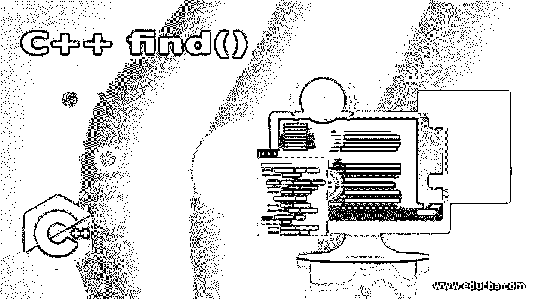

# C++ find()

> 原文：<https://www.educba.com/c-plus-plus-find/>




## C++ find()简介

C++ find()函数是标准库函数的一部分，它尝试查找指定范围元素的第一个匹配项，该范围从第一个范围开始到最后一个范围，迭代器遇到第一个元素，比较所有可能的比较后必须相等的值，如果没有找到元素，则返回最后一个元素。为了进行所有的比较，它使用运算符=来进行比较。如果 find()函数执行任何不必要的操作，它会抛出程序员不需要的异常。

**语法:**

<small>网页开发、编程语言、软件测试&其他</small>

语法流是这样的，模板使用 InputIterator 类，范围是 first、last 和 Iterator，用于值比较。

```
template <class InputIterator, class T>
InputIteratorfind (InputIteratorfrst, Input_Iteratorlst, const T&vl);
```

find()函数搜索迭代器指向的值，然后搜索由 InputIterator 类组成的模板。

*   **frst:** 它是范围从迭代器的第一个到迭代器的最后一个的自变量，由第一个和最后一个之间的所有可能元素组成，包括具有特定范围和标准的元素。
*   **lst:** 是表示整个指定范围内最后一个自变量，然后逐个比较该范围的迭代器所指向的值的自变量。
*   **vl** :对迭代器指向的值进行搜索，并考虑进一步使用。
*   如果在与现有值进行比较后，范围内第一个元素的迭代器不相同，则函数在执行所有搜索和比较后返回最后一个值。

### C++中 find()函数如何工作？

与其他函数不同的是，find()函数的工作方式是，find()函数模板有一些组件和参数，它们试图为这些组件和参数工作，因为模板用第一个和最后一个元素指定了一些范围。位于范围内的元素进行遍历，然后让指向该值的迭代器返回一些值。如果比较后的值不相等或不相同，那么它将返回最后一个元素作为考虑的值，否则它将总是在考虑时返回第一个值。迭代器的输入从序列中的第一个和最后一个元素开始，否则首先或最后搜索由第一个或最后一个迭代器指向的所有元素组成的范围。在查找元素的第一次出现时，它使用=操作符进行任何函数操作或更改。如果找到了迭代器指向的具有指定范围的元素，那么它将返回整个元素范围的第一个元素，否则它将返回最后一个元素。即使 find()函数不能搜索范围内第一个元素，它也会返回最后一个元素。如果在传递元素比较或一些无效参数时执行了一些不需要的操作，就会引发异常。这个函数的时间复杂度是线性的。

### 实现 C++ find()函数的例子

下面是 C++ find()的例子:

#### 示例#1

这个程序演示了 std C++ find()函数，指定的范围包括函数的开始和结束，如输出所示。

**代码:**

```
#include <iostream>
#include <vector>
#include <algorithm>
using namespace std;
int main(void) {
intvl = 3;
vector<int>vc = {8, 9, 3, 2, 4};
auto rslt = find(vc.begin(), vc.end(), vl);
if (rslt != end(vc))
cout<< "Elements_present_in_Vector " <<vl<<endl;
vl = 18;
rslt = find(vc.begin(), vc.end(), vl);
if (rslt == end(vc))
cout<<"Element_not_present_in_Vector" <<vl<<endl;
return 0;
}
```

**输出:**


#### 实施例 2

这个程序演示了 C++ find()函数，它使用迭代器从实际的向量中搜索元素，遍历函数的开始和结束，比较所有的元素，然后用某个值初始化一个值来验证，如输出所示。

**代码:**

```
#include <iostream>
#include <vector>
#include <algorithm>
int main ()
{
std::vector<int>vc_tr { 20, 10, 15, 12 };
std::vector<int>::iterator tr;
std::cout<< "Actual_Vector:";
for (int j=0; j<vc_tr.size(); j++)
std::cout<< " " <<vc_tr[j];
std::cout<< "\n";
intsrch = 25;
tr = std::find (vc_tr.begin(), vc_tr.end(), srch);
if (tr != vc_tr.end())
{
std::cout<< "All_Elements " <<srch<<" found_at : " ;
std::cout<<tr - vc_tr.begin() << " (Started_from_1st_index) \n" ;
}
else
std::cout<< "srch_Not_Found_Element.\n\n";
return 0;
}
```

**输出:**


**Note:** Any find() function defined should have a proper standard library for inclusion otherwise it will throw an unwanted exception saying that this member or method is not present with the designated standard library for the function which means incompatibility of function with the standard library.

### C++ find()的优势

*   作为标准库的一部分，find()函数可以被程序员用来在与指定范围内的第一个和最后一个元素进行比较时搜索元素。
*   指向第一个或最后一个元素的迭代器可以增强或操纵整个遍历过程，因为所有出现的元素都在索引中，检索值对于比较和其他操作很重要。
*   它增强了代码库的可重用性，因为一次又一次地设计和定义函数并不重要，只要需要，我们就可以调用 find 函数，并且任务变得简单，因为它已经存在于标准库中。
*   随着重写函数的范围变得简单，测试单个函数变得容易。
*   程序的划分使得代码库的视图清晰，程序员可以理解，从而编写新的增强形式的代码。

### 结论

C++中的 find()函数是标准库函数的一部分，它有助于检索元素以在指定范围内搜索所需的元素，这解决了程序员获得管理代码和迭代器使用的视图的可重用性的复杂性。

### 推荐文章

这是一个 C++ find()的指南。在这里，我们讨论 C++ find()函数的介绍及其语法，并举例说明代码实现及其不同的优点。您也可以浏览我们推荐的文章，了解更多信息——

1.  [c++中的递归函数(示例)](https://www.educba.com/recursive-function-in-c-plus-plus/)
2.  [c++的 11 大特性](https://www.educba.com/features-of-c-plus-plus/)
3.  [机器学习 C++库](https://www.educba.com/machine-learning-c-plus-plus-library/)
4.  [C 语言中类型为](https://www.educba.com/hashing-function-in-c/)的哈希函数


