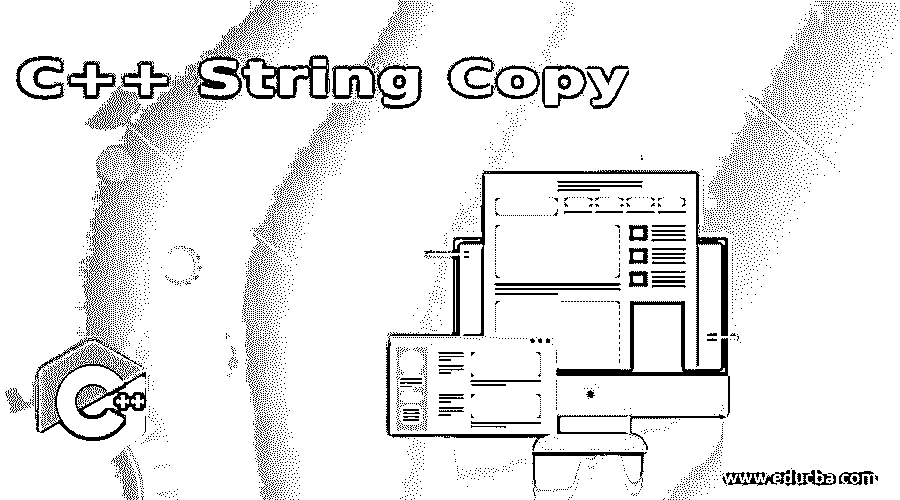

# C++字符串复制

> 原文：<https://www.educba.com/c-plus-plus-string-copy/>




## C++字符串复制的定义

字符串复制是 C++中的一个函数，用于无缝地将一个完整的字符串复制到另一个字符串，而无需做太多的修改和努力。C++中的字符串复制是标准库函数的一部分，它将一个字符串的内容，实际上是整个字符串复制到另一个字符串中。不像 C 语言，字符串复制函数存在于字符串中。h 头文件，在 C++中，字符串复制函数存在于 cstring 头文件中。使用字符串复制很容易将源字符串中的所有内容完全复制到目标字符串中。

**语法:**

<small>网页开发、编程语言、软件测试&其他</small>

C++字符串复制的语法流程如下所示:

```
string_1.copy(string_2,len_gth);
string_1.copy(string_2,len_gth,posi_tion);
```

string_1 和 string_2 是被视为源字符串和目的字符串的两个对象。让我们看看 Sting 副本是如何工作的。

**参数:**

传递的参数表示以下内容:

*   String_2 是目标字符串，它是由数据组成的目标对象，它保存来自源字符串的副本字符串。
*   String_1 表示源字符串。
*   length 表示整个字符串中子串的长度。
*   position 表示字符第一个位置的位置，以包含其值。

### C++中如何复制字符串？

复制字符串功能与 C++中的其他功能相同，尽管在 C 标准库中包含复制功能的事实存在于字符串中。header，而在 C ++中，header 函数是 cstring.h 的标准库函数。该方法必须强制包含源字符串和目标字符串，作为操作参数的一部分，并将内容从源完全复制到目标。源字符串是将被复制到目标字符串中的字符串。目标字符串是由要复制的内容或源字符串中的整个字符串组成的字符串。甚至参数也包括长度，这意味着在源或目标字符串中定义的字符串的子字符串。此外，该参数可能包括获取字符串值的位置。

有一种误解，认为源字符串被追加到目标字符串，但事实完全不同，它从来没有以这种方式工作，而是复制整个内容，而没有从源字符串追加到目标字符串。甚至源字符串也不会被修改或改变，这意味着它根本不会受到影响，它仍然和以前一样。C++中被复制的字符串的返回值包括许多被复制的字符。如果为指向目标字符串的目标指针分配的内存没有大到足以容纳来自源字符串的所有内容，那么行为仍然是未定义的。此外，字符串的格式不应该相互重叠。在内容复制或内容操作时，必须记住这两个字符串函数。

许多程序员创造了一个神话，认为 strncpy 和 strcpy 函数可以交替使用，但是如果内存分配大小增加或减少，那么 strcpy 和 strncpy 函数将同时使用，这是完全错误的。strcpy()函数满足这样的条件，其中源字符串被复制到目标字符串，并且如果目标字符串的内存分配大小大于源字符串，则源字符串很容易被复制到包括终止空字符的目标字符串，因此出现了另一种情况，其中目标字符串可能获得相对较少的内存分配，在这种情况下，终止空字符将被跳过，并且从源字符串到目标字符串的内容将被复制，这意味着终止空字符将被忽略。此外，字符串不会与目标字符串重叠，因此目标字符串必须有更多的空间和适当的内存分配。

### C++字符串复制的例子

下面是一些例子:

#### 示例#1

这个程序演示了使用 strcpy()函数将源字符串的内容复制到目标字符串，这个函数是 string.h 头文件的标准库函数的一部分，如输出所示。

**代码:**

```
using namespace std;
intmain()
{
string src_str1 = "Learning_New_Language";
char dest_on[30];
cout<<"Present_source_strng : "<<src_str1<<'\n';
src_str1.copy(dest_on,sizeof src_str1);
cout<<"Final_string_dest:"<<dest_on;
return 0;
}
```

**输出:**


#### 实施例 2

这个程序演示了当字符串中的字符位置从参数中传递过来时，字符串的复制。它将所有内容从源复制到目的地，即使在传递了输出中所示的参数之后也能获得值。

**代码:**

```
#include<iostream>
using namespace std;
intmain()
{
string str = "copy_str_func";
char str_p[19] ;
str.copy(str_p,3,7);
cout<<"Content_Of_String : " <<str_p;
return 0;
}
```

**输出:**


#### 实施例 3

这个程序演示了 strcpy()函数，它表示应该为目标字符串分配更多的内存，以便将源字符串的全部内容无缝地复制到目标字符串，如输出所示。

**代码:**

```
#include <cstring>
#include <iostream>
using namespace std;
intmain()
{
char sr_1[] = "Welcome_Everyone !";
char dest_n[50];
strcpy(dest_n,sr_1);
cout<<dest_n;
return 0;
}
```

**输出:**


**注意**:strcpy()函数有一个主要问题，它类似于目标字符串数组没有指定整个数组的大小，这对于内存分配来说是有风险的，因为具有大字符数组的数组将不会得到适当的容纳，然后它将为缓冲区和与内存相关的数组的其他功能带来问题，因为这种情况经常出现。

### 结论

C++中的 strcpy()函数主要用于将源字符串的内容复制到目标字符串，而不会妨碍源字符串的内容，然后在不改变源字符串中任何内容的情况下放置所有内容。它为程序员提供了灵活性和方便。

### 推荐文章

这是一个 C++字符串复制的指南。这里我们也讨论一下 C++中 String 的定义以及如何复制？以及不同的示例及其代码实现。您也可以看看以下文章，了解更多信息–

1.  [c++中的类型转换](https://www.educba.com/type-casting-in-c-plus-plus/)
2.  [c++中的正则表达式](https://www.educba.com/regular-expressions-in-c-plus-plus/)
3.  [C++ any()](https://www.educba.com/c-plus-plus-any/)
4.  [C++位集](https://www.educba.com/c-plus-plus-bitset/)


