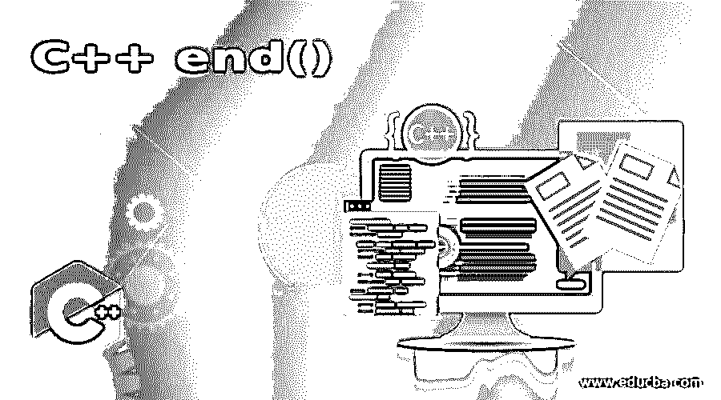
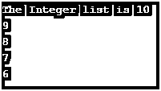
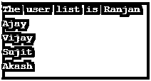
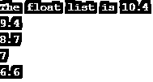

# C++ end()

> 原文：<https://www.educba.com/c-plus-plus-end/>




## C++简介 end()

在 C++中，我们通常使用 end()函数对元素列表进行迭代，它将用于打印属性的结尾。这个函数是 c++系统定义的，它可以用于任何类型的数组迭代列表。例如，如果我们有学生姓名的列表，我们想打印每个学生的姓名，这里我们可以看到学生的姓名是一个字符串，以同样的方式，可以对任何整数值进行迭代，我们可以打印列表的最终值。例如，如果我们有标记列表，那么我们可以用迭代打印每个结束标记。

**语法:**

<small>网页开发、编程语言、软件测试&其他</small>

下面是 c++中函数 end 的简单语法。从下面的语法中我们可以看到，我们使用了 end()函数和变量值。其中 value 是列表数组。它可以包含从字符串到整型列表的任何内容。这是它最重要的特性，可以使用任何类型的链表组合(整数、字符串、浮点)。

请参阅下面的语法，以便更好地理解。

```
values.end() //value can be any list of the array.
```

### end()函数在 C++中是如何工作的？

在讨论端函数之前，我们需要了解它的重要性。假设我们有一些数字数组，我们想把它们全部打印出来，那么我们将使用数组列表的迭代，并使用 cout<< index 值，输出将类似于 10964589。这里的列表类似于{10，96，45，89}，所以输出看起来像一个数字。现在，为了解决这个问题，如果我们在这里使用 end 函数，比如 cout<< index <

### 实现 C++ end()的示例

下面是我们打印数组列表末尾的一些例子。我们采用了各种类型的列表类型，如字符串、浮点和整数类型，并打印它们的值。在示例中，我们采用迭代器来执行和使用函数 end()

#### 示例#1

**代码:**

```
//Importing the package vector
#include <vector>
//Importing the package iostream to handle io works
#include <iostream>
//Using the namespace std
using namespace std;
int main(void) {
//creating a list of number of integer type
vector<float> values = {10, 9, 8, 7, 6};
cout<< "The number list without end function is";
for (auto n = values.begin(); n != values.end(); ++n)
//printing each number without using end function
cout<< *n ;
return 9;
}
```

**输出:**


#### 实施例 2

**代码:**

```
//Importing the package vector
#include <vector>
//Importing the package iostream to handle io works
#include <iostream>
//Using the namespace std
using namespace std;
int main(void) {
//creating a list of number of integer type
vector<int> values = {10, 9, 8, 7, 6};
cout<< "The Integer list is";
//Iteration over the list of the integer value
for (auto i = values.begin(); i != values.end(); ++i)
//printing each number end value
cout<< *i<<endl;
return 9;
}
```

**输出:**




#### 实施例 3

**代码:**

```
//Importing the package vector
#include <vector>
//Importing the package iostream to handle io works
#include <iostream>
//Using the namespace std
using namespace std;
int main(void) {
//Creating the list of uses for iteration
vector<string> values = {"Ranjan", "Ajay", "Vijay", "Sujit", "Akash"};
cout<< "The user list is";
for (auto i = values.begin(); i != values.end(); ++i)
//Printing the each user endvalue by iteration and by using end function
cout<< *i<<endl;
return 9;
}
```

**输出:**




#### 实施例 4

**代码:**

```
//Importing the package vector
#include <vector>
//Importing the package iostream to handle io works
#include <iostream>
//Using the namespace std
using namespace std;
int main(void) {
//Creating the list of float number of the marks
vector<float> values = {10.4, 9.4, 8.7, 7.0, 6.6};
cout<< "The float list is";
for (auto f = values.begin(); f != values.end(); ++f)
//Printing each float value of the marks
cout<< *f <<endl;
return 9.6;
}
```

**输出:**




#### 实施例 5

**代码:**

```
// Importing important packages for the program
using namespace std;
#include <bits/stdc++.h>
int main()
{
//Creating the list of marks with float type
list<float> marks;
// Here we are setting all the marks to marks variable
marks.push_back(103.3);
marks.push_back(201.4);
marks.push_back(188.5);
marks.push_back(134.3);
//Printing directly the end value of the list
list<float>::iterator m = marks.end();
//Here we are printing the last marks of variable
cout<< "The last marks from the variable is : " << *m <<endl;
//Iteration over the lists of the marks
for (auto mtr = marks.begin();
mtr != marks.end(); mtr++) {
//Here we are printing each value with the end of the marks list
cout<< *mtr<< " ";
}
return 9;
}
```

**输出:**


### C++ end()的优势

在 c++中使用 end 函数有很多优点，下面给出了其中最重要的优点。

**1。**帮助打印迭代器的最终值，因为它是一个系统定义的函数，所以使用起来非常优化。

**2。**减少额外的代码，用我们写的代码执行同样的任务。

**3。**它总是访问元素，但从不修改元素

**4。**与任何其他现有方法相比，总是提供更好的性能。

### 结论

从本教程中，我们学习了 c++中 end 函数的基础知识。我们学习了 end 函数的工作原理和语法。为了理解它的工作，我们展示了一些重要的例子。我们还关注使用 end()函数的一些优点。

### 推荐文章

这是一个 C++端的指南()。在这里，我们讨论 C++ end()的介绍及其不同的优势，并给出示例和代码实现。您也可以浏览我们推荐的文章，了解更多信息——

1.  [c++中的递归函数(示例)](https://www.educba.com/recursive-function-in-c-plus-plus/)
2.  [c++的 11 大特性](https://www.educba.com/features-of-c-plus-plus/)
3.  [机器学习 C++库](https://www.educba.com/machine-learning-c-plus-plus-library/)
4.  [C 语言中类型为](https://www.educba.com/hashing-function-in-c/)的哈希函数


