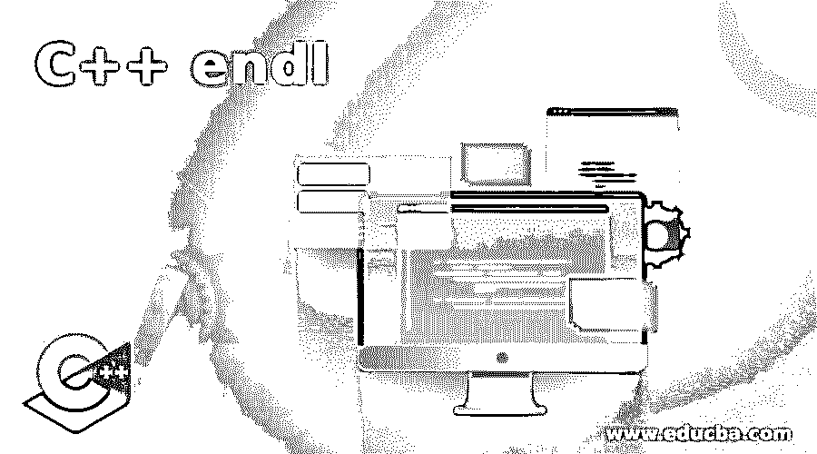

# C++ endl

> 原文:# t0]https://www . educba . com/c-plus-final/




## C++ endl 简介

类的预定义对象 iostream class 用于插入新行字符，而刷新流在 C++中称为 endl。这个 endl 类似于\n 执行插入新行字符的功能，但是它不刷新流，而 endl 在刷新流时执行插入新行字符的工作。因此，语句 cout < < endl 将等于语句 cout < < ' \ n ' < < flush 这意味着与 flush 一起使用的换行符显式地等同于 C++中的 endl 语句。

**语法:**

<small>网页开发、编程语言、软件测试&其他</small>

C++ endl 的语法如下:

```
cout<< statement to be executed <<endl;
```

### C++ endl 的工作原理

*   每当程序将输出数据写入流时，所有的数据都不会一次写入终端。相反，它将被写入缓冲区，直到缓冲区中收集了足够的数据来输出到终端。
*   但是如果在我们的程序中使用 flush，整个输出数据将直接刷新到终端，而不在缓冲区中存储任何东西。
*   每当刷新流时需要插入新的行字符来显示下一行的输出，我们可以在 C++中使用 endl。
*   每当需要插入新的行字符来显示下一行的输出时，我们可以在' \n '字符中使用 endl，但是它不做刷新流的工作。因此，如果我们想在刷新流的同时插入一个新的行字符，我们可以在 C++中使用 endl。
*   每当程序将输出数据写入流时，所有的数据都不会一次写入终端。相反，它将被写入缓冲区，直到缓冲区中收集了足够的数据来输出到终端。

### C++ endl 示例

以下是 c++ endl 的例子:

#### 示例#1

C++程序来演示 endl 在一个程序中打印给定语句的新行:

**代码:**

```
//The header file iostream is imported to enable us to use cout in the program
#include <iostream>
//a namespace called std is defined
using namespace std;
//main method is called
intmain( )
{
//cout is used to output the statement
cout<< "Welcome to ";
//cout is used to output the statement along with endl to start the next statement in the new line and flush the output stream
cout<< "C#"<<endl;
//cout is used to output the statement along with endl to start the next statement in the new line and flush the output stream
cout<< "Learning is fun"<<endl;
}
```

**输出:**


在上面的程序中，导入了头文件 iostream，使我们能够在程序中使用 cout。然后定义了一个名为 std 的名称空间。然后调用 main 方法。然后使用 cout 输出语句。然后，再次使用 cout 和 endl 输出语句，以开始新行中的下一条语句，并刷新输出流。

#### 实施例 2

C++程序，在程序中演示 endl，提示用户输入他或她的名字，同时使用 endl 在下一个新行中打印每个语句，同时刷新输出流:

**代码:**

```
//The header file iostream is imported to enable us to use cout in the program
#include <iostream>
//a namespace called std is defined
using namespace std;
//main method is called
intmain( )
{
//a string variable is used to store the name entered by the user
string name;
//cout is used to output the statement to prompt the user to enter his name with endl used in the statement so that the next statement is printed in the next new line
cout<< "Please enter your name: " <<endl;
//cin takes the name of the user entered by the user
cin>> name;
//cout is used to output the statement along with endl to start the next statement in the new line and flush the output stream
cout<< "My name is: "<< name <<endl;
}
```

**输出:**


在上面的程序中，导入了头文件 iostream，使我们能够在程序中使用 cout。然后定义了一个名为 std 的名称空间。然后调用 main 方法。然后使用一个字符串变量来存储用户输入的名称。然后用 cout 输出语句，提示用户用语句中使用的 endl 输入自己的名字，以便在下一个新行打印下一条语句。然后在 takes 中，用户输入的用户名。然后使用 cout 和 endl 输出语句，以开始新行中的下一条语句，并刷新输出流。

### 优势

在 C++中使用 endl 有几个优点。它们是:

*   每当程序将输出数据写入流时，所有的数据都不会一次写入终端。相反，它将被写入缓冲区，直到缓冲区中收集了足够的数据来输出到终端。
*   但是如果在我们的程序中使用 flush，整个输出数据将直接刷新到终端，而不在缓冲区中存储任何东西。
*   通过使用 endl，我们可以在刷新流时插入新的行字符来显示下一行的输出。
*   如果我们在程序中使用 endl 来刷新输出流，就没有必要显式地使用 flush。

### 推荐文章

这是一个 C++ endl 的指南。在这里，我们也讨论了 c++ endl 的介绍和工作，以及不同的例子和它的代码实现。您也可以看看以下文章，了解更多信息–

1.  [C++测试()](https://www.educba.com/c-test/)
2.  [c++中的 ifstream](https://www.educba.com/ifstream-in-c-plus-plus/)
3.  [C++运算符[]](https://www.educba.com/c-plus-plus-operator/)
4.  [c++中的信号](https://www.educba.com/signal-in-c-plus-plus/)


