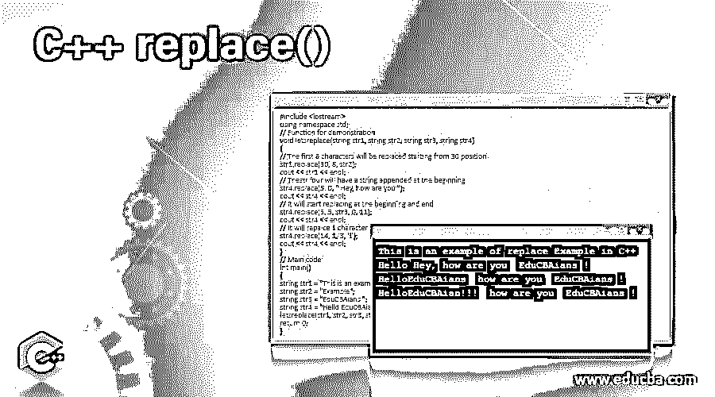

# C++替换()

> 原文：<https://www.educba.com/c-plus-plus-replace/>




## C++ replace()简介

字符串库在 C++中有很多功能。replace()函数是 C++提供的字符串函数的一部分。它有助于替换字符串的一部分，该部分将从某个位置开始，该位置将作为起点，它将一直扩展到某个字符数。该字符串将被指定的字符串替换。要用起始和结束位置替换的字符串应该作为参数提供给 replace()函数，以帮助我们替换该字符串。让我们详细检查一下这个函数是如何工作的，以及如何在不同的例子中使用它。

**语法:**

<small>网页开发、编程语言、软件测试&其他</small>

```
string1.replace(start,length,string2);
```

让我们检查以下参数及其意义。

*   **string1:** 这是一个字符串对象。该对象是可以复制到另一个 string 对象中的值。
*   **开始:**开始指定替换必须工作的位置。应该替换字符串的字符。
*   **Length:**Length 参数定义从给定字符串中替换的字符数。
*   **String2:** 这将是您想要替换 string1 的字符串。这将是新的字符串，将取代旧的。

### C++ replace()是如何工作的？

我们已经检查了 replace()函数所需的参数。现在让我们一步一步地检查这个函数是如何工作的。

**代码:**

```
#include<iostream>
using namespace std;
int  main()
{
string string1 = "Let us learn C language";
string string2 = "C++";
cout << "The string before replacement is: "<<string1<<'\n';
string1.replace(13,1,string2);
cout << "The string after replacement is: "<<string1<<'\n';
return 0;
}
```

您在上面检查的函数现在将显示它实际上是如何工作的。这里的主函数有一个字符串，它说“让我们学习 C 语言”。然后程序员意识到我们在学 C++。因此，我们将在这里使用 replace()函数，它将帮助我们纠正 string1。我们给出的起始位置是 14。这是 c 的位置。该字符为 1，因此长度参数的长度被定义为 1。第三个参数是 string2，即“C++”，这里需要用 C 替换。一旦这样做了，该函数将根据其功能工作，并给我们所需的输出。它将输出让我们学习 C++语言。我们将在下一节中查看更多示例，这将有助于您更好地理解该功能。

### C++ replace()的示例

下面是一些例子:

#### 示例#1

**代码:**

```
#include <iostream>
using namespace std;
// Function for demonstration
void letsreplace(string str1, string str2, string str3, string str4)
{
// The first 8 characters will be replaced starting from 30 position
str1.replace(30, 8, str2);
cout << str1 << endl;
// Thestr four will have a string appended at the beginning
str4.replace(5, 0, " Hey, how are you ");
cout << str4 << endl;
// It will start replacing at the beginning and end
str4.replace(5, 5, str3, 0, 11);
cout << str4 << endl;
// It will repalce 1 character at 14 and append exclamation after it
str4.replace(14, 1, 3, '!');
cout << str4 << endl;
}
// Main code
int main()
{
string str1 = "This is an example of replace function in C++";
string str2 = "Example";
string str3 = "EduCBAians ";
string str4 = "Hello EduCBAians !";
letsreplace(str1, str2, str3, str4);
return 0;
}
```

**输出:**


上面的例子有 3 个替换函数的变体。让我们逐一检查这些机器的运转情况。我们已经声明了在 let's replace 函数中使用的 4 个字符串。这是一个用户定义的函数，我们使用 replace 函数来替换给定的字符串。在第一次替换中，我们使用 str1，从位置 30 开始，用 str2 替换 8 个字符的长度。第二种变型是从第三个位置开始替换，直到第五个位置。它将被 str4 取代。下一个替换从第 4 个位置开始的 5 个字符。除此之外，它还被替换为从 string3 的第 0 位开始的 5 个字符。最后一个示例替换了从第 14 个<sup>到第 1 个</sup>的字符，并添加了 3 个感叹号。这是杰出的，你可以检查下面的输出，以便更好地理解这些例子。下面是上面代码的输出。

#### 实施例 2

用字符串替换特殊字符。

**代码:**

```
#include <iostream>
#include <string>
int main()
{
std::string str = "Edu*";
std::string rep = "*", y = "CBA";
size_t position;
while ((position = str.find(rep)) != std::string::npos) {
str.replace(position, 1, y);
}
std::cout << "The place to learn new things is " << str;
return 0;
}
```

**输出:**


上面的代码是一个用字符串替换字符的例子。我们取了 Edu*字符串。* we 将被另一个已定义的字符串替换。我们还采用了一个位置变量来定义字符串的开始。我们使用了一个 while 语句，该语句一直执行到字符串中的*为止。它将它与字符串进行比较，直到不相等。*以已经指定的替换字符串开始和结束的位置。然后，这将作为输出字符串给出。下面将是上述程序的输出。它用指定的替换字符串替换原始字符串。

### 结论

replace()函数是一个帮助我们替换某些字符串的函数。这是一个简单而有效的函数，它将开始位置、长度和要替换的字符串作为参数，然后相应地提供结果。replace 函数速度很快，并且还增强了所生成代码的性能。除此之外，您还可以通过以优化的方式使用该函数来添加额外的字符串。有一个使用 boost 的高级版本，可以帮助毫不费力地屏蔽数据。

### 推荐文章

这是一个 C++ replace()的指南。这里我们也讨论一下 c++ replace()的定义和工作原理？以及不同的示例及其代码实现。您也可以看看以下文章，了解更多信息–

1.  [C++ setw()](https://www.educba.com/c-plus-plus-setw/)
2.  [C++ iomanip](https://www.educba.com/c-plus-plus-iomanip/)
3.  [C++矢量函数](https://www.educba.com/c-plus-plus-vector-functions/)
4.  [C++ any()](https://www.educba.com/c-plus-plus-any/)


