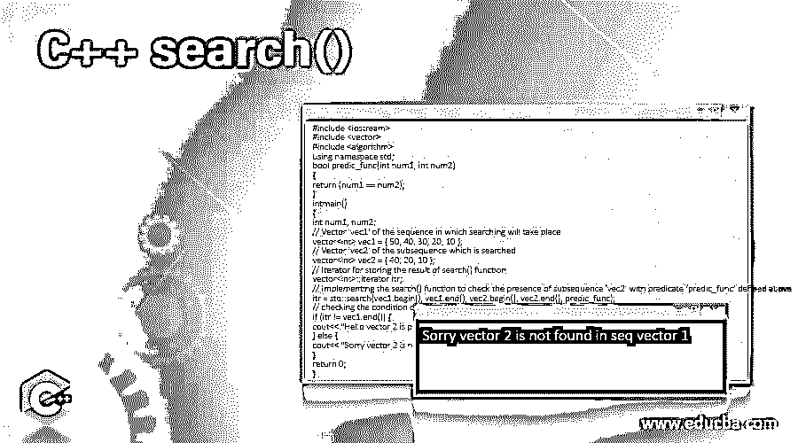

# C++搜索()

> 原文：<https://www.educba.com/c-plus-plus-search/>




## C++搜索简介()

众所周知，搜索是日常生活或编写任何程序时最重要也是最基本的功能之一。总是需要在一个数组或另一个内存位置搜索任何数据/元素。每种编程语言都提供了一些预定义的函数，这些函数可以简单地用于根据它们定义的规范进行搜索。同样，在 C++中，search()算法函数用于我们希望根据指定的条件(如果没有提到谓词，通常是相等的)在给定序列中找到子序列范围的情况。C++ search()函数存在于 C++ <algorithm>头文件中。该函数用于搜索一系列元素，而不是单个元素。</algorithm>

**语法:**

<small>网页开发、编程语言、软件测试&其他</small>

下面给出的是 C++ search()算法函数的基本语法:

1.带有等号(==)运算符的 C++ search()函数的语法

```
template<class ForwardIterator1, class ForwardIterator2>
ForwardIterator1 search (ForwardIterator1 frst1, ForwardIterator1 lst1,
ForwardIterator2 frst2, ForwardIterator2 lst2);
```

在哪里，

*   **frst1:** 它是在其中搜索子序列的序列[frst1，lst1 的第一个元素的前向迭代器。
*   **lst1:** 它是在其中搜索子序列的序列[frst1，lst 1]的最后一个元素的前向迭代器。
*   **frst2:** 它是要搜索的子序列[frst2，lst2 的第一个元素的前向迭代器。
*   **lst2:** 它是要搜索的子序列[frst2，lst 2]的最后一个元素的前向迭代器。

2.带有谓词的 C++ search()函数的语法

```
template<class ForwardIterator1, class ForwardIterator2>
ForwardIterator1 search (ForwardIterator1 frst1, ForwardIterator1 lst1,
ForwardIterator2 frst2, ForwardIterator2 lst2, BinaryPredicatepred);
```

在哪里，

*   **frst1，lst1，frst2，lst2** :与上面定义的参数相同。
*   **pred:** 它是一个二元函数，基本上接受 2 个参数，返回一个可转换为 bool 的值。用作参数的元素取自每个容器。谓词函数需要在代码中单独声明和定义。

### C++中 search()函数是如何工作的？

search()函数在[frst1，lst1 中定义的序列中搜索[frst2，lst2)中定义的子序列。该函数返回一个迭代器，如果[frst2，lst2 的所有元素都与[frst1，lst1 匹配，则认为该函数为真(匹配)。使用它时要记住的最重要的事情之一是返回元素。

*   如果没有找到匹配项，则返回 lst1，即序列 1 的最后一个元素(将在其上进行搜索)。
*   如果找到子序列[frst1，lst1 中的第一个子序列[frst2，lst2 的第一个元素(或者整个子序列都匹配)，则返回迭代器。

如语法中所述，默认情况下，如果没有定义任何内容，search()函数与质量运算符(= =)一起使用，但它也可以与谓词一起使用(它返回布尔值或可转换为布尔值的值，并根据定义的谓词函数工作)。

### C++搜索的例子()

下面给出的例子显示了如何使用该功能:

#### 示例#1

使用默认的 std:search()函数(使用等式==运算符)

**代码:**

```
#include <iostream>
#include <vector>
#include <algorithm>
using namespace std;
intmain()
{
// Vector 'vec1' of the sequence in which searching will take place
vector<int> vec1 = { 50, 40, 30, 20, 10 };
// Vector 'vec2' of the subsequence which is searched
vector<int> vec2 = { 30, 20, 10 };
// Iterator for storing the result of search() function
vector<int>::iterator itr;
// Implementing the search() function to check the presence of subsequence 'vec2' with equality operator
itr = std::search(vec1.begin(), vec1.end(), vec2.begin(), vec2.end());
// checking the condition of search() function
if (itr != vec1.end()) {
cout<< "Hello vector 2 is present in vector 1 at position:  " << (itr - vec1.begin());
} else {
cout<< "Sorry vector 2 is not found in seq vector 1";
}
return 0;
}
```

**输出:**


**代码解释:**在上面的例子中，我们声明了两个向量‘ve C1’和‘ve C2’是用定义的值声明的。迭代器“itr”被声明为在 search()函数返回迭代器值时存储结果。search()函数是用上述语法中提到的参数定义的。使用 if 和 else 语句检查返回的迭代器值，并相应地在控制台上打印输出。使用函数“itr–ve C1 . begin()”计算字符串匹配的位置

#### 实施例 2

使用谓词使用 std:search()函数。

**代码:**

```
#include <iostream>
#include <vector>
#include <algorithm>
using namespace std;
bool predic_func(int num1, int num2)
{
return (num1 == num2);
}
intmain()
{
int num1, num2;
// Vector 'vec1' of the sequence in which searching will take place
vector<int> vec1 = { 50, 40, 30, 20, 10 };
// Vector 'vec2' of the subsequence which is searched
vector<int> vec2 = { 40, 20, 10 };
// Iterator for storing the result of search() function
vector<int>::iterator itr;
// Implementing the search() function to check the presence of subsequence 'vec2' with predicate ‘predic_func’ defined above
itr = std::search(vec1.begin(), vec1.end(), vec2.begin(), vec2.end(), predic_func);
// checking the condition of search() function
if (itr != vec1.end()) {
cout<< "Hello vector 2 is present in vector 1 at position:  " << (itr - vec1.begin());
} else {
cout<< "Sorry vector 2 is not found in seq vector 1";
}
return 0;
}
```

**输出:**


**代码解释:**代码与上面描述的代码相同，都有默认的等式操作符，唯一的区别是其中定义了谓词。谓词函数“predic_func”函数在返回布尔值的代码的开头定义。在 search()函数中，predic_func()作为参数添加，并根据 search()条件返回结果。在上面的代码中，由于范围不匹配，它不会返回位置。

### 结论

上面的描述清楚地解释了 search()算法函数在 C++中是如何工作的，以及在编程中是如何使用的。search()算法函数基本上匹配序列中的一系列元素，而不是单个元素(我们通常可以使用循环和等式操作符来实现)。在使用这个函数之前，你需要熟悉 C++的高级概念，比如动态数组、向量、迭代器等等。要轻松地工作，否则它将是忙乱使用这个功能。

### 推荐文章

这是一个 C++搜索指南()。这里我们也讨论一下 c++ search()的定义和工作原理？以及不同的示例及其代码实现。您也可以看看以下文章，了解更多信息–

1.  [c++中的宏](https://www.educba.com/macros-in-c-plus-plus/)
2.  [C++矢量函数](https://www.educba.com/c-plus-plus-vector-functions/)
3.  [C++ any()](https://www.educba.com/c-plus-plus-any/)
4.  [C++ setw()](https://www.educba.com/c-plus-plus-setw/)


