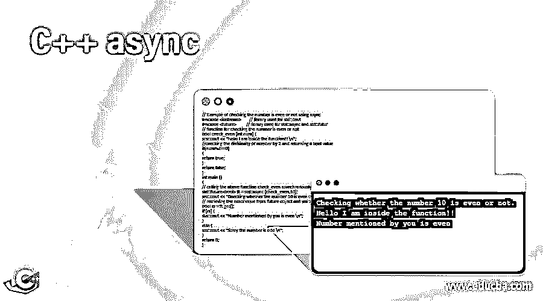

# C++异步

> 原文：<https://www.educba.com/c-plus-plus-async/>




## C++异步简介

顾名思义，C++ async 是一个函数模板 fn，它以函数或函数对象为自变量(基本上称为回调)，异步运行。它返回 STD::future 对象，用于保存上述函数的结果。结果存储在共享状态中。为了从中获取值，程序员需要调用它的成员 future:: get。在 C++中，异步函数有两种使用方式，即在函数参数中指定或不指定策略。当指定启动策略时，第一个参数是定义函数异步行为的策略本身。

### C++异步的语法和工作原理

下面给出了在 C++程序中如何使用异步函数的基本语法:

<small>网页开发、编程语言、软件测试&其他</small>

异步函数有两种使用方式:

#### 1.不指定策略

```
template <class function (Fn), class... Args>
std::future<typename std::result_of<Fn(Args...)>::type>
async (Function && fn, Args&&... args);
```

在上面的语法中，启动策略没有在函数参数中指定。自动选择启动策略，即 launch:: async | launch:: deferred。

#### 2.指定策略

```
template <class function(Fn), class... Args>
std::future<typename std::result_of<Fn(Args...)>::type>
async (launch policy, Function && fn, Args&&... args);
```

在上面的语法中，函数参数中提到了启动策略，以便指定函数应该在哪个策略中执行。

在哪里，

**Fn:** 是可调用对象或者函数对象。函数' fn '的返回值存储在共享状态中，由对象' future '访问。同样在异常的情况下，该值被设置为共享状态，未来对象也可以访问该状态。

**参数:**在异步函数“fn”中传递的是自变量或参数。

在异步函数中需要注意的一个要点是，函数“Fn”和参数“args”都应该是可移动构造的，并且函数使用 Fn 和 args 的衰减副本。

**策略:**c++ async 中的策略在定义使用 async 函数的异步行为中起着重要的作用。使用不同策略创建异步基本上有 3 种方式:

| **序列号** | **策略名称** | **行为** |
| 1. | 启动::异步 | 这个启动策略确保了函数的异步行为，这意味着可调用的函数将在一个新的线程中执行。它遵循简单评估策略，即计算将在新线程的工作包中立即进行评估。在异常的情况下，它存储在共享状态，由 std::future 访问。 |
| 2. | 启动::延期 | 在该启动策略中，可调用函数不在新线程中执行；相反，它遵循非异步行为。它遵循惰性求值策略，在这种策略中，对函数的调用被推迟，直到前一个线程调用 future 对象上的 get，这使得共享状态再次可访问。该功能将不再被推迟。在这种情况下，函数将在同一个线程中运行它的工作包。在异常情况下，它被置于未来的共享状态；然后，为所需的功能做好准备。 |
| 3. | 启动::异步&#124;启动::延迟 | 这是一个自动启动策略。在此策略中，行为未定义。根据系统的优化可用性，系统可以根据实现选择异步或延迟。程序员对它没有任何控制权。 |

根据系统实现，还有其他可用的启动策略，并且可以与标签“启动::”一起使用。人们可以通过将多个值组合在一起来使用它。

**返回值:**async 的返回值是 std:: future，是 std::async 的函数调用创建的共享状态。我们可以使用函数返回的成员 future::get 从中获取值。

### C++异步示例

让我们借助一个例子来深入了解异步函数在 C++程序中是如何使用的:

```
// Example of checking the number is even or not using async
#include <iostream>       // library used for std::cout
#include <future>         // library used for std::async and std::futur
// function for checking the number is even or not
bool check_even (int num) {
std::cout << "Hello I am inside the function!! \n";
//checking the divisibility of number by 2 and returning a bool value
if(num%2==0)
{
return true;
}
return false;
}
int main ()
{
// calling the above function check_even asynchronously and storing the result in future object
std::future<bool> ft = std::async (check_even,10);
std::cout << "Checking whether the number 10 is even or not.\n";
// retrieving the exact value from future object and waiting for check_even to return
bool rs = ft.get();
if (rs) {
std::cout << "Number mentioned by you is even \n";
}
else {
std::cout << "Sorry the number is odd \n";
}
return 0;
}
```

**输出:**


**说明:**在上面的代码中，我们已经使用 async 函数检查了数字是否为偶数。#include < future >库包含在内，以便使用 future 和 async 函数。基本函数' check_even '用于检查作为返回布尔值的参数传递的数字。std:: async 函数是异步使用的，结果存储在 std::future 对象中。如前所述，为了得到精确的值，使用了' get ',并根据返回的布尔值将输出打印在控制台上。

**异常:**

在 C++中，使用 async 函数有很多机会抛出异常，比如当系统无法使用 std:: async 函数启动新线程时，就会抛出“system_error”。需要记住的重要一点是，当抛出异常时，所有对象都处于有效状态，并处于共享状态，未来的对象可以访问该状态。根据系统的实现，还会根据不同的情况抛出其他特定的异常。

### 结论

上面的描述清楚地解释了 C++异步函数以及如何在程序中使用它。由于可以根据特定的启动策略使用异步功能，因此必须理解所有的策略和代码要求。作为一名优秀的程序员，理解使用该函数时抛出的异常也很重要，以便相应地处理它。

### 推荐文章

这是一个 C++异步的指南。这里我们借助一个例子来讨论如何在 C++程序中使用 async 函数的深层理解。您也可以看看以下文章，了解更多信息–

1.  [C++格式化程序](https://www.educba.com/c-plus-plus-formatter/)
2.  [c++中的 malloc()](https://www.educba.com/malloc-in-c-plus-plus/)
3.  [C++读取文件](https://www.educba.com/c-plus-plus-read-file/)
4.  [C++流](https://www.educba.com/c-plus-plus-stream/)


