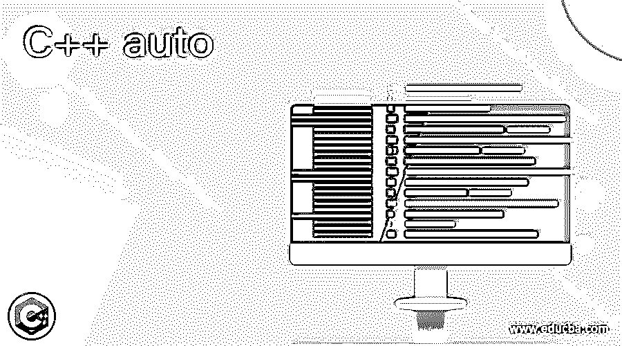

# C++自动

> 原文：<https://www.educba.com/c-plus-plus-auto/>




## C++ auto 简介

在 C++中，auto 关键字用于指定变量的数据类型将自动从其初始值中推导出来。对于函数，函数名或自动返回类型前的 auto 关键字表示该函数的返回类型将在运行时根据返回类型表达式进行计算。从 C++ 11 开始，引入了这个关键字；在此之前，程序员需要在编译时显式地分配每个变量的数据类型。从表达式中自动推导出数据类型在 C++中称为类型推理。这个特性减少了开销，并为程序员节省了大量时间来声明编译器已经知道的东西。

**语法:**

<small>网页开发、编程语言、软件测试&其他</small>

在程序中使用 auto 关键字没有特定的语法。相反，我们只需要在变量名或函数返回类型前写“auto”关键字。

1.计算表达式后，使用 auto 关键字作为变量的数据类型:

```
int main()
{
auto var1 = 3.767;
auto var 2 = 34;
…
…
....
}
```

2.在函数返回类型中使用 auto 关键字:

```
auto sum(int var1, var2)
{
return (var1+var2);
}
auto sub(double var1, double var2)
{
return (var1-var2);
}
```

### auto 关键字在 C++中是如何工作的？

关键字 auto 通常像 C++中的其他关键字一样使用。它用在变量名或函数名之前，以推断两者的返回类型。当 auto 关键字被使用时，它在编译时被评估。由于编译器不得不这么做，这就把编译时间增加到了几秒钟，几乎可以忽略不计。

使用 auto 关键字的一个优点是，它减少了程序员定义数据类型的额外开销，这样他/她就可以专注于其他重要的任务。在函数的情况下，使用 auto 关键字有助于创建通用函数，也就是说，我们可以将不同的参数传递给数据类型为 auto 的函数。因此，为不同的数据类型创建单独的函数的问题可以通过只创建一个函数来轻松解决。

虽然 auto 关键字可以用在函数返回类型中，但在简单函数的情况下，程序员通常不使用它，因为它有时会产生问题，因为函数的返回类型非常有用，并返回给调用者，然后调用者根据程序要求执行特定的任务。调用者可能会误解函数返回的内容，这可能会导致意外的结果。

使用 auto 关键字时，需要记住一些要点:

1.  关键字 auto 可以和常量、指针(*)、引用(&)等修饰符一起使用。
2.  当在函数中使用自动返回类型时，该函数的所有返回语句必须需要返回相同的数据类型；否则，它将在程序中抛出一个错误。
3.  关键字 auto 也可以用来迭代复杂数据结构的值，如向量、集合等。，在 C++中。程序员不用担心冗长复杂的迭代器声明。它可以简单地定义为“自动”。
4.  在定义变量的 auto 的情况下，不可能对变量进行多重声明。比如汽车 a =10，b = 344.5
5.  函数参数也可以声明为 auto。比如 auto func(自动 a，自动 b)。
6.  必须避免将变量声明为“auto”，它存储函数的返回值，因为它有时会造成混淆。比如 auto-answer = funct()。

### C++ auto 的例子

下面给出了一些在 C++程序中使用 auto 关键字的例子:

#### 示例#1

在 vector 中推送自动变量，并使用自动变量迭代到 vector 的元素

**代码:**

```
#include <iostream>
#include <string>
#include <vector>
using namespace std;
int main()
{
// declaring the name variables as auto
auto name1 = "komal";
auto name2 = "yashi";
auto name3 = "rashi";
//pushing the names defined above in vector
vector<string> vec1;
vec1.push_back(name1);
vec1.push_back(name2);
vec1.push_back(name3);
// printing the values of vector on console using 'i' as an auto variable to iterate
cout << "Here is the vector data" << endl;
for (auto i = vec1.begin() ; i != vec1.end() ; i++)
{
cout << *i << endl;
}
return 0;
}
```

**输出:**


**说明:**

在上面的代码中，向量“vec1”被声明为字符串类型。所有名称变量，即 name1、name2、name 3，都被声明为 auto，编译器将进一步将它们作为字符串进行计算。为了遍历整个向量以在控制台上打印值，使用了迭代器“I ”,它被声明为 auto。使用* i 将数值打印在控制台上，这意味着数值保持在“I”位置。

#### 实施例 2

使用不同数据类型的变量，并通过将它们定义为 auto 来执行它们的加法

**代码:**

```
#include <iostream>
using namespace std;
int main()
{
// declaring the variables as auto
auto var1= 100;
auto var2 = 199.990;
auto result = var1+ var2;
cout << "Result of addition is " << result <<endl;
return 0;
}
```

**输出:**


**解释:**在上面的代码中，变量 var1 和 var2 被声明为 auto，值分别为 100 和 199.990。对于编译器本身，这些值将被计算为 int 和 double。值的相加存储在一个变量中，该变量再次声明为 auto，编译器将其解释为 double 并打印在控制台上。

#### 实施例 3

使用函数返回类型作为 auto

**代码:**

```
#include<iostream>
using namespace std;
//function body with the return type and the parameters declared as ‘auto’
auto mod(auto var1, auto var2)
{
auto result = var1% var2;
return result;
}
int main()
{
auto var1 = 25;
auto var2 = 8;
// Value returned in ‘result’ is also auto type
auto result = mod(var1,var2);
cout<<"The result of above operation is " << result <<endl;
return 0 ;
}
```

**输出:**


**说明:**在上面的程序中，创建了一个求 2 个数的模的函数，其返回类型和参数定义为‘auto’，编译器会将其推导为 int 类型。从函数返回的值存储在变量“result”中，该变量也被声明为“auto”(将再次被编译器推导为 int)。

### 结论

上面的描述清楚地解释了什么是 C++中的 auto 关键字，以及如何使用它来推导变量的数据类型和函数返回类型。在 C++ 11 中，引入了许多新的关键字，这为程序员将类型推导的任务留给编译器本身提供了便利。然而，尽管它是非常有用的关键字之一，但它容易出错，尤其是在函数中。所以在程序中使用它之前，需要完全理解它。

### 推荐文章

这是一个 C++ auto 的指南。在这里，我们讨论 auto 关键字在 C++中是如何工作的，以及代码和输出的例子。您也可以看看以下文章，了解更多信息–

1.  [C++ sort()](https://www.educba.com/c-plus-plus-sort/)
2.  [C++可变](https://www.educba.com/c-plus-plus-mutable/)
3.  [C++ end()](https://www.educba.com/c-plus-plus-end/)
4.  [C++ find()](https://www.educba.com/c-plus-plus-find/)


