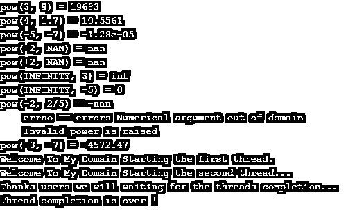
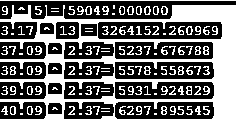

# C++ pow

> 原文：<https://www.educba.com/c-plus-plus-pow/>


## C++ pow 简介

C++ pow 被定义为数学函数 pow()，它计算出的基数将被提升到指数幂。头文件<cmath>有这些函数，基数将是任何类型的数字。它支持正整数和负整数。然而，幂的指数是有限的。尽管如此，它不支持整数类型的值，因为有时它会抛出一个域错误，该函数还可能导致几个范围错误。它返回大数值或小数值；这取决于库的实现。</cmath>

**语法**

<small>网页开发、编程语言、软件测试&其他</small>

pow()函数也计算基数，总是计算指数的幂。这始终是数学组件函数之一，这些库函数将来自<cmath>头文件；这些函数将采用不同类型的参数，包括基值和指数。</cmath>

```
#include<iostream>
#include<cmath>
using namespace std
data type main()
{
data type basevalue, exponent, output;
basevalue=number;
expoenent=number;
output=pow(basevalue,exponent);
---some logics---
}
```

以上代码是根据需求在应用逻辑中计算 pow()函数的基本语法；它计算幂以及也适用于计算函数值的数据类型数值。

### C++中的 pow 函数是如何工作的？

我们在 C++语言中使用了不同类型的数学函数，其中 pow()函数计算基值，而指数是用数值范围计算的。当我们使用基值有一个有限的范围，这是负值，同时指数也计算有限的范围集，但它不支持整数类型的值，它导致并抛出域类型的错误。

如果基值和指数值都为零，则会导致某些类型的实现出现域类型的错误。如果基值是零并且指数数值范围是负的，则它可能在值的指数范围内变化，这意味着它也可能导致域类型的误差，并且该误差类似于极点类型的误差。这些错误还会抛出，并且它伴随着库实现，因为它只识别和验证来自基值和指数部分的数字。

C++语言会并行使用一些其他的数学函数，比如 std::pow，std::powf，STD::powl；这些是库中一些标准的基于电源的函数。我们可以使用其他数据类型，如 float、double、long double 等。这些数据类型值是在基值范围内计算的，使用 exp 和 iexp 计算幂，而 pow()中的两种类型的参数(如 base 和 exponent)都使用相同的数据类型值进行传递。此外，我们还可以添加 iexp 作为整数指数值。

如果有时没有错误发生，意味着基值将自动提升到 exp 的幂，如 iexp，并且返回具有指数幂的基，并且如果返回基于实现的值，则相同的域已经发生；也就是说，函数支持并返回任何类型的值。如果由于在两种类型的参数中都可以返回的数值范围中出现数值溢出而导致出现极点类型的错误或某些数值范围错误，则由于在某些情况下出现下溢情况而导致出现参数数值范围，结果的输出将总是返回某些数值范围。如果基值是有限的，我们可以使用错误处理机制返回错误，这将通过一些特定的 math_errhandling 库来报告。这将是两个域误差的正 exp 和负 exp。

### C++ pow 的例子

下面给出了 C++ pow 的例子:

#### 示例#1

**代码:**

```
#include <iostream>
#include <thread>
#include <chrono>
#include <cmath>
using namespace std;
void first() {
std::this_thread::sleep_for(std::chrono::seconds(2));
}
void second() {
std::this_thread::sleep_for(std::chrono::seconds(4));
}
int main ()
{
long double bse = 45.3, output;
int expn = -7;
output = pow(bse, expn);
cout << bse << "^" << expn << " = " << output << endl;
int b = -7, ex = 3;
double rslt;
rslt = pow(b, ex);
cout << b << "^" << ex << " = " << rslt;
std::cout << "Welcome To My Domain Starting the first thread.\n";
std::thread example(first);
std::cout << "Welcome To My Domain Starting the second thread...\n";
std::thread example1(second);
std::cout << "Thanks users we will waiting for the threads completion..." << std::endl;
example.join();
example1.join();
std::cout << "Thread completion is over !\n";
return 0;
}
```

**输出:**


#### 实施例 2

**代码:**

```
#include <iostream>
#include <thread>
#include <chrono>
#include <cmath>
#include <cerrno>
#include <cfenv>
#include <cstring>
#pragma STDC FENV_ACCESS ON
using namespace std;
void first() {
std::this_thread::sleep_for(std::chrono::seconds(2));
}
void second() {
std::this_thread::sleep_for(std::chrono::seconds(4));
}
int main ()
{
std::cout << "pow(3, 9) = " << std::pow(3,9) << '\n'
<< "pow(4, 1.7) = " << std::pow(4,1.7) << '\n'
<< "pow(-5, -7) = " << std::pow(-5,-7) << '\n';
std::cout << "pow(-2, NAN) = " << std::pow(-2,NAN) << '\n'
<< "pow(+2, NAN) = " << std::pow(+2,NAN) << '\n'
<< "pow(INFINITY, 3) = " << std::pow(INFINITY, 3) << '\n'
<< "pow(INFINITY, -5) = " << std::pow(INFINITY, -5) << '\n';
errno = 1;
std::feclearexcept(FE_ALL_EXCEPT);
std::cout << "pow(-2, 2/5) = " << std::pow(-2, 1.7/5) << '\n';
if (errno == EDOM)
std::cout << "    errno == errors " << std::strerror(errno) << '\n';
if (std::fetestexcept(FE_INVALID))
std::cout << "    Invalid power is raised\n";
std::feclearexcept(FE_ALL_EXCEPT);
std::cout << "pow(-3, -7) = " << std::pow(-0.3, -7) << '\n';
if (std::fetestexcept(FE_DIVBYZERO))
std::cout << "    The number is divisible by zero\n";
std::cout << "Welcome To My Domain Starting the first thread.\n";
std::thread example(first);
std::cout << "Welcome To My Domain Starting the second thread...\n";
std::thread example1(second);
std::cout << "Thanks users we will waiting for the threads completion..." << std::endl;
example.join();
example1.join();
std::cout << "Thread completion is over !\n";
return 0;
}
```

**输出:**




#### 实施例 3

**代码:**

```
#include <stdio.h>
#include <math.h>
int main ()
{
printf ("9 ^ 5 = %f\n", pow (9.0, 5.0) );
printf ("3.17 ^ 13 = %f\n", pow (3.17, 13.0) );
printf ("37.09 ^ 2.37= %f\n", pow (37.09, 2.37) );
printf ("38.09 ^ 2.37= %f\n", pow (38.09, 2.37) );
printf ("39.09 ^ 2.37= %f\n", pow (39.09, 2.37) );
printf ("40.09 ^ 2.37= %f\n", pow (40.09, 2.37) );
return 1;
}
```

**输出:**




### 结论

在 C++中，数学幂是使用 pow()计算的，这个函数支持所有类型的数据类型值，它涵盖了整数、浮点数和其他支持的十进制值。使用基数和指数覆盖和计算这些值；这些值将返回数据类型整数。

### 推荐文章

这是一个 c++ power 的指南。在这里，我们讨论了 C++中的 pow 函数是如何工作的，以及代码和输出的例子。您也可以看看以下文章，了解更多信息–

1.  [C++保留()](https://www.educba.com/c-plus-plus-reserve/)
2.  [C++ push_back](https://www.educba.com/c-plus-plus-push_back/)
3.  [C++格式化程序](https://www.educba.com/c-plus-plus-formatter/)
4.  [C++字符串复制](https://www.educba.com/c-plus-plus-string-copy/)


