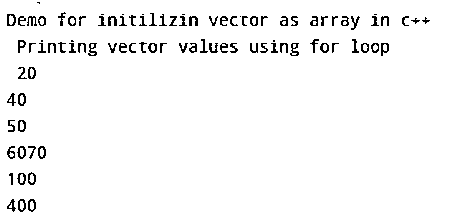
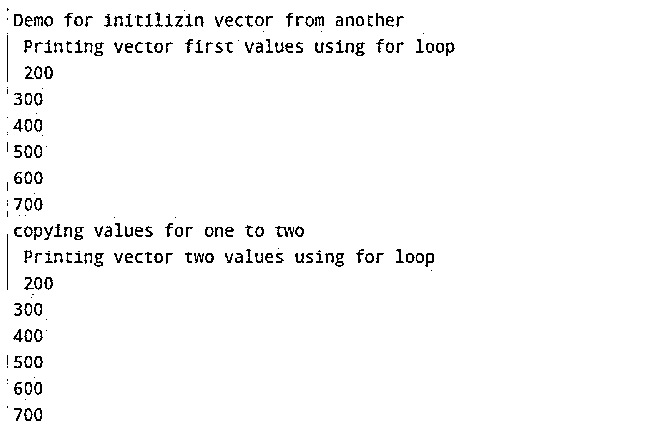

# C++向量初始化

> 原文：<https://www.educba.com/c-plus-plus-vector-initialization/>


## C++向量初始化简介

下面的文章提供了 C++向量初始化的概要。向量初始化意味着在向量内部存储元素；同样，vector 的初始化通过构造函数或任何方法接受固定大小的输入。这可以通过五种不同的方式来完成:我们可以在创建对象时使用现有的 vector、array 来初始化 vector，最重要的是，使用 push back 方法。迭代器可以访问放置在连续内存中的初始化向量之后的初始化向量。

### C++中如何用各种方法初始化 vector？

通过使用运算符，我们可以很容易地将一个向量复制到另一个向量；如果需要，这将帮助我们维护一个矢量副本。

<small>网页开发、编程语言、软件测试&其他</small>

我们现在将看到如何初始化 vector 的语法，但是在继续之前，我们需要创建一个 vector。

**语法:**

因此，我们将看到在 c++中创建向量的语法:

```
vector <type_varibale> variable_name (element)
```

让我们来详细了解一下它们:

*   **variable_name:** 通过使用它，我们可以为我们的向量指定一个名称，稍后可以使用它来初始化和访问它。
*   type_variable: 这代表了向量的类型，这意味着我们的向量在初始化的时候将持有的值的类型，我们可以赋予它什么类型的值。
*   **元素:**这个参数指定了我们可以分配给向量的元素数量。

现在我们将看到不同的类型通过使用不同的方法来初始化我们的 vector 对象:

*   C++中使用 push back 方法初始化向量。
*   通过定义向量的大小。
*   像数组一样的向量初始化。
*   数组到向量。
*   从一个向量复制另一个向量。

#### 1.C++中使用 push back 方法初始化向量

在这种方法中，我们可以使用“push_back”方法来初始化我们的向量。这是最简单的方法，因为我们只需要调用这个方法并给它赋值。为了更好的理解，我们可以看看如何在我们的程序中使用它来准备 vector 的例子。

**举例:**

**代码:**

```
#include <iostream>
#include <bits/stdc++.h>
using namespace std;
int main()
{
cout << "Demo to initialize vector using push back method" << "\n";
vector<int> vectDemo;
vectDemo.push_back(200);
vectDemo.push_back(300);
vectDemo.push_back(100);
vectDemo.push_back(36);
vectDemo.push_back(900);
cout << "printing values of vector below :" << " \n";
for (int value : vectDemo)
cout << value << " ";
return 0;
}
```

**输出:**

**

** 

**说明:**

*   在这个例子中，我们在这里使用“vector”关键字创建一个 vector 对象。
*   之后，我们调用 push_back 方法给 vector 对象赋值。我们可以在其中分配任意数量的元素，因为它本质上是动态的。
*   最后，我们使用 C++中的 for 循环打印输出。

#### 2.通过定义向量的大小

在这种方法中，我们可以同时定义向量的大小和指定值。为此，我们可以在 vector 对象中指定这两个参数。

**举例:**

**代码:**

```
#include <iostream>
#include <bits/stdc++.h>
using namespace std;
int main()
{
cout << "Demo for initilizin vector using size and value" << "\n ";
int size = 10;
cout << "size of vector is " << " ";
cout << size << " \n";
vector<int> vectordemo(size, 001);
cout << "Values inside vector are::" << "\n";
for (int value : vectordemo)
cout << value << " ";
return 0;
}
```

**输出:**


**说明:**

*   在这个例子中，我们创建了一个 vector 对象，但是在这样做的同时，我们也指定了两个参数。
*   第一个参数是向量的大小，这意味着它将容纳多少个元素，另一个参数是向量中作为元素存在的值。
*   最后，我们使用 for 循环打印矢量元素。

#### 3.矢量初始化类阵列

在这种方法中，我们可以在创建向量的对象时初始化向量的元素。

**举例:**

**代码:**

```
#include <iostream>
#include <bits/stdc++.h>
using namespace std;
int main()
{
cout << "Demo for initilizin vector as array in c++" << "\n ";
vector<int> vectordemo{ 20, 40 , 50 , 60, 70 , 100, 400 };
cout << "Printing vector values using for loop" << "\n ";
for (int value : vectordemo)
cout << value << "\n";
return 0;
}
```

**输出:**




**说明:**

*   我们在创建向量对象的同时，也像在数组中一样赋值。
*   这是一个非常容易遵循的方法。

#### 4.数组到向量

在这种方法中，我们可以通过使用数组本身来初始化向量。

**举例:**

**代码:**

```
#include <iostream>
#include <bits/stdc++.h>
using namespace std;
int main()
{
cout << "Demo for initilizin vector as array in c++" << "\n ";
int array[] = { 100,200, 300, 400, 500 };
int sizeCal = sizeof(array) / sizeof(array[0]);
cout << "size iss :::" << " ";
cout << sizeCal << " \n";
vector<int> vetcrdemo(array, array + sizeCal);
cout << "Printing vector values using for loop" << "\n ";
for (int value : vetcrdemo)
cout << value << " ";
return 0;
}
```

**输出:**


**说明:**

*   在这里，我们创建了一个数组；之后，我们使用这个数组来初始化 vector 对象。
*   为此，我们在 vector 对象内部传递数组以及我们计算的大小。

#### 5.从一个矢量复制另一个矢量

在这种方法中，我们可以使用下面指定的两种方法将向量值复制到另一个向量。

**举例:**

**代码:**

```
#include <iostream>
#include <bits/stdc++.h>
using namespace std;
int main()
{
cout << "Demo for initilizin vector from another" << "\n ";
vector<int> vectordemo1{ 200, 300, 400, 500, 600, 700 };
cout << "Printing vector first values using for loop" << "\n ";
for (int value1 : vectordemo1)
cout << value1 << "\n";
cout << "copying values for one to two " << "\n ";
vector<int> vectordemo2(vectordemo1.begin(), vectordemo1.end());
cout << "Printing vector two values using for loop" << "\n ";
for (int value2 : vectordemo2)
cout << value2 << "\n";
return 0;
}
```

**输出:**




**说明:**

*   在这个例子中，我们创建一个 vector 对象并初始化它的值，但是我们在这里创建了两个 vector，通过使用 vector 的 begin()和 end()方法将 vector 的一个值复制到另一个值。
*   这将把该向量的所有元素复制到另一个向量中。

### 结论

到目前为止，我们知道向量是用来存储元素的。他们能很好地处理动态数据；通过使用 C++中可用的方法来初始化 vector 中的数据是非常容易的。它们还提供了数据的大小调整，因为它们提供了更好的灵活性来处理动态数据。我们总是知道我们的数据大小不是固定的，所以数组不能到处使用。

### 推荐文章

这是一个 C++矢量初始化的指南。这里我们讨论一下在 C++中如何使用各种方法初始化 vector？您也可以看看以下文章，了解更多信息–

1.  [C++线程 _ 本地](https://www.educba.com/c-plus-plus-thread_local/)
2.  [C++静态转换](https://www.educba.com/c-plus-plus-static_cast/)
3.  [c++中的反射](https://www.educba.com/reflection-in-c-plus-plus/)
4.  [C++ shuffle()](https://www.educba.com/c-plus-plus-shuffle/)


