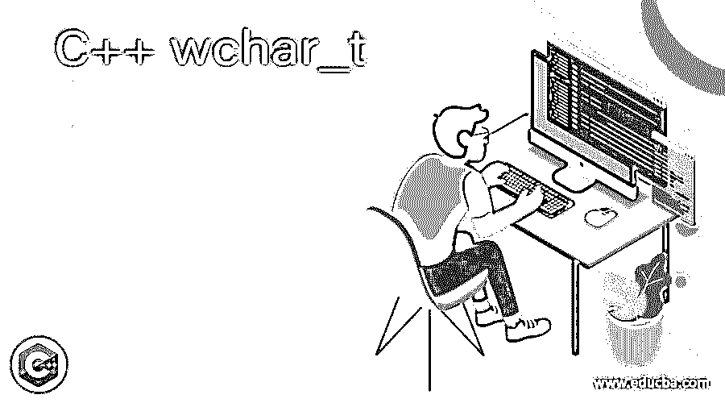

# C++ wchar_t

> 原文：<https://www.educba.com/c-plus-plus-wchar_t/>




## C++ wchar_t 的定义

在 C++中，宽字符类似于字符数据类型，只是 char 数据类型占用一个字节的空间，而宽字符占用两个字节的空间。在某些情况下，根据编译器的不同，宽字符会占用四个字节的内存。这可以在这两个字节的空间中保存不同的 64K (65536)个字符。也就是说，它可以保存 UNICODE 字符，UNICODE 是一种国际标准，允许对任何语言中的任何字符进行编码。让我们在下面的章节中看到更多关于宽字符的细节。在本文中，我们将讨论 C++ wchar_t 的功能和示例。

**语法:**

<small>网页开发、编程语言、软件测试&其他</small>

宽字符以下面提到的格式书写。

```
wchar_t
```

这将用于宽字符实现的程序中。

### 宽字符的功能

下面是宽字符中使用的一些函数。

#### 函数:wcslen()

**语法:**

```
wcslen ( const wchar_t* str ) ;
```

**描述:**帮助获取宽字符串长度的函数。

#### 函数:wcsncpy()

**语法:**

```
wchar_t* wcsncpy( wchar_t* dst, const wchar_t* sr, size_t sn) ;
```

**描述:**帮助将序列号字符从源复制到目的地的功能。如果源端小于大小 sn，那么目的端会有一些空字符。

#### 函数:wcscat()

**语法:**

```
wchar_t* wcscat ( wchar_t* dst, const wchar_t* sr) ;
```

**描述:**帮助连接源字符串和目标字符串的函数。

#### 函数:wcscpy()

**语法:**

```
wchar_t* wcscpy ( wchar_t* dst, const wchar_t* sr) ;
```

**描述:**帮助将源字符串复制到目的字符串的函数。

#### 函数:wcscmp()

**语法:**

```
wcscmp ( const wchar_t* str1, const wchar_t* str2) ;
```

**描述:**帮助比较第一个字符串和第二个字符串的函数。这个函数类似于普通的字符串比较。

#### 函数:wcsstr()

**语法:**

```
const wchar_t* wcsstr ( const wchar_t* str1, const wchar_t* str2) ;
```

**描述:**帮助查找第一个字符串中第二个字符串第一次出现的函数。如果不存在，将返回 Null。

#### 函数:wcstok()

**语法:**

```
wchar_t* wcstok ( const wchar_t* str1, const wchar_t* delim , wchar_t ** ptr) ;
```

**描述:**帮助对借助宽字符生成的字符串进行标记的功能。分隔符 delim 也用于字符串标记化。

### C++ wchar_t 示例

在本节中，让我们看一些关于 wchar_t 的示例。

#### 示例#1

CPP 程序实现宽字符并得到它的大小

**代码:**

```
#include <iostream>
using namespace std;
int main()
{
//declare a wide character
wchar_t c = L'S' ;
//print the character value
cout << "The wide character value 'S' is: " << c << endl ;
//print the size of wide character
cout << "Wide character size is " << sizeof(c) ;
return 0;
}
```

**输出:**


在这个程序中，首先声明一个宽字符。在执行代码时，打印出值及其大小。在这里，可以看到 L 被用作宽字符文字和宽字符字符串文字的前缀，它通知编译器字符串或字符是宽字符类型。

#### 实施例 2

使用 wcslen()实现宽字符并获得其大小的 CPP 程序

**代码:**

```
#include <iostream>
using namespace std;
int main()
{
//declare a wide character array string
wchar_t c[] = L"Hope never dies" ;
//print the character value
cout <<"The wide character length of Hope never dies " <<" is : " << wcslen(c) << endl ;
return 0 ;
}
```

**输出:**


在这个程序中，首先声明一个宽字符数组字符串。在执行代码时，字符串的大小被打印出来。

#### 实施例 3

将宽字符串复制到另一个位置的 CPP 程序

**代码:**

```
#include <iostream>
#include<cwchar>
using namespace std;
int main()
{
//declare a wide character array string
wchar_t c[] = L"Hope never dies" ;
wchar_t d[15] ;
//copy the string
wcscpy(d, c);
wcout << L"Original string is : " << c << L"\n Copied string is :  " << d << endl;
return 0;
}
```

**输出:**


在这个程序中，一个额外的头文件<cwchar>也与其他头文件一起使用。还使用了两个字符串数组，其中一个数组用于存储字符串，另一个数组用于复制字符串。在执行代码时，可以看到 string 被复制到了另一个位置。</cwchar>

#### 实施例 4

将宽字符串与另一个字符串连接起来的 CPP 程序

**代码:**

```
#include <iostream>
#include<cwchar>
using namespace std;
int main()
{
//declare a wide character array string
wchar_t c[] = L"Hope never dies" ;
wchar_t d[] = L" and trust yourself" ;
//concatenate the string
wcscat(c, d);
wcout << L"Concatenated string is : " << c << endl;
return 0;
}
```

**输出:**


在这个程序中，首先声明两个字符串数组。在执行代码时，可以看到两个字符串是使用函数 wcscat()连接起来的。

#### 实施例 5

将宽字符串与另一个字符串进行比较的程序

**代码:**

```
#include <iostream>
#include<cwchar>
using namespace std;
int main()
{
//declare a wide character array string
wchar_t c[] = L"Hope never dies" ;
wchar_t d[] = L" and trust yourself" ;
//compare the strings
wcout << L"Comparison of first string with second = " << wcscmp(c, d) << endl;
wcout << L"Comparison of first string with first string = " << wcscmp(c, c) << endl;
wcout << L"Comparison of second string with first string = " << wcscmp(d, c) << endl;
return 0;
}
```

**输出:**


在这个程序中，首先声明了两个字符串数组。与上面的程序不同，这个程序是比较两个字符串。在执行代码时，可以看到显示了 3 个值。当第一个字符串与第二个字符串进行比较时，由于第一个字符串的值高于第二个字符串的值，因此返回 1。在第二种情况下，返回 0，因为字符串与自身进行比较。最后，在第三种情况下，当第一个字符串的值小于第二个字符串的值时，返回-1。

### 结论

在这篇文章中，从语法、功能和例子等不同方面对 wchar_t C++进行了详细的解释。

### 推荐文章

这是一个 C++ wchar_t 的指南，在这里我们分别讨论 C++ wchar_t 的宽字符的定义和功能以及例子。您也可以看看以下文章，了解更多信息–

1.  [C++ ofstream](https://www.educba.com/c-plus-plus-ofstream/)
2.  [C++数组长度](https://www.educba.com/c-plus-plus-length-of-array/)
3.  [C++ Max](https://www.educba.com/c-plus-plus-max/)
4.  [C++静态](https://www.educba.com/c-plus-plus-static/)


