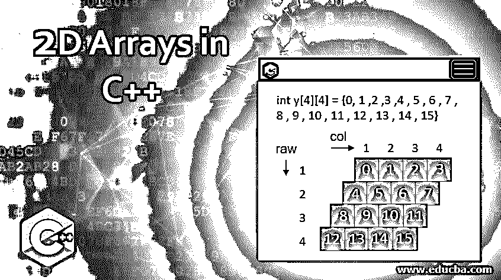
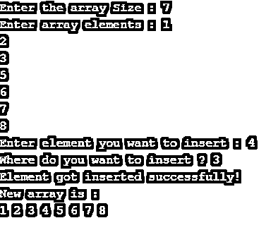

# C++中的 2D 数组

> 原文：<https://www.educba.com/2d-arrays-in-c-plus-plus/>




## C++中 2D 数组的介绍

2D 数组被认为是多维数组下最简单的一种形式。你可以把 2D 数组看作是 1D 数组的一个数组，以便于理解。在这个主题中，我们将学习 C++中的 2D 数组。

### 2D 数组在 C++中是如何定义的？

在 C++中，更简单的方法是将多维数组定义为数组的数组。在 2D 数组中，你可以用表格格式存储数据，也可以按行优先顺序存储数据。

<small>网页开发、编程语言、软件测试&其他</small>

N 维数组声明的基本形式:

```
datatype  arrayname [size1][size2]....[sizeN];
where,
datatype: Type of data that has to be stored in an array.
the datatype is considered to be a valid C++ data type.
arrayname : Name of the array, and
size1, size2, ,... ,sizeN : Sizes of dimensions.
```

**例如:**

*   二维数组:int two array[10][20]；
*   三维数组:int three array[10][20][30]；

#### 多维数组大小

我们可以在多维数组中存储的元素总数可以通过每个维度的大小相乘来计算。

**例如:**

Array int y[20][10]能够存储 20*10 = 200 个元素。简单地说，数组 int y[10][5][20]可以存储总共(10*5*20) = 1000 个元素。

### 如何在 C++中创建 2D 数组？

二维数组元素可以称为 y[i][j]，其中 I 被认为是行号，j 被认为是列号。

二维数组可以预测为具有“x”行和“y”列的表格。这里行号从 0 到 x-1，列号从 0 到 y-1。

具有 4 行 4 列的 2D 阵列 y 如下:

**2D 数组的初始化**:我们有两种方法可以初始化 2D 数组。

**第一种方式**:

```
int y[4][4] = {0, 1 ,2 ,3 ,4 , 5 , 6 , 7 , 8 , 9 , 10 , 11 , 12 , 13 , 14 , 15}
```

上面的数组有 4 行 4 列。从左到右大括号中的数字也以相同的方式存储在表中。这些元素以这种方式填充到数组中:第一行中从左开始的前 4 个元素，第二行中接下来的 4 个元素，接下来的两行也是如此。

**第二路**:

```
int y[4][4] = {{0, 1, 2, 3}, {4, 5, 6, 7},  {8, 9, 10, 11}, {12, 13, 14, 15}};
```

这种初始化使用嵌套的大括号。这些内大括号中的每个集合表示一行。正如我们在上面的例子中看到的，总共有四行，因此有三组内括号。

**访问 2D 数组元素:**2D 数组中的元素可以通过行索引和列索引来访问。

**例如:**

```
int y[3][1];
```

此示例表示第三行第一列中存在的元素。

### 如何在 C++中插入 2D 数组的元素？

下面的 C++程序提示用户输入数组的大小，然后要求用户输入数组元素，然后要求用户输入要插入的元素或数字，最后要求用户输入要在数组中插入所需元素的位置或索引。因此，该程序将插入所需的元素，然后在插入元素后显示新的数组:

```
// C++  Program : Insert Element in Array
#include<iostream>
using namespace std;
int main()
{
int a[50], size, num, i, pos;
cout << "Enter the array Size : ";
cin >> size;
cout<<"Enter array elements : ";
for(i=0; i<size; i++)
{
cin>>a[i];
}
cout<<"Enter element you want to insert : ";
cin>>num;
cout<<"Where do you want to insert ? ";
cin>>pos;
// now create place at the required position
for(i=size; i>pos; i--)
{
a[i]=a[i-1];
}
a[pos]=num;
cout<<"Element got inserted successfully!\n";
cout<<"New array is : \n";
for(i=0; i<size+1; i++)
{
cout<<a[i]<<" ";
}
return 0;
}
```

**输出:**




### 如何在 C++中更新 2D 数组的元素？

C++中 std::replace_if 的函数模板如下:

void replace _ if(forward iterator first，ForwardIterator last，UnaryPredicate pred，const T& newvalue)

**其中，**

*   首先，最后是向前迭代器，分别指向数字列表中的初始位置和最终位置。
*   pred 是一元函数，它可以接受范围中的元素作为参数，然后
*   返回一个可以转换为布尔值的值。
*   旧值:需要替换的值。
*   newvalue:替换值。

**例子如下:**

输入: 1 2 3 4 5 6 7 8 9 10

**输出:**0 2 0 4 0 6 0 8 0 10//在这里，我们已经将所有的奇数值替换为 0。

运筹学

**输入:** 10 20 30 30 20

**输出:** 10 4 30 30 4 //这里，我们把所有能被 4 整除的数都换成了 4。

```
// C++ code that finds all the elements which are odd
// and then replace them with 0.
// using std::replace_if
#include <bits/stdc++.h>
using namespace std;
// Function that is used in std::replace_if
// If the number is odd return 1 otherwise return 0
// 1,that is, true means replace the number
// 0,that is, false means do not replace
bool IsOdd(int i)
{
return ((i % 2) == 1);
}
// Driver/Main code
int main()
{
int a[] = { 1, 2, 3, 4, 5, 6, 7, 8, 9, 10, 11, 12 };
int n = sizeof(a) / sizeof(a[0]);
// print old array
cout << "Original Array:";
for (int i = 0; i < n; i++)
cout << ' ' << a[i];
cout << '\n';
// replacement value
int newval = 0;
// replace_if function
replace_if(a, a + n, IsOdd, newval);
// new array after using std::replace
cout << "New Array:";
for (int i = 0; i < n; i++)
cout << ' ' << a[i]; cout << '\n';
return 0;
}
```

**输出:**


### 结论

因此，我们可以得出结论，我们知道为了能够在以后使用任何值，我们需要将它存储到一个变量中。该变量将有一个对存储该值的内存的引用，以便我们能够随时使用它。类似地，考虑这样一种情况，我们有成百上千这样的数据需要存储在一个变量中以供将来参考。

将所有这些值存储到变量中实际上是不可能的，因为我们必须为它创建成百上千个变量。这些变量甚至不容易记住。因此出现了数组的概念。一种类型的数组是多维数组，在 C++中也称为矩形数组。根据需要，它可以是二维数组，也可以是三维数组。这些值以表格格式存储，也称为行和列形式的矩阵。声明多维数组的语法是–

```
<data type> <name of array>[number of rows][number of columns]
int two_dim[2][2]; // rows = 2 , columns = 2
```

### 推荐文章

这是一个 C++中 2D 数组的指南。这里我们讨论如何在 C++中插入和更新 2D 数组的元素，并给出例子。您也可以看看以下文章，了解更多信息–

1.  [c++中的多维数组](https://www.educba.com/multi-dimensional-arrays-in-c-plus-plus/)
2.  [PHP 中的 2D 数组](https://www.educba.com/2d-arrays-in-php/)
3.  [Python 中的数组](https://www.educba.com/arrays-in-python/)
4.  [Matlab 中的数组](https://www.educba.com/arrays-in-matlab/)


