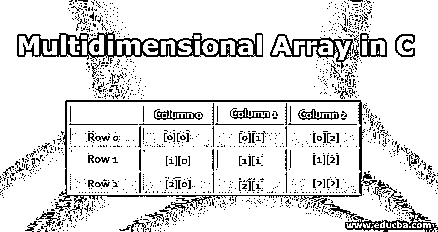
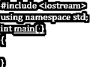
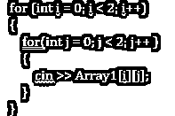
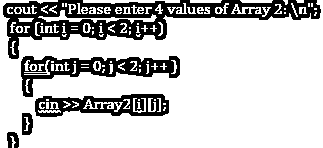
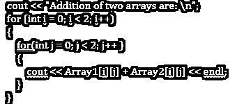
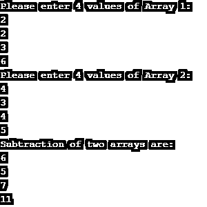
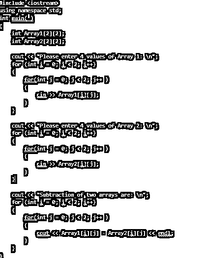
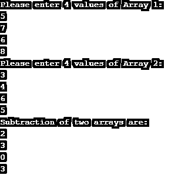

# C++中的多维数组

> 原文：<https://www.educba.com/multi-dimensional-arrays-in-c-plus-plus/>




## C++中多维数组的介绍

C++数组中的多维数组用于以行和列的表格形式存储数据。在这里，我们可以创建单个或[多维数组](https://www.educba.com/c-sharp-multidimensional-arrays/)来保存不同场景中的值。一维数组有一维，而多维数组可以是二维、三维等。我们可以把多维数组看作数组的数组。这里的数据以表格的形式存储。在本文中，我们将看到什么是多维数组，多维数组的使用，如何访问它们，以及如何在我们的代码中有效地使用多维数组。

### C++中多维数组的一个元素

*   让我们考虑一个矩阵的例子来理解多维数组。在 2D 矩阵中，有行和列。为了表示这一点，我们使用 2D 维数组。
*   在多维数组中，数据以表格的形式出现，即以行为主的顺序排列。二维数组的一般语法如下。

```
data_type    array_name[size1][size2];
```

*   请记住，大小始终是一个正整数值。下面是一个三维数组的例子。

```
int matrix[3][5];
```

这里的矩阵是一个二维数组，最多有 15 个元素。

<small>网页开发、编程语言、软件测试&其他</small>

*   数组中包含的最大元素数是通过乘以所有维度的大小获得的。例如，在 3DArray[2][3][4]中，最大元素是通过乘以 2，3，4，即 24 获得的。
*   类似地矩阵[10][10][10]，可以容纳 1000 个元素。我们可以把它想象成 10 个元素中的每一个都可以容纳 10 个元素，这样总共有 100 个元素。每 100 个元素可以容纳另外 10 个元素，这使得最终计数为 1000。
*   我们可以先创建一个比较简单的数组，然后扩展到需要的维度，来创建一个多维数组。

#### 多维数组的初始化

让我们取一个 3D 数组。我们可以用很多方法初始化一个三维数组。以下是供参考的例子。

```
int 3DArray[2][2][4] = {1, 3, 6, 5, 8, 9, -2, 4, 5, 10, 34, 56, 23, -56, 10, 37};
```

*   花括号中从左到右的值作为一个从左到右的表存储在数组中。这些值将按以下顺序填充到数组中。第一行左起的前 4 个元素，第二行的后 4 个元素，依此类推。
*   上面的初始化不会给我们一个清晰的数组图像。为了更好的可视化，我们可以如下初始化同一个数组。

```
int 3DArray[2][2][4] =
{
{     {1, 3, 6, 5}, {8, 9, -2, 4}    },
{     {5, 10, 34, 56}, {23, -56, 10, 37}   }
};
```

通过使用元素的索引，访问多维数组中的元素类似于任何其他数组。我们必须使用三个循环来访问数组中的所有元素。下面是一个访问 3D 数组中元素的示例。

```
x[2][1][0]
```

*   对于更高维的数组，如 4、5、6 等。，概念很相似，但是处理事情的复杂性增加了。例如，使用的循环次数、元素搜索次数、访问特定元素等。
*   三维或更高维数组的元素可以以不同的方式移动。这个操作类似于向量和矩阵。不同的技术，如整形、置换和压缩，用于重新排列数组中的元素。这些是复杂的技术，我们现在不必担心。

### C++中多维数组的例子

下面是一些 C++中多维数组的例子，步骤如下:

#### 示例#1

现在我们将[使用这些 2D 阵列](https://www.educba.com/arrays-in-php/)来理解多维阵列将如何工作。我们将编写一个 C++代码，它将接受用户对两个矩阵的输入，将它们相加，并显示矩阵相加的结果。首先，我们将编写执行的主程序。




在 main 函数中，我们将声明两个二维数组，最多可以存储 4 个元素。


现在我们将要求用户为每个数组输入 4 个值。


为了将值存储到数组中，我们需要两个循环，即每个维度使用一个循环来遍历。我们用两个指数，I 和 j 来表示两个维度。为了更好地理解代码，我们将使用 For 循环。第一个 for 循环代表第一维，第二个 for 循环代表第二维。在第二个 for 循环中，我们接受用户的输入。




现在以类似的方式接受第二个数组的输入。




现在，由于值存储在每个数组中，是时候向用户展示两个数组的添加了。为此，我们再次使用两个 For 循环进行遍历，这次使用 cout 来打印值。




**输出:**




#### 实施例 2

我们声明一个包含任意数量元素的数组，并使用它们来执行不同的功能，如加、减、乘、逆、变换等。对于减法，可以使用以下代码:




选择不同的输入，检查输出，并用数学方法计算。

**输出:**




### 结论

在本文中，我们学习了什么是数组，什么是单维数组和多维数组，多维数组的意义，如何初始化数组，以及如何根据需要在程序中使用多维数组。

### 推荐文章

这是一个 C++中多维数组的指南。这里我们讨论 C++中多维数组的语法、元素和初始化，并给出例子和步骤。你也可以看看下面的文章来了解更多-

1.  [C 中的多维数组](https://www.educba.com/multidimensional-array-in-c/)
2.  [c++简介](https://www.educba.com/introduction-to-c-plus-plus/)
3.  [Rust vs C++](https://www.educba.com/rust-vs-c/)
4.  [c++中的重载和重写](https://www.educba.com/overloading-and-overriding-in-c-plus-plus/)


