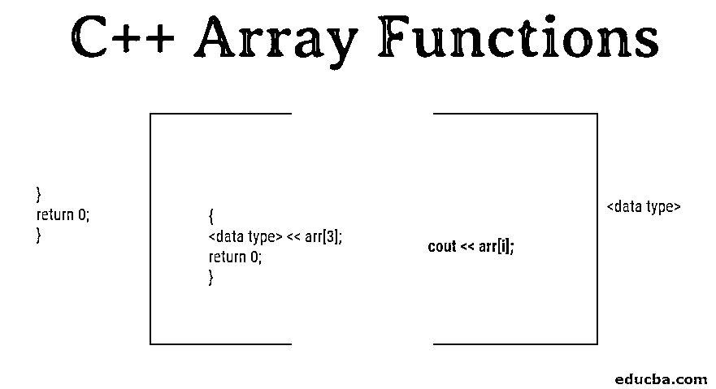
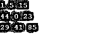
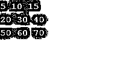
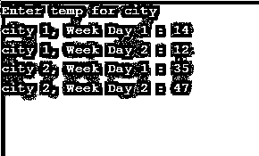

# C++数组函数

> 原文：<https://www.educba.com/c-plus-plus-array-functions/>




## 什么是 C++数组函数？

数组函数是用来对数组集合执行操作的函数。为了访问数组元素，C++提供了各种数组函数，如 at()、get()、front()、back()、size()、max_size()等等，其中 at()将使用数组索引访问数组元素，front()将返回第一个数组元素，back()将返回最后一个数组元素，size()将返回数组元素的数量，max_size()用于显示元素的最大数量。

数组是由大多数编程语言实现的一个非常重要的数据结构概念。C++还提供了数组，它是固定大小的相同类型元素的集合。声明数组时要记住的两件基本事情是数组的大小和数组的类型。因为这两件事是在声明数组的最开始声明的，所以数组本质上是静态的。数组的大小决定了它可以存储的元素数量。

<small>网页开发、编程语言、软件测试&其他</small>

**数组声明的一般语法是-**

```
<Type of array> <array name> <[Size of array]>
```

**示例—**

```
int pincode_of_cities[50]
```

数组的大小必须是一个大于 0 的整数常数值。数组的类型可以是在 C++中有效的任何数据类型。

### C++数组的初始化

有两种初始化阵列的基本方法

#### 方法 1:在声明时

```
int pincode[5] = {123, 000, 342, 678, 654};
```

运筹学

```
int pincode[] = {123, 000, 342, 678, 654};</pre.
```

#### 方法 2:使用循环

```
int number[5];
for(int i = 0; i<sizeof(pincode); i++)
number = i;
```

这是一维数组或 1D 数组。第二种类型的[数组是多维数组](https://www.educba.com/multi-dimensional-array-in-javascript/),我们稍后会讨论它。

首先，让我们看看如何从数组中访问值。下面给出了以下几种方法

### 访问数组的值

数组名称[index]:这将返回所提到的索引位置的值。

```
#include <iostream>
using namespace std;
int arr[5] = {10,20,30,40,50};
int main ()
{
cout << arr[3];
return 0;
}
```

**输出:**


为了打印数组中的所有值

```
#include <iostream>
using namespace std;
int arr[5] = {10,20,30,40,50};
int i;
int main ()
{
for ( i=0 ; i<5 ; i++ )
{
cout << arr[i];
}
return 0;
}
```

**输出:**


**举例:**

```
#include <iostream>
using namespace std;
int main()
{
int num[5], sum = 0;
cout << "Enter 5 natural numbers: ";
//  Store numbers
//  Then find sum
for (int i = 0; i < 5; ++i)
{
cin >> num[i];
sum += num[i];
}
cout << "Sum = " << sum << endl;
return 0;
}
```

**输出:**


### 多维数组

以上是对一维数组的声明。第二种类型的数组是[多维数组](https://www.educba.com/multidimensional-array-in-c/)，在 C++中也被称为矩形数组。根据需要，它可以是二维数组，也可以是三维数组。这些值以表格格式存储，也称为行和列形式的矩阵。

声明多维数组的语法是–

```
<data type> <name of array>[number of rows][number of columns]
int two_dim[2][2];
```

这意味着上述数组具有–

*   2 行
*   2 列

上述数组可以通过以下方式初始化

#### 方法 1

```
#include <iostream>
using namespace std;
int main()
{
int arr[3][3] =
{
{1, 5, 15},
{44, 0, 23},
{29, 41, 85}  };  //declaring and initializing at the same time
//traversing through the array
for(int i = 0; i < 3; ++i)
{
for(int j = 0; j < 3; ++j)
{
cout<< arr[i][j]<<" ";
}
cout<<"\n"; //this will take to a new line once the all the columns of the                                                //particular row has been traversed
}
return 0;
}
```

**输出:**




#### 方法 2

```
#include <iostream>
using namespace std;
int main()
{
int arr[3][3];  //declaring a 2D array
arr[0][0]=5;  //initializing the array
arr[0][1]=10;
arr[0][2]=15;
arr[1][0]=20;
arr[1][1]=30;
arr[1][2]=40;
arr[2][0]=50;
arr[2][1]=60;
arr[2][2]=70;
//traversing through the elements in the array
for(int i = 0; i < 3; ++i)
{
for(int j = 0; j < 3; ++j)
{cout<< arr[i][j]<<” ” ;
}
cout<<"\n"; //this will take to a new line once the all the columns of the                                                //particular row has been traversed
}
return 0;
}
```

**输出:**




**举例:**

```
#include <iostream>
using namespace std;
const int city = 2;
const int week = 2;
int main()
{
int temp[city][week];
cout << "Enter temp for city \n";
// Insert values
for (int i = 0; i < city; ++i)
{
for(int j = 0; j < week; ++j)
{
cout << "city " << i + 1 << ", Week Day " << j + 1 << " : ";
cin >> temp[i][j];
}
}
// Access values
for (int i = 0; i < city; ++i)
{
for(int j = 0; j < week; ++j)
{
cout << "city " << i + 1 << ", Week Day " << j + 1 << " = " << temp[i][j] << endl;
}
}
return 0;
}
Enter temp for city
city 1, Week Day 1 : 12
city 1, Week Day 2 : 24
city 2, Week Day 1 : 35
city 2, Week Day 2 : 47</pre.
```

**输出:**




### 推荐文章

这是一个 C++数组函数的指南。这里我们讨论 C++数组和多维数组的初始化方法、例子和输出。您也可以阅读以下文章，了解更多信息——

1.  [c++中的星形模式](https://www.educba.com/star-patterns-in-c-plus-plus/)
2.  [什么是 C++](https://www.educba.com/what-is-c-plus-plus/)
3.  [C#数组 vs 列表](https://www.educba.com/c-sharp-array-vs-list/)
4.  [C 语言中的数组函数](https://www.educba.com/array-functions-in-c/)


