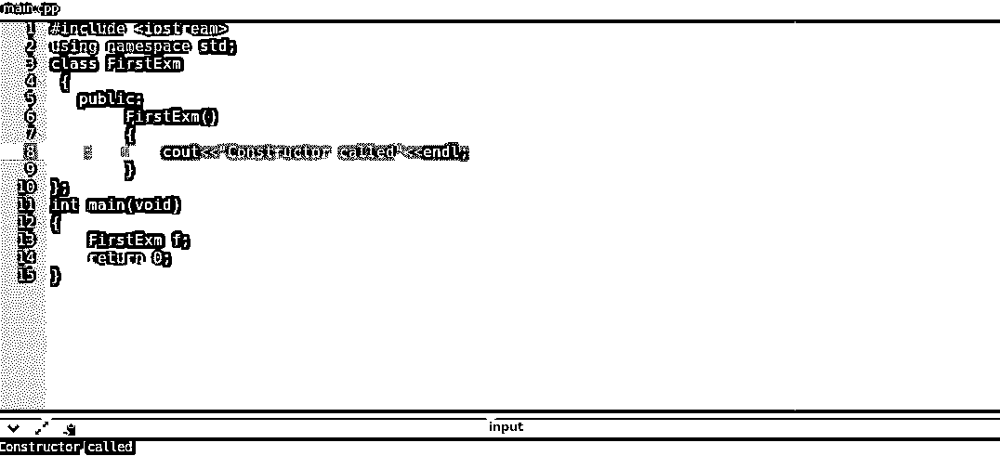

# C++中的构造函数

> 原文：<https://www.educba.com/constructor-in-c-plus-plus/>


## C++中的构造函数介绍

构造函数可以被定义为与类同名的特殊类型的方法。构造函数在对象初始化后立即被调用，不需要显式调用构造函数。一旦调用了构造函数，它就将内存分配给资源。

构造函数是初始化对象(即类实例)的类的特殊类成员函数。在 C++中，构造函数与类本身同名。如果创建了对象，则自动调用构造函数。使用类名和范围解析(::)运算符，可以在类定义内部或类定义外部定义构造函数。

<small>网页开发、编程语言、软件测试&其他</small>

它使应用程序更加高效，使用它可以被认为是一种很好的编程方法。它可以被声明为类似于其他方法。它与该类中其他方法的唯一不同之处在于函数的名称。像其他函数一样，值可以在初始化时传递给构造。根据程序的要求，它可以是任何返回类型。在这个主题中，我们将学习 C++中的构造函数。

### 句法

为了在程序中实现构造函数，你必须遵循正确的语法。在初始化和声明时，必须注意语法。下面是声明的语法，然后我们来看看初始化的语法。

**1。构造函数声明:**

```
ReturnType Construtor_name()
{
Statement 1;
Statement 2;
.
.
Statement n;
}
```

这里，返回类型定义了必须从该方法返回的数据类型。如果提到的数据类型是 integer，那么构造函数返回的值将是 integer 值，同样，可以使用任何数据类型。默认构造函数的语句将在类的实例创建后立即开始执行。

**2。调用构造函数:**

```
ClassName objectName = new ClassName();
Or
ClassName objectName = new ClassName(argument1…. Argument n);
```

调用构造函数时，可能需要从调用它的地方传递值，也可能不需要。以上是调用构造函数的两种方法的语法。在使用构造函数时，必须确保正确遵循语法，否则会导致错误。

### C++中的构造函数是如何工作的？

在我们可以在程序中使用构造函数之前，我们必须确保理解它是如何工作的，这样我们才能正确地使用它来提高程序的效率。它的工作方式非常简单，有助于应用程序的改进。构造函数用在程序中，每当创建特定类的对象时，我们都需要调用一组语句。从来不需要显式调用构造函数。

一旦创建了类的对象或实例，它将隐式调用构造函数，并在该构造函数下执行一条语句。如果必须传递某些值，您需要在创建该类的对象时传递这些值。在上一节中，我们已经讨论了将值传递给构造函数的语法。这是构造函数的工作方式，它有助于使程序简单高效。

### C++中构造函数的类型

根据值是否必须传递给构造函数，它被分为两种类型:默认构造函数和参数化构造函数。下面我们将讨论这两种类型。

#### 1.默认构造函数

默认构造函数可以被定义为这样一种类型的构造函数，其中不需要传递任何值，并且可以通过创建该类的实例来简单地调用。在声明默认构造函数时，我们只需要使用返回类型、构造函数名称和括号。不需要在构造函数名后面的括号中写和参数。下面是默认构造函数的样子。

```
Int Employee();
```

在本例中，没有接受任何值，返回类型是字符串。调用这样的构造函数所需要的只是创建该类的实例。

#### 2.参数化构造函数

参数化构造函数可以定义为这样一种构造函数，它需要传递一些值，以便这些值可以被构造函数中定义的变量使用。必须传递的值可以在变量初始化时被提及。当涉及到参数化构造函数的声明时，我们将需要使用返回类型、构造函数名称、括号和用于引入值的参数。它类似于默认的构造函数，除此之外，它唯一拥有的就是值。

```
Int Employee(int empID, Sting empName);
```

在这个参数化构造函数声明的例子中，返回类型是一个整数，构造函数将接受两个值。可以注意到，任何数据类型的值都可以作为参数传递。

### C++构造函数示例

为了使构造函数的概念更加精确，我们将看到一个如何在实际程序中使用构造函数的实例。在下面的例子中，我们使用了默认的构造函数，当类的对象被创建时，这个构造函数将被调用。




在上面的例子中，类名是 FirstExp，并且已经在其中声明和定义了构造函数。如果构造函数调用，就会导致打印“构造函数调用”。在 main 方法中，已经为调用或调用默认构造函数的 FirstExp 类创建了对象“f ”,程序的输出是“调用的构造函数”。

### 结论

构造器可以被定义为编程语言的特殊特征，用于使程序有效和高效。它也可以被认为是一种特殊类型的方法，与类同名，只要创建了该类的对象，就可以调用它。基于构造函数的要求，曾经可以在缺省和参数化构造函数之间进行选择。必须理解的是，它只能用在这样的情况下，在类的实例被创建之后，有一些东西必须被立即调用。

### 推荐文章

这是 C++中构造函数的指南。这里我们讨论构造函数的类型以及 C++中构造函数是如何工作的。您也可以阅读以下文章，了解更多信息——

1.  [Python 框架](https://www.educba.com/python-frameworks/)
2.  [C++命令](https://www.educba.com/c-plus-plus-commands/)
3.  [Python 集合](https://www.educba.com/python-collections/)
4.  [C 语言中的构造函数](https://www.educba.com/constructor-in-c/)


