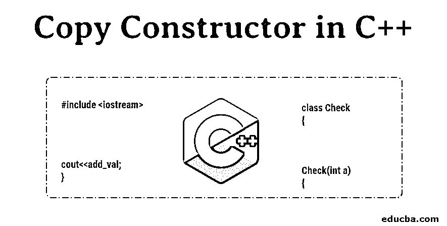

# C++中的复制构造函数

> 原文：<https://www.educba.com/copy-constructor-in-c/>




## C++中复制构造函数介绍

编程语言为我们提供了各种可以用来开发应用程序的特性。就中级语言而言，与高级语言相比，这些特性可能要少一些，但是它们提供的任何选项都足以开发重要的应用程序。在这一节，我们将学习复制构造函数。构造函数可以被定义为一个特殊的函数，它的名字与被定义的类的名字相同。当初始化该类的对象时，会自动调用构造函数。可以说，如果类隐式调用构造函数，则初始化对象。如果构造函数是重载的，那么在这种情况下，值必须在初始化对象时与对象一起传递。在这里，我们将要学习的构造函数的类型非常独特，被称为复制构造函数。这个构造函数使用其他对象而不是普通的值。

### C++中复制构造函数是如何工作的？

复制构造函数可以定义为特殊类型的构造函数，用于声明对象并使用其他对象初始化该对象。初始化该类的对象时调用的普通构造函数。如果构造函数用几个参数重载，那么初始化对象并传递相同数量的参数将调用重载参数。因为复制构造函数是重载的，所以它可以在使用参数初始化对象时被调用，并且参数必须传递对象值而不是任何普通值。

<small>网页开发、编程语言、软件测试&其他</small>

一旦重载构造函数的参数接收的值被发现是一个对象，复制构造函数将被调用，复制构造函数中定义的语句集将开始执行。在使用复制构造函数之前，我们必须创建一个相同类的对象。它清楚地说明了一种方法，即任何打算实现复制构造函数的程序也应该有一个默认的或[参数化的构造函数](https://www.educba.com/parameterized-constructor-in-c-plus-plus/)，这样就可以创建有助于涉及复制构造函数的对象。

整个场景可以被认为是利用一个对象来创建另一个对象。复制构造函数用来初始化对象的与对象绑定的所有值都被分配给新初始化的对象。这意味着如果第一个对象使用任何变量的值，复制构造函数初始化的对象也可以使用相同的变量。复制构造函数的特性被认为是非常重要的，它使得某些应用程序的开发非常方便。它使用同一个类的对象引用的特性有助于开发具有仅使用复制构造函数就能满足的需求的应用程序。虽然它不像默认或参数化构造函数那样经常被利用，但它有足够的能力为应用程序添加新功能。

### C++中复制构造函数的示例

让我们通过例子来理解复制构造函数的概念。在这里，我们将使用一个简单的示例，向您展示复制构造函数如何工作，以及它如何访问绑定到对象的值，复制构造函数使用这些值创建新对象。下图将让您了解调用复制构造函数与调用普通重载构造函数有什么不同。

**代码:**

```
#include <iostream>
using namespace std;
class Check
{
public:
int val;
Check(int a)
{
val=a;
}
Check(Check &i)
{
val = i.val;
}
};
int main()
{
int add_val;
Check a1(50);
Check a2(a1);
add_val = a2.val + 10;
cout<<add_val;
}
```

在这个程序中，我们调用了参数化的构造函数，通过 a1 绕过了实参。传递的值是一个整数，因为参数化构造函数已被定义为只接受整数。当值 50 被传递给构造函数时，该值已被赋给名为 var 的变量。那么对象 a1 已经通过 a2 传递给了复制构造函数。一旦复制构造函数接收到对象引用，它就将分配给第一个对象的值与新形成的对象绑定。这是一个简单的例子来解释复制构造函数的概念。它可以在其他几个程序中使用，以获得应用程序中的各种功能。

**输出:**


### C++中复制构造函数的规则和规范

复制构造函数被认为与默认的或参数化的构造函数有点不同。一方面，普通构造函数使用通用数据类型的值，另一方面，复制构造函数使用以前创建的同一类的对象。使用复制构造函数时必须确保的是，通过复制构造函数传递的参数应该与&符号一起使用，因为它是用于保存对象引用的特殊字符。如果在实现复制构造函数时没有使用&符号，它将不再是复制构造函数，而是被自动视为参数化构造函数。

当调用复制构造函数时，我们必须确保作为参数传递的值应该携带对象引用，而不是任何属于公共数据类型的值。这些是在 C++编程语言中实现复制构造函数时必须非常仔细考虑的几件事。此外，每次我们使用复制构造函数时，我们都必须确保正确区分它和参数化构造函数，否则将完全改变程序的功能，并导致不正确的输出生成。

### 结论

复制构造函数被认为是一种特殊的构造函数，它使用同一个类的对象引用。它用于在应用程序中引入多种功能。如果与默认构造函数相比，复制构造函数在简单的程序中并不常用，但是当涉及到开发必须在生产环境中部署的复杂应用程序时，复制构造函数就用在那里，这也使得应用程序开发非常方便。

### 推荐文章

这是一个 C++中复制构造函数的指南。在这里，我们讨论了 C++中复制构造函数的介绍以及如何与复制构造函数的规则和规定一起工作。您也可以阅读以下文章，了解更多信息——

1.  [复制 Java 中的构造函数](https://www.educba.com/copy-constructor-in-java/)
2.  [复制 C#中的构造函数](https://www.educba.com/copy-constructor-in-c-sharp/)
3.  [c++中的构造函数](https://www.educba.com/constructor-in-c-plus-plus/)
4.  [C 语言中的构造函数](https://www.educba.com/constructor-in-c/)


