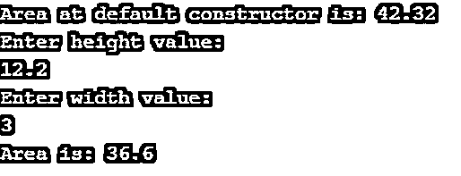
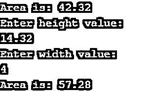
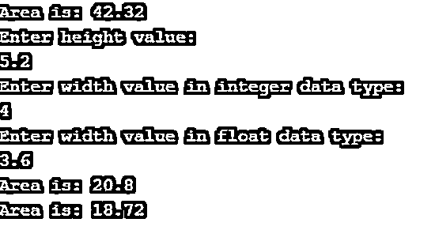

# C++结构构造函数

> 原文：<https://www.educba.com/c-pluse-pluse-struct-constructor/>


## C++结构构造函数简介

称为 Struct 的结构允许我们将一组由混合数据类型组成的变量创建到一个单元中。同样，构造函数是一种特殊的方法，在面向对象的编程语言中，当为类声明对象时，会自动调用它。

因此，结合这两种不同的方法，我们可以说，当这些构造函数是在一个结构中定义的，那么这些将被称为结构构造函数。让我们了解一下 C++编程语言中的这一功能。

<small>网页开发、编程语言、软件测试&其他</small>

**语法:**

结构构造函数的一般语法可以定义如下:

```
Struct Struct_Name
{
datatype_1 variable_1;
datatype_2 variable_2;
datatype_3 variable_3;
datatype_4 variable_4;
……..
……..
Struct_Name()
{
//inside default constructor
}
Struct_Name(data_type1 variable_name1, data_type2 variable_name2)
{
//inside parameterized constructor
}
…
………
…………
};
```

按照上面的语法，可以使用 struct 关键字定义结构，后跟用户定义的结构名。正如我们可以注意到的，声明是 struct 类似于类声明。

在定义了结构之后，就要用不同的数据类型声明所有的变量。然后我们定义了构造函数。它被定义为与结构名同名的函数。在语法中，我们展示了默认和参数化构造函数的声明。

### C++中 Struct 构造函数是如何工作的？

在这里，让我们看看示例代码，了解它在 C++编程语言中的工作原理。

**代码:**

```
#include <iostream>
using namespace std;
struct rect
{
float a; //for height
int b; //for width
rect()
{
a=10.58;
b=4;
cout<<"Area at default constructor is: "<<a*b<<endl;
}
};
int main()
{
rect r1;
}
```

**输出:**


上面我们使用了构造函数和结构函数。我们可以看到，我们定义了一个带有两个变量的结构来计算矩形的面积。然后，我们定义了一个默认的构造函数，并为前面定义的变量初始化了值。

我们甚至计算了已定义的构造函数的面积，然后结束了结构功能。在 main 方法中，我们刚刚创建了 Struct 变量。在输出中，我们可以观察到，在没有显式调用的情况下，我们在默认 struct 构造函数下计算的区域已经被成功打印。这样，构造函数的概念在 Struct。

### C++结构构造函数示例

这里，让我们来看看结构构造函数的不同例子:

#### 示例#1

我们将把我们的第一个例子定义为上述例子的扩展。下面，我们将定义一个参数化的构造函数并检查它是如何工作的，

**代码:**

```
#include <iostream>
using namespace std;
struct rect
{
float a; //for height
int b; //for width
rect()
{
a=10.58;
b=4;
cout<<"Area at default constructor is: "<<a*b<<endl;
}
rect( float x, int y)
{
cout<<"Area is: "<<x*y;
}
};
int main()
{
rect r1;
float x;
int y;
cout<<"Enter height value: "<<endl;
cin>>x;
cout<<"Enter width value: "<<endl;
cin>>y;
rect(x,y);
}
```

**输出:**




这里，我们已经在 Struct 下定义了默认的和参数化的构造函数。我们需要通过将参数化构造函数作为用户输入来观察它的调用功能。我们获取了两个用户输入值，将它们存储在变量中并调用构造函数。分别进行面积计算。

#### 实施例 2

让我们看一个没有用户输入值的参数化结构构造函数的例子:

**代码:**

```
#include <iostream>
using namespace std;
struct rect
{
float a; //for height
int b; //for width
rect()
{
a=10.58;
b=4;
cout<<"Area at default constructor is: "<<a*b<<endl;
}
rect( float x, int y)
{
cout<<"Area is: "<<x*y;
}
};
int main()
{
rect r1;
float x=7.8;
int y=3;
rect(x,y);
}
```

**输出:**


这里我们没有提供任何用户输入值，只是在 main 方法本身中给出了硬编码的值，并调用了参数化的构造函数。

上面写的两个代码是 Struct 构造函数重载概念的例子。

#### 实施例 3

让我们看看如何在 struct 下定义一个构造函数和一个方法。

**代码:**

```
#include <iostream>
using namespace std;
struct rect
{
float a; //for height
int b; //for width
rect()
{
a=10.58;
b=4;
area(a,b);
}
rect( float x, int y)
{
area(x,y);
}
int area(float x, int y)
{
cout<<"Area is: "<<x*y<<endl;
}
};
int main()
{
rect r1;
float x;
int y;
cout<<"Enter height value: "<<endl;
cin>>x;
cout<<"Enter width value: "<<endl;
cin>>y;
rect(x,y);
}
```

**输出:**




在这个例子中，我们没有计算构造函数内部的面积，而是在结构本身内部声明了一个新的方法来计算面积。在该方法中，我们显示结果。通过 Struct 构造函数，我们调用了方法并获得了所需的输出。

#### 实施例 4

这里，我们来看一个例子，有两个参数化的构造函数，参数数量相同，但数据类型不同。

**代码:**

```
#include <iostream>
using namespace std;
struct rect
{
float a; //for height
int b; //for width
rect()
{
a=10.58;
b=4;
area(a,b);
}
rect( float x, int y)
{
area(x,y);
}
rect( float x, float z)
{
area(x,z);
}
int area(float x, int y)
{
cout<<"Area is: "<<x*y<<endl;
}
int area(float x, float z)
{
cout<<"Area is: "<<x*z<<endl;
}
};
int main()
{
rect r1;
float x;
int y;
float z;
cout<<"Enter height value: "<<endl;
cin>>x;
cout<<"Enter width value in integer data type: "<<endl;
cin>>y;
cout<<"Enter width value in float data type: "<<endl;
cin>>z;
rect(x,y);
rect(x,z);
}
```

**输出:**




对于这个例子，我们也必须为面积方法编写代码。因为我们之前的方法有类似于构造函数的参数。所以为了找到区域不同的参数构造函数，我们也需要有相同的方法。如果我们没有正确地声明和使用那些不同的数据类型变量，那么我们对该区域的输出结果为零。

**Note:** As an exercise, try different ways and different executions of incorporating constructors in Struct functionality.

### 结论

在这里，我们已经了解了如何在 C++编程语言中声明和初始化结构构造函数。请注意，我们在 main 下声明了结构变量，这些变量不叫对象。我们已经学会了使用不同的方法来使用结构构造函数，所以继续练习并享受学习的乐趣吧。

### 推荐文章

这是一个 C++结构构造器的指南。这里我们讨论 C++中的结构构造函数的介绍和工作原理，以及不同的例子和代码实现。您也可以看看以下文章，了解更多信息–

1.  [c++中的堆栈](https://www.educba.com/stack-in-c-plus-plus/)
2.  [c++中的方法重载](https://www.educba.com/method-overloading-in-c-plus-plus/)
3.  [C++结构](https://www.educba.com/c-plus-plus-struct/)
4.  [C++标识符](https://www.educba.com/c-identifiers-plus-plus/)


