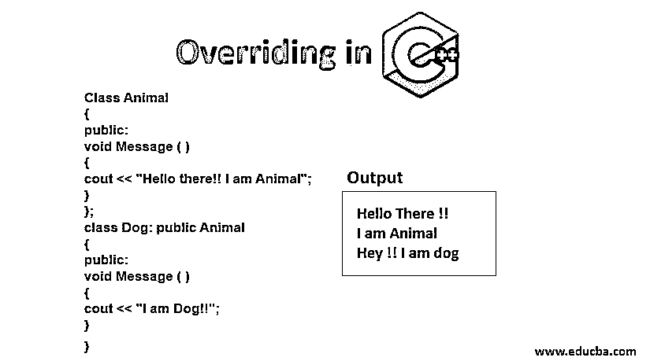

# 在 C++中重写

> 原文：<https://www.educba.com/overriding-in-c-plus-plus/>




## C++中的重写简介

在 C++中重写是实现运行时多态性的方法之一，在这种情况下，我们修改同一方法的行为。通常，子类从基类继承成员函数和数据成员。但是当我们需要覆盖子类中的功能时，我们需要[来使用函数覆盖](https://www.educba.com/function-overriding-in-c-plus-plus/)。重写为方法提供了在基类及其派生类中具有相同名称的特权。根据我们的需要，它使我们能够在其派生类中改变基类中存在的函数行为。

### 在 C++中重写是如何工作的？

在了解重写之前，让我们先[了解一下多态性](https://www.educba.com/what-is-polymorphism/)。多态性的字面意思是多种形式，即一个特定事物有多种形式。在面向对象的编程语言中，这是有用的特性之一。在继承中，当基类和派生类具有相同的成员函数声明，但它们的定义将会不同时，多态性是通过函数或方法重写来实现的。

<small>网页开发、编程语言、软件测试&其他</small>

为此，我们需要首先从一个类继承到派生类中。然后，我们应该根据需要在派生类中再次为基类的任何一个方法提供不同的定义。只有这样，那个函数才被称为被覆盖，这个一步一步的过程叫做函数覆盖。

假设有这样一个场景，我们的应用程序需要改变派生类中基类方法的行为；那么我们应该使用覆盖**的特性。**为了在派生类中重写一个函数，我们必须在子类中有相同的签名；此外，基类和派生类中的函数名应该相同。在这里，签名意味着使用相同的数据类型和在函数中传递的参数序列。如果不需要参数，那么我们不需要在基函数和子函数中使用任何参数。在使用覆盖之前，我们需要记住以下几点。

*   在 C++编程中，重写将是运行时多态性或动态多态性的一个例子。
*   重写只能在派生类中的方法中进行，因为派生类中的方法是从基类重写的。
*   为了实现重写，基类和派生类中的函数应该具有相同的名称、相同的返回类型和相同的参数。

被重写声明重写的方法称为被重写的基方法。基类将包含此方法。调用了新的实现，重写方法是从该基类继承的。当我们创建一个派生类的对象并调用基类和派生类中都存在的成员函数时，基类的成员函数将被忽略，派生类的成员函数将被调用。

#### 下面是方法重写的要求:

*   第一件也是最重要的事情是从基类到派生类应该有继承，因为函数重写不能在同一个类中完成。为了实现这一点，我们需要一个基类和一个派生类。
*   重新定义的函数在基类和派生类中应该有完全相同的声明。那是什么意思？这意味着函数应该有相同的名称、相同的签名和相同的参数列表。

### 覆盖的示例

下面一个简单的例子用步骤解释。

**代码:**

```
class Animal
{
public:
void Message ( )
{
cout << "Hello there!! I am Animal";
}
};
class Dog: public Animal
{
public:
void Message ( )
{
cout << "I am Dog!!";
}
}
```

在上面的示例中，函数 Message()在派生类中被重写。

#### 步骤示例

1.让我们看看使用 main()函数的例子，以便更好地理解重写。

2.创建一个任意名称的基类。这里我用的是动物。写一个方法来显示一些消息。这将是我们的重写方法，我们将在继承的类中重写它。在该方法中，编写一些要打印的消息。

```
class Animal
{
public void Message( )
{
cout << "Hello there!! I am Animal";
}
}
```

3.现在再创建一只狗。这一次我们将从之前创建的基类继承它，即 Animal。为了继承，我们使用“:”符号。

```
class Dog: public Animal
```

4.这里，我们为不同的实现声明相同的 Message()函数并编写一些消息。确保派生类中的方法名和签名与基类中的方法名和签名匹配。

```
public void Message ( )
{
cout << "Hey!! I am Dog";
}
```

5.我们还需要一个类来执行检查重写的功能。创建一个任意名称的类。在里面，写主函数。

```
class ExecutionClass
{
int Main( )
{
}
}
```

6.创建父类的对象，并使用该类的对象触发函数。这将调用 Animal 类中的 Message 方法。

```
Animal animalObject;
animalObject.Message( );
```

7.现在，创建派生类的对象并调用 Message 方法。这将调用 Dog 类的 Message 方法。

```
Dog dogObject;
dogObject.Message( );
```

8.这段代码的输出会是什么？你能猜出来吗？如下图所示。

**输出:**


9.在上面的例子中，我们用相同的名字和签名调用函数，使用分别为派生类和基类创建的对象。在这两种情况下，将为基类和派生类调用不同版本的函数。

### 结论

在本文中，我们了解了 C++中的方法覆盖、方法覆盖的必要性、覆盖原则的真实示例、实现方法以及使用代码覆盖[的示例。我们可以得出结论，覆盖是 C++中多态性的一个有用特性，我们可以改变派生类中基类方法的行为。](https://www.educba.com/overriding-in-python/)

### 推荐文章

这是一个在 C++中重写的指南。这里我们讨论 C++中的重写是如何工作的，这是一个包含不同步骤的简单例子。您也可以浏览我们的其他相关文章，了解更多信息-

1.  [c++中的数组](https://www.educba.com/arrays-in-c-plus-plus/)
2.  [C++命令](https://www.educba.com/c-plus-plus-commands/)
3.  [在哎呀中覆盖](https://www.educba.com/overriding-in-oops/)
4.  [在 Java 中覆盖](https://www.educba.com/overriding-in-java/)


