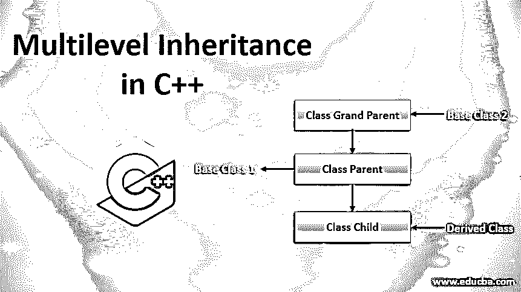
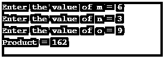

# C++中的多级继承

> 原文：<https://www.educba.com/multilevel-inheritance-in-c-plus-plus/>




## C++中的多级继承介绍

继承是一种属性，其中一个类的对象拥有另一个类的属性，并且可以进一步将这些属性继承给其他类。这种类型的类框架之间的父子关系是一种继承。多级是一种继承，其中基类或子类有多个父类，并且可以扩展到任何级别。因此，就像其他继承特性一样，如[层次继承](https://www.educba.com/hierarchical-inheritance-in-c-plus-plus/)和多重继承，我们可以得出结论，那些拥有多个父类的基类在 C++中被称为多级继承。

**语法:**

<small>网页开发、编程语言、软件测试&其他</small>

```
class base_classname
{
Properties;
Methods;
}
class intermediate_classname: visibility_mode
Base_classname
{
Properties;
Methods;
};
class child_classname:visibility_mode
Intermediate_classname
{
Properties;
Methods;
};
```

**对上述语法的解释:**基类被创建，后跟它的类名，基类将有它自己的属性和方法，这些属性和方法将进一步被下一个中间类用访问修饰符和一些作用域继承。中间类将获得一些公共属性，或者它可以是非公共属性，这也取决于该类想要获得什么的要求。最后，子类将具有由父类继承的所有基本和必需的属性，并且基类和中间类都充当父类。因此，如上所述，具有多于一个父类并继承属性的子类被称为[正在获得多级继承](https://www.educba.com/multilevel-inheritance-in-java/)。

### C++中多级继承是如何工作的？

*   例如，考虑三个类:A 类作为父类，B 类作为第二类或中间类，C 类作为第三类或子类。根据类的对象或类本身之间的关系类型，继承的级别可以扩展到任何级别。
*   这种类型的继承的特殊之处在于，继承级别可以扩展到任何继承级别。
*   基于访问修饰符或可见性，范围被捕获，基类的属性被继承。访问修饰符可以是私有的、公共的和受保护的。
*   例如:如果我们以动物为例，那么哺乳动物是它的中间类，而人类是从中间类哺乳动物衍生出来的子类，并获得了哺乳动物的所有特性。即作为子类的人类将获得哺乳动物或中间类的所有特性。

**Note:** This kind of inheritance can have more than one parent class and can be extended to any level of inheritance depending upon the requirement of the object of the class.

### 在 C++中实现多级继承的例子

下面是在 C++中实现多级继承的示例:

#### 示例#1

**代码:**

```
#include <iostream>
using namespace std;
class P
{
public:
void display ()
{
cout<<"All contents of Base Class";
}
};
class Q: public P
{
public:
void display1()
{
cout<<"\nall content of class Q.";
}
};
class R: public Q
{
public:
void display2()
{
cout<<"All contents if class R.";
}
};
int main ()
{
R r;
r.display();
r.display1();
return 0;
}
```

**输出:**


**对上述代码的解释:**在示例 1 中，类 P 是基类，其具有显示和获取基类内容的方法，该基类将由中间类 Q 继承或获取，中间类 Q 也必须显示内容，即方法的属性，并且对于该中间类 Q，类 P 成为父类。此外，对于作为子类的类 R，在这种情况下，将获得中间类的属性，并且子类的对象将获得父类的所有内容和特征。

#### 实施例 2

**代码:**

```
#include <iostream>
using namespace std;
class Transport
{
public:
Transport ()
{
cout << "This is a Transport" << endl;
}
};
class fourWheelr: public Transport
{
public:
fourWheelr()
{
cout<<"Transport have 4 wheels as object"<<endl;
}
};
class AutoRikshaw: public fourWheelr{
public:
AutoRikshaw()
{
cout<<"AutoRikshaw has 4 Wheels"<<endl;
}
};
int main ()
{
AutoRikshaw obj;
return 0;
}
```

**输出:**


**对上述代码的解释:**在例 2 中，运输的基类具有运输的特征或属性及其能力，该特征或属性及其能力将被传递或继承给中间类，即四轮车。这种四轮车可以获得运输工具的属性，并且自动人力车也是一种四轮车，它可以继承四轮车的属性，并且可以扩展到任何继承级别，这也取决于需求。

#### 实施例 3

**代码:**

```
#include <iostream>
using namespace std;
class base {
public:
int m;
void getdata ()
{
cout << "Enter the value of m = "; cin >> m;
}
};
class derive1 : public base {
public:
int n;
void readdata ()
{
cout << "Enter the value of n = "; cin >> n;
}
};
class derive2 : public derive1
{
private:
int o;
public:
void indata()
{
cout << "Enter the value of o = "; cin >> o;
}
void product()
{
cout << "Product = " << m * n * o;
}
};
int main ()
{
derive2 p;
p.getdata();
p.readdata();
p.indata();
p.product();
return 0;
}
```

**输出:**




### 结论

与其他继承不同，多级继承有一个特殊的特性，即除了依赖于对象和类的要求之外，它可以扩展到任何级别的继承。同样，一个基类可以有多个父类。这种情况甚至可能出现在现实世界中，这可以使用多级继承来克服。

### 推荐文章

这是 C++中多级继承的指南。这里我们讨论 C++中多级继承是如何工作的？以及相应的示例。您也可以浏览我们的其他相关文章，了解更多信息——

1.  [c++中的 goto 语句](https://www.educba.com/goto-statement-in-c-plus-plus/)
2.  [c++中的单一继承](https://www.educba.com/single-inheritance-in-c-plus-plus/)
3.  [c++中的继承类型](https://www.educba.com/types-of-inheritance-in-c-plus-plus/)
4.  [c++中的多重继承](https://www.educba.com/multiple-inheritance-in-c-plus-plus/)


