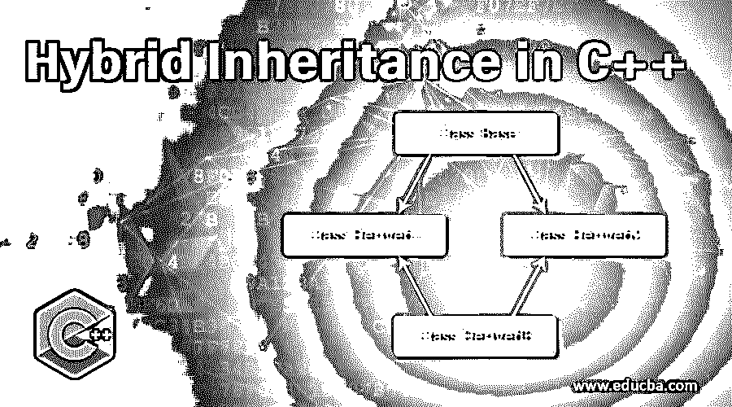
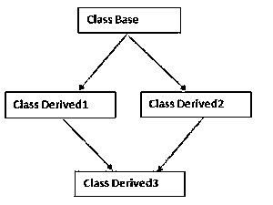
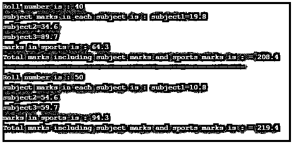

# C++中的混合继承

> 原文：<https://www.educba.com/hybrid-inheritance-in-c-plus-plus/>




## C++中混合继承的介绍

下面的文章提供了一个关于 C++中混合继承的概要。它是一种以上继承类型的组合。例如，它可以通过多级和[层次继承](https://www.educba.com/hierarchical-inheritance-in-c-plus-plus/)的组合来实现。这种类型的继承有时也称为多路径继承。

**语法:**

<small>网页开发、编程语言、软件测试&其他</small>

```
class Base
{
// body of Base class
};// end of Base class
class Derived1: access_mode Base
{
// access_mode can be public, private or protected
//body of Derived1 class which inherit property from base class
}; // end of class Derived1
class Derived2: access_mode Base
{
// access_mode can be public, private or protected
//body of Derived2 class which inherit property from Base class
};//end of class Derived2
class Derived3: access_mode Derived1, access_mode Derived2
{
// access_mode can be public, private or protected
//body of Derived3 class which inherit property from both Derived1 and Derived2 class.
};//end of class Derived3
```

### 混合继承在 C++中是如何工作的？

下图说明并显示了混合继承的工作方式。




如上图所示，类 Derived1 从基类继承属性。派生的另一个类 2 从基类继承属性。类 Derived3 从类 Derived1 和类 Derived2 继承属性。在这里，类 Derived3 具有基类的所有属性，因此通过创建类 Derived3 的对象，我们可以访问在基类中声明和定义的所有成员变量和成员函数。通过创建类 Derived3 的对象，我们还可以访问和使用类 Derived1 和类 Derived2 的成员函数和成员变量。

### 混合继承的例子

包括所有必需的头文件。

**代码:**

```
#include<iostream>
#include<conio.h>
// student class which is base class
class student
{
// Body of student class which contain declaration and definition of all members of student class
protected:
int rollnum; // rollnum is protected member of student class
public:
// set_rollnum is function which is used to set the value to protected member rollnum through public member function
void set_rollnum(int num)
{
rollnum=num; // protected member of class is assigned value using public member function
}
// print_rollnum is function to print the value of rollnum
void print_rollnum(void)
{
std::cout<<"Roll number is : "<<rollnum<<"\n"; // print the value of rollnum
}
}; // end of class student
// class subject which inherits property from class student
class subject:public student
{
// Body of class subject
// protected member variables of subject class
protected:
float subject1, subject2, subject3; // subject1, subject2 and subject3 are protected float members of class subject
// public member functions of class subject
public:
//set_subjectmark is public member function to assign the values to the protected member variables of subject class
void set_subjectmark(float a,float b,float c)
{
// assigning values to the all protected member variables of the subject class
subject1 = a; // assign value a to the subject1
subject2 = b; // assign value b to the subject2
subject3 = c; // assign value c to the subject3
}
// print_subjectmarks is public member function of the class subject to print values of protected member variables subject1,subject2 and subject3
void print_subjectmarks()
{
std::cout<<"subject marks in each subject is : "<<"subject1="<<subject1<<"\n"<<"subject2="<<subject2<<"\n"<<"subject3="<<subject3<<"\n";
}
}; // end of class subject
// class sports which inherits property from class student
class sports
{
// Body of class sports
// protected member variable of class sports
protected:
float sport_marks; //sport_marks is protected member variable of class sports
// public member functions of class sports
public:
// public member function set_sports_marks of class sports which is used to set value to protected member variable sport_marks
void set_sports_marks(float marks)
{
sport_marks=marks; // assign value to protected member variable sport_marks
}
// print_sports_marks function to print value of protected member variable sport_marks
void print_sports_marks(void)
{
std::cout<<"marks in sports is : "<< sport_marks <<"\n";
}
}; // end of class sports
// class overall_result which inherits property of both class subject and class sports
class overall_result: public subject , public sports
{
// Body of class overall_result
private:
float total_marks; // total_marks is private member variable of class overall_result
public:
void display_total(void);// display_total is public member function of class overall_result
};// end of class overall_result
void overall_result::display_total(void)
{
// Body of function display_total
// This function calculated and display total
total_marks=subject1+subject2+subject3+sport_marks; // calculating total of subject marks and sport marks
print_rollnum();
print_subjectmarks();
print_sports_marks();
std::cout<<"Total marks including subject marks and sports marks is : = "<<total_marks<<"\n";
}
int main()
{
overall_result stu; // object of class overall_result
stu.set_rollnum(40); // assign value to rollnum which is member variable of class student
stu.set_subjectmark(19.8,34.6,89.7); // assign value to subject1, subject2 and subject3 which are member variables of clss subject
stu.set_sports_marks(64.3); // assign value to sport_marks which is member variable of class sports
stu.display_total(); // this function calculate and display total
std::cout << "---------------------------------------------------------"<<"\n";
overall_result stu2; // another object of class overall_result
stu2.set_rollnum(50); // assign value to rollnum which is member variable of class student
stu2.set_subjectmark(10.8,54.6,59.7); // assign value to subject1, subject2 and subject3 which are member variables of clss subject
stu2.set_sports_marks(94.3); // assign value to sport_marks which is member variable of class sports
stu2.display_total(); // this function calculate and display total
return 0;
}
```

**输出:**




### 结论

混合继承解释了其语法和示例代码。混合继承如何通过不同类型的继承的组合来继承不同类的属性，在本教程中也有解释。这种类型的继承基本上是在我们想要用多种类型的继承来继承财产的情况下使用的。

### 推荐文章

这是 C++中混合继承的指南。这里我们讨论 C++中的简介、语法以及混合继承是如何工作的？举例说明。您也可以看看以下文章，了解更多信息–

1.  [C++垃圾收集](https://www.educba.com/c-plus-plus-garbage-collection/)
2.  [c++中的访问说明符](https://www.educba.com/access-specifiers-in-c-plus-plus/)
3.  [c++中的控制语句](https://www.educba.com/control-statement-in-c-plus-plus/)
4.  [c++中的继承类型](https://www.educba.com/types-of-inheritance-in-c-plus-plus/)


