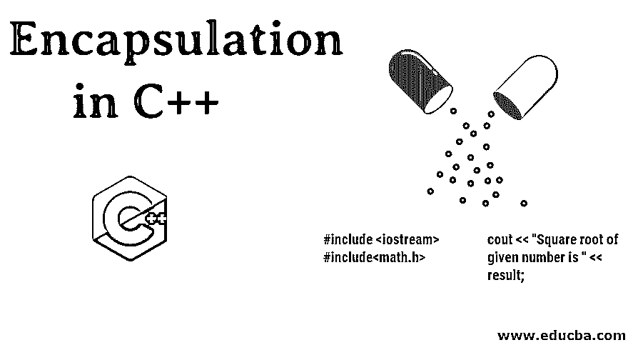
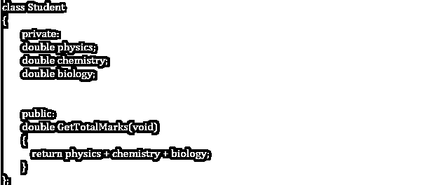

# C++中的封装

> 原文：<https://www.educba.com/encapsulation-in-c-plus-plus/>

## C++封装简介

下面的文章提供了用 C++封装的概要。封装是指将数据和功能封装在一个胶囊中的过程。它还通过限制访问来保护其他类的数据。基本上，它隐藏了数据。如果我们以现实世界中的大学为例，我们有不同的系，如物理系、化学系和生物系等。可能会出现这样的情况:物理系的负责人需要从生物系获得一些信息；他不能直接访问那个部门的数据。所以首先，他应该联系生物系主任，然后请求他提供数据。这就是封装的工作原理。

### C++中如何使用封装？

为了实现这一点，我们必须遵循以下步骤:

<small>网页开发、编程语言、软件测试&其他</small>

*   首先，我们需要使所有的数据成员私有。
*   然后，应该为每个数据成员创建公共的 getter 和 setter 函数，以便 get 函数获取数据成员的值，set 函数设置数据成员的值。

在 C++中，封装和数据隐藏可以通过使用称为类的用户定义类型来实现。类中的访问说明符可以是私有的、受保护的或公共的。默认情况下，类中的所有项目都是私有的。但是，根据需要，我们可以更改访问级别。

三个级别的访问说明符如下:

*   **私有:**同一个类的成员可以访问数据。
*   **Public:** 所有的类都可以访问数据。
*   **Protected:** 允许相同类或派生类的成员访问数据。

只有当我们使用 private 或 protected 时，才能最好地利用封装。当使用 public 时，我们必须确保我们知道它在代码中的适当需求。

为了解释这一点，我们将看看下面的类。

在这里，物理、化学和生物是双精度类型，是私有变量。GetTotalMarks()是一个公共方法，用于检索所有三个科目的总分数。我们不能访问另一个类中的每个主题，因为它的保护级别。但是我们可以访问方法，并通过传递单个科目的分数来检索总分。我们可以使用 setter 方法来设置每个主题的标记，我们将在下一个示例中查看。

### 带步骤的 C++封装示例

下面是实现封装的逐步说明。

1.让我们考虑这样一个场景，我们需要通过计算三个科目(即物理、化学和生物)的总和来计算学生的总分数。但情况是另一个班级。

2.首先，包含输入和输出功能的 iostream。

3.使用名称空间 std。

4.编写一个类来保存所有的数据和函数。顺其自然吧，学生。

5.声明私有变量物理、化学和生物。这说明我们不能访问这个学生类之外的变量。但是如果需要，我们可以在本地访问它们并修改值。为了修改该值，我们可以编写一个公共 setter 函数，并在另一个类中访问它。

6.编写一个名为 SetMarks 的函数，用于设置私有变量的值。因为我们不能访问学生类之外的私有变量物理、化学和生物，所以我们需要这个函数从外部类设置这些值。这个方法将是公共的，因为我们需要在类外访问它。我们需要三个参数来获得每个主题的值。在函数内部，我们将设置私有变量的值。

7.我们还需要一种方法，将所有三个科目的分数相加，得到总分。这个方法也是公共的。只要在课外调用这个方法，我们就会得到三科的分数之和。

8.现在，在这个类之外，我们将编写 main 函数。

9.在 main 函数中，首先，我们将访问类 student 并创建一个类对象。

10.下一步，我们将调用函数来设置三个科目的分数。这里我们将把标记作为参数传递给函数。下面是实现这一点的一段代码。

11.接下来，我们将得到总分并打印出数值。最后返回 0。

12.你能猜出代码的输出吗？你是对的。输出如下所示。

**输出:240**

13.现在，我们将分析我们是如何得到这个输出的。因为我们不能访问私有变量，所以我们编写了一个 Setter 函数，它从其他类中获取值并修改变量。getter 函数获取变量，将它们相加，然后发送学生的总成绩。当我们向 setter 函数传递三个不同的值时，我们可以看到我们得到的总分数也会相应地变化。

14.由此，我们可以说封装帮助我们保护了一些需要的数据；此外，setter 和 getter 函数会改变它们的值。通过这样做。在不妨碍我们的目的的情况下也实现了保护。

### 结论

在本文中，我们了解了如何在 C++中实现封装。通过这样做，我们可以获得以下好处。封装后的类增加了可读性，降低了复杂性。它有助于保护数据。通过使用访问修饰符，无需修改整个代码就可以更改类中数据的隐私。

### 推荐文章

这是一本关于 C++封装的指南。这里我们讨论基本概念，如何在 C++中使用封装，以及一个用 C++封装的例子。您也可以阅读以下文章，了解更多信息——

1.  [C++字符串复制](https://www.educba.com/c-plus-plus-string-copy/)
2.  [C++ setw()](https://www.educba.com/c-plus-plus-setw/)
3.  [C++ noexcept](https://www.educba.com/c-plus-plus-noexcept/)
4.  [C++数据结构](https://www.educba.com/c-plus-plus-data-structures/)

