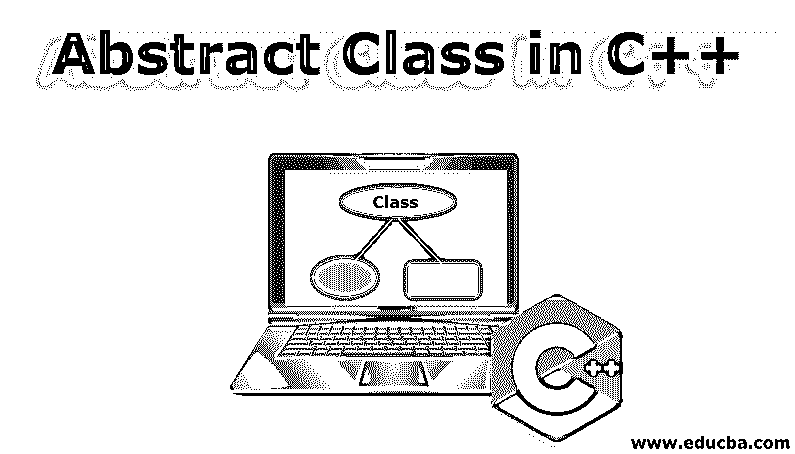

# C++中的抽象类

> 原文：<https://www.educba.com/abstract-class-in-c-plus-plus/>




## C++中抽象类的介绍

抽象类是用 abstract 关键字声明的类，abstract 关键字是一个受限类，因此不能用于创建对象；但是，它们可以被子类化。要访问抽象类，它必须从另一个类继承。在类实现[和继承](https://www.educba.com/inheritance-in-php/)中，当我们想要在基类和派生类中定义相同的函数时，我们使用关键字‘virtual’和基类函数。这个“虚拟”函数指定在派生类中重新定义或重写同一个函数。因此，抽象类是具有纯虚函数的类。

那么，什么是纯虚函数呢？纯虚函数是没有体的[虚函数](https://www.educba.com/virtual-function-in-java/)，赋值为 0。当我们需要一个函数，但是我们目前不知道它的功能是什么时，就实现这种类型的函数。因此，这个函数需要在派生类中实现或定义。如果不是，那么派生类也成为抽象类。

<small>网页开发、编程语言、软件测试&其他</small>

纯虚函数定义如下:

```
virtual void func() = 0;
```

### C++中抽象类的例子

这里，我们详细讨论 C++中抽象类的不同例子:

#### 示例#1

**代码:**

```
#include<iostream>
using namespace std;
class Sample_Class {
int a = 5;
public:
virtual void sample_func() = 0;
void print_func() {
cout << a;
}
};
class Derived_Class : public Sample_Class {
public:
void sample_func() {
cout << "pure virtual function is implemented";
}
};
int main() {
Derived_Class d_object;
d_object.sample_func();
}
```

**输出:**


**代码解释:**这里 Sample_Class 是基类，Derived_Class 是从 Sample_Class 派生出来的。基类中声明了一个名为 sample_func()的纯虚函数。它被赋值为 0，这意味着它没有成员，函数内部没有实现任何东西。因此，基类变成了一个抽象类，因为它有一个纯虚函数。最初，当 Derived_Class 从基类派生时，它也成为一个抽象类。但是在派生类中，定义了 sample_func()类，防止派生类成为抽象类。当派生类对象被创建，并且函数被调用时，我们将得到打印为‘纯虚函数被实现’的输出。

抽象类不能被实例化，这意味着我们不能为抽象类创建实例或对象。无法创建对象，因为该类未完全实现。它实际上是后来完全实现的类的基础。但是[指针或引用](https://www.educba.com/pointers-in-c-plus-plus/)可以是为抽象类创建的[。这个指针可以用来调用派生类函数。一个抽象类除了一个纯虚函数之外，还可以有其他类似于普通类实现的数据成员和函数。](https://www.educba.com/abstract-class-in-c-sharp/)

以上观点可以通过下面的程序来说明。

#### 实施例 2

**代码:**

```
class Class1 {
int a;
public:
virtual void func1() = 0;
void func2() {
cout << "base class";
}
};
class Class2 : public Class1 {
public:
void func1() {
cout << "func1 in derived class";
}
};
int main() {
Class1 b;   //---------- > this line will cause an error
//Class1 *b = new Class2(); //---------- > pointer can be created, so this line is correct
// b -> func1();
}
```

**输出:**

这里我们将得到一个错误，因为无法为抽象类创建对象。相反，可以实现第 2 <sup>行和第 3 <sup>行代码，可以创建一个指针并用于调用派生类函数。</sup></sup>

**代码解释:**这里，在上面的函数中，Class1 是基类，由于它有一个纯虚函数(func1)，所以变成了抽象类。Class2 派生自父类 Class1。func1 在派生类中定义。在 main 函数中，当我们试图创建一个基类类型的对象时，我们会得到一个错误，因为不能为抽象类创建对象。而当我们试图创建一个基类类型的指针时，它将被成功创建，并且我们可以将它指向派生类。这个指针可以用来调用派生类函数。

抽象类可以有一个类似于普通类实现的构造函数。对于析构函数，我们可以声明一个纯虚拟析构函数。有一个析构函数来删除为该类分配的内存是很重要的。纯虚拟析构函数是赋值为 0 的析构函数，但它必须由同一个类定义，因为该析构函数通常不会被重写。

### C++中抽象类的构造函数和析构函数示例

这里，我们详细讨论 C++中抽象类的构造函数和析构函数的例子。

**代码:**

```
class Base {
public:
int a;
virtual void func1() = 0;
// Constructor
Base(int i) {
a = i;
}
// Pure Virtual destructor
virtual ~Base() = 0;
};
// Pure virtual destructor is defined
Base :: ~Base() {
cout << "Pure virtual destructor is defined here" << endl;
}
class Derived : public Base {
int b;
public:
// Constructor of derived class
Derived(int x, int y) : Base(y) { b = x; }
// Destructor of derived class
~Derived() {
cout << "Derived class destructor" << endl;
}
//Definition for pure virtual function
void func1() {
cout << "The value of a is " << a << " and b is " << b << endl;
}
};
int main() {
Base *b = new Derived(5,10);
b->func1();
delete b;
}
```

**输出**:


**代码解释:**这里，上例中基类是一个抽象类，有纯虚函数 func1()，一个构造函数和一个纯虚析构函数。纯虚函数定义在派生类中，防止派生类成为抽象类。类外部的基类定义了纯虚拟析构函数。如果我们想在类之外定义一个类的成员函数，应该使用作用域解析操作符，如示例所示。基类类型的指针被创建并指向派生类。当使用“delete”调用析构函数时，首先调用派生类析构函数，然后调用基类析构函数。

### 结论

因此，为了编译抽象类的所有内容，我们可以说抽象类是一个具有纯虚函数的类。这个纯虚函数必须在派生类中定义；如果不是，那么派生类也成为抽象类。无法为抽象类创建对象，但可以创建一个指针，该指针可以指向派生类。

### 推荐文章

这是一个 C++中抽象类的指南。这里我们讨论抽象类的介绍和 C++中构造函数和析构函数的实现及其例子。你也可以看看下面的文章来了解更多-

1.  [Python 中的抽象类](https://www.educba.com/abstract-class-in-python/)
2.  [Java 中的抽象类](https://www.educba.com/abstract-class-in-java/)
3.  [c++中的构造函数和析构函数](https://www.educba.com/constructor-and-destructor-in-c-plus-plus/)
4.  [在 C++中覆盖](https://www.educba.com/overriding-in-c-plus-plus/)


