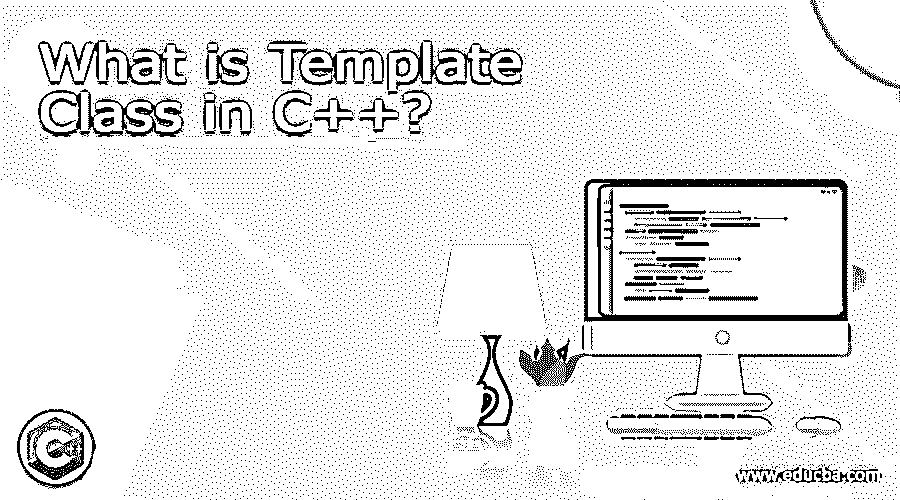

# C++中的模板类是什么？

> 原文：<https://www.educba.com/what-is-template-class-in-c-plus-plus/>




## C++中的模板类是什么？

模板类，顾名思义，就是类的模板。C++为我们提供了创建一个类的方法，这个类将作为未来类的蓝图/模板。一个模板类将拥有类型为“T”的通用变量和方法，以后可以根据需要对其进行定制，以用于不同的数据类型。

### 定义

按照标准定义，C++中的模板类是一个允许程序员操作一般数据类型的类。这使得该类可以根据需要用于许多不同的数据类型，而不需要为每种类型重新编写。

<small>网页开发、编程语言、软件测试&其他</small>

### 理解 C++中的模板类

如果为了更好地理解，我们考虑模板类的真实世界的例子，那么我们可以把它看作一个蓝图。如果一个房地产建筑商正在设计一个城镇，他准备公寓的布局，包括一般的规格，如平面图，门，窗的位置等。这个蓝图可以被认为是一个模板类，它将让我们从一个更大的图片中大致了解一个公寓将会是什么样子。这可以用来设计个人公寓，可以根据业主的偏好定制，这将是特定的公寓，但通用模板将在整个城镇保持通用。

模板类的工作原理类似。如果我们正在[设计一个企业应用](https://www.educba.com/career-in-designing/)，它将有多个实体来代表这些类。每个类都有自己特定的属性和方法。但是，可以设计一个模板来将这些实体插入数据库。我们将在本文接下来的部分使用这个例子。但是如果我们不使用模板类，那么我们将不得不为创建、检索、更新、删除操作编写单独的类。然而，通过使用模板类，我们可以通过只编写一个类来完成这项工作，从而减少了大量时间，并消除了大量冗余重复代码的可能性。

### C++中的模板类是如何让工作变得如此简单的？

当开发一个企业应用程序时，大多数时候，程序员会面临这样一种情况:随着模型类数量的增加，程序结构变得复杂。当我们实现继承和多态等 OOPS 概念时，复杂性进一步增加。在这种情况下，模板类非常方便，您可以减少为执行一些跨多个类/实体保持相同的操作而编写的代码行。

### 在 C++中可以用模板类做什么？

使用模板类，可以通过定义要在模板类中执行的一般操作来降低代码复杂性，并使用具有多种数据类型的模板类来获得所需的结果。

例如，如果我们正在编写一个计算器程序，它的方法有两个输入参数，可以执行加法、减法、乘法和除法，并返回给我们输出。

让我们假设最初的需求是只开发这样一个程序来处理自然数。为此，您只需使用下面的模板编写一个类。

#### 班级计算器

```
{
public:
unsigned Add(unsigned num1, unsigned num2) {}
unsigned Subtract (unsigned num1, unsigned num2) {}
unsigned Multiply (unsigned num1, unsigned num2) {}
unsigned Divide (unsigned num1, unsigned num2) {}
};
```

现在，随着需求的变化，您需要对所有整数(负数和正数)以及小数类型(long)执行类似的操作。

使用当前的类，您将编写两个额外的类，或者编辑这个类来为 long 和数据类型添加类似的函数。

但是，如果我们要使用一个模板类，我们将只定义一个模板类来处理泛型数据类型，返回值和输入参数的数据类型将根据是否传递无符号变量或者是否传递 long 或 int 数据类型来确定:

模板<class t=""></class>

#### 班级计算器

```
{
Public:
T Add (T num1, T num2) {}
T Subtract (T num1, T num2) {}
T Multiply (T num1, T num2) {}
T Divide (T num1, T num2) {}
};
```

### 在 C++中使用模板类

根据上一节中的计算器示例，我们可以在主函数或程序的任何其他区域中使用这个计算器泛型类，数据类型如下:

```
void main () {
Long resultLong = Calculator.Add (20.7, 18.2);
Int resultInt = Calculator.Add (10, -15);
Unsigned resultUnsigned = Calculator.Add (10, 18);
}
```

这里，泛型类中定义的 T 的数据类型将根据传递给函数的输入参数的数据类型来确定。

### C++中模板类的优势

使用模板类的主要优点如下:

1.  您只需要定义一个处理不同数据类型的类。
2.  在编译时，该模板类的实例只为那些在程序中使用了该模板类的数据类型生成。

例如，在上面的例子中，如果我们只使用 int 数据类型的模板类，那么编译器将只创建 int 数据类型的实例，从而节省空间，如果我们为每种数据类型编写单独的类，长整型和无符号数据类型的实现将会利用这些空间。

3.  正如我们已经看到的，创建和使用一个模板类将减少开发的工作量和代码行，还将减少调试程序的复杂性和时间，因为您只使用一个类。

### C++技能中必需的模板类

创建和使用模板类非常简单，不需要你有任何高级的 C++ 编程技能。您所需要做的就是分析具有共同功能的类，并为它们创建一个模板类。

### C++中为什么要使用模板类？

当我们在开发一个将来会改变和增长的企业应用程序时，我们应该总是尝试在我们的程序中加入模板类。这将有助于我们将来扩展程序的功能，然后我们意识到大量的工作已经由模板类管理，当应用程序在一段时间内变得复杂时，代码仍将保持紧凑，并能被任何新来看程序的人理解。

### 为什么在 C++中我们需要一个模板类？

当多个类以相似的方式对不同的数据类型执行相同的功能时，模板类就像一个非常方便的容器。该容器将功能封装在一个实体中，该实体可以根据需求用于不同的数据类型。

template 类的另一个常见用途是实现数据结构，如支持不同数据类型的链表、堆栈和队列。这些[数据结构将遵循](https://www.educba.com/data-structure-interview-questions/)相同的方法来推送、弹出和遍历元素，而不考虑数据类型，因此可以通过实现模板类来使用。

### 这项技术将如何帮助你的职业发展？

对模板类这样的概念有很好的了解和动手能力，这将使你作为一个企业应用程序的程序员与一个只学会编程，可能无法以最佳方式立即适应大型企业应用程序的程序区分开来。

这也将允许您编写具有更好的可理解性和可扩展性的代码。

### 结论

当使用任何语言工作和编程时，我们的目标应该始终是通过使代码尽可能通用、保持模块化和紧凑来支持代码的可重用性。模板类是一种很好的方法，可以让具有相似功能的类实现这一点。

### 推荐文章

这是一个 C++中什么是模板类的指南？.这里我们讨论了 C++中模板类的优点和需求。您也可以阅读以下文章，了解更多信息——

1.  [Java 中的模板](https://www.educba.com/template-in-java/)
2.  [网页模板 HTML](https://www.educba.com/web-templates-html/)
3.  [什么是 ExpressJS？](https://www.educba.com/what-is-expressjs/)
4.  什么是探索性测试？


