# 数据结构和算法 C++

> 原文：<https://www.educba.com/data-structures-and-algorithms/>

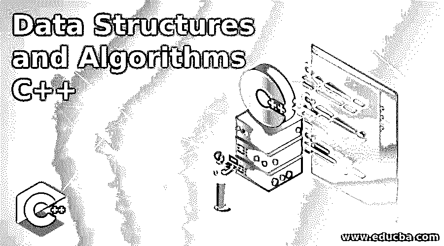

## 数据结构和算法 C++

数据结构和算法 c++–意味着以特定的方式安排或组织元素。当我们说我们必须安排元素时，那些元素可以以不同的形式组织。例如，袜子可以以各种不同的方式排列。你可以把它乱七八糟地放在你的橱柜里。或者你可以把它整齐地折叠起来。最好的方法是把它们折叠起来，按颜色排列。因此，对于搜索一双特定的袜子，第三种安排是完美的。

以类似于 socks 的组织方式，数据也可以以不同的方式或形式来组织。这些不同的数据组织方式被称为数据结构。让我们来看看数据结构的正式定义以及数据结构和算法基础。

<small>网页开发、编程语言、软件测试&其他</small>

### **数据结构和算法 C++**

特定数据组织的逻辑或数学模型。

运筹学

这是在计算机中组织数据以便使用的一种特殊方式。

类似于袜子；C++可用的列表数据结构和算法的不同组织是

1.  **数组**
2.  **链表**
3.  **堆栈**
4.  **队列**
5.  **树**
6.  **图形**
7.  **哈希表**
8.  **堆**
9.  **记录**
10.  **表格**

这些数据结构和算法 C++在编程时非常重要。一个好的程序员总是强调数据结构而不是代码。每种编程语言都使用 C++中的各种数据结构和算法。 [C++](https://www.educba.com/c-programming-language-basics/ "C++ Programming Language Basics") 中可用的数据结构如下。

1.  **数组**
2.  **链表**
3.  **堆栈**
4.  **队列**
5.  **树**
6.  **图形**
7.  **哈希表**
8.  **堆**

让我们一个一个地讨论这个

#### **# 1–数组**

数组是一种最简单的数据结构和算法。数组被定义为相同数据类型的数据元素的固定大小的顺序集合。例如 a0=12，a1=21，a2=14，a3=15…我们可以表示一维数组如图所示:

 

在哪里

0,1,2,3…..n 称为下标或索引

a[1]，a[2]，…a[n]称为下标变量

它可以是一维的、二维的、三维的等等多维的。

在存储器阵列中存储到连续的存储器位置。

最低地址对应于第一个元素

最高地址对应于最后一个元素

我们可以在 **C++** 中声明一维[数组如下](https://www.educba.com/c-plus-plus-commands/)

数据类型 array name[array size]；

例如 int num[5]；

在 C++中初始化数组

num={23，10，12，3，6 }；

我们可以将声明和初始化合并成一条语句，如下所示。

int num={23，10，12，3，6 }；

当我们想要动态分配数组的大小时，我们应该像下面这样添加新的操作符

int * a = new int[size]；

**数组的缺点**是元素的插入和删除比较慢，就像在有序数组及其固定大小的存储中一样。

#### **# 2–链表**

列表是指项目的线性集合。链表是一系列连接的节点(数据元素)，如图 3 所示。头节点指向列表的第一个节点，最后一个节点指向由？表示的空值。因为每个节点至少包含。

1.  一段数据(任何类型)
2.  指向列表中下一个节点的指针

 

[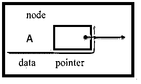

](https://cdn.educba.com/academy/wp-content/uploads/2015/08/Single-node-of-Linked-List1.jpg) 

链表在内存中用两个数组表示。一个数组存储称为 info 的信息，它是要存储的数据，另一个数组存储称为 LINK 的下一个指针字段，它是下一个节点的地址。

**链表相对于数组的优势:**

数组和链表都是内存中项目列表的表示。重要的区别是项目链接在一起的方式。数组的主要限制是元素插入到数组中，并且元素从有序数组中删除是困难的，因为剩余的元素必须被移动。从链表中插入和删除元素非常简单。

[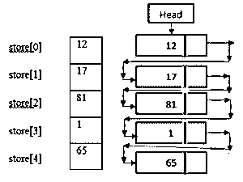

](https://cdn.educba.com/academy/wp-content/uploads/2015/08/store.jpg) 

**Note:** [Become a C++ Developer ](https://www.educba.com/career-tracks/become-a-c-developer/)Learn to design and customize programs for various platforms. Code, test, debug, and implement software applications. Develop skills to ensure applications run smoothly.

#### **链表的类型**

下面是不同的类型如下:

**1。单链表**:只包含一个链表字段，保存列表中下一个节点的地址，以及 info 字段，保存要存储的信息。

 

**2。单一循环链表:**它只是一个单一的链表，但是链表的最后一个节点包含第一个节点的地址，而不是 null。即最后一个节点的头和下一个字段的内容是相同的。

 

**3。双向链表:**包含两个链接字段 previous 和 next。保存列表中前一节点的地址的前一链接字段和保存列表中下一个节点的地址的下一链接字段以及保存要存储的信息的信息字段。

 

**4。双循环链表:**它是双链表，但是最后一个节点的 next 字段包含第一个节点的地址，而不是 null。

 

**c++中链表的实现**涉及到节点的创建，从链表中删除一个节点，将新创建的节点插入到链表中，用特定的键搜索一个节点。

创建节点的**代码如下:**

[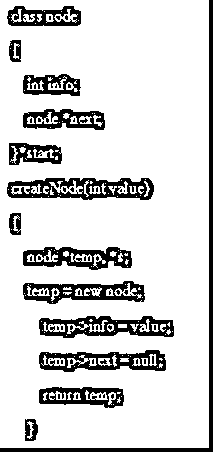

](https://cdn.educba.com/academy/wp-content/uploads/2015/08/Code-for-creation-of-node-.jpg) 

#### 将节点插入列表

向列表中插入节点涉及三种情况

1.**在开头插入节点**表示插入新创建的节点作为开始节点。要在开头插入节点，首先创建一个新节点，并使新节点指向旧的起点，然后更新起点以指向新节点，如下图所示:

[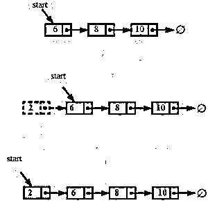

](https://cdn.educba.com/academy/wp-content/uploads/2015/08/Inserting-a-node-to-the-list-.jpg) 

用于在开头插入节点的代码:

 

2.**在尾部插入一个节点**表示将新创建的节点作为最后一个节点插入。要将节点作为尾节点插入，必须创建一个新节点，并使旧的最后一个节点指向新节点，然后更新尾节点以指向新节点。

[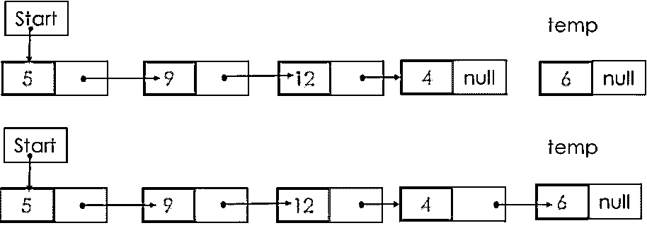

](https://cdn.educba.com/academy/wp-content/uploads/2015/08/Inserting-node-at-the-tail-.jpg) 

3.**在给定位置插入一个节点** 涉及到新的临时节点的创建，那么必须找到新创建的节点的插入位置。

用于在给定位置插入节点的代码:

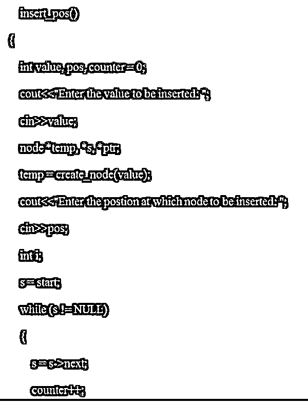

 

**从列表中删除一个节点** 包括从现有列表中删除一个节点。从链表中删除节点比在链表中插入节点简单。在 C++中删除节点的代码给出如下:

[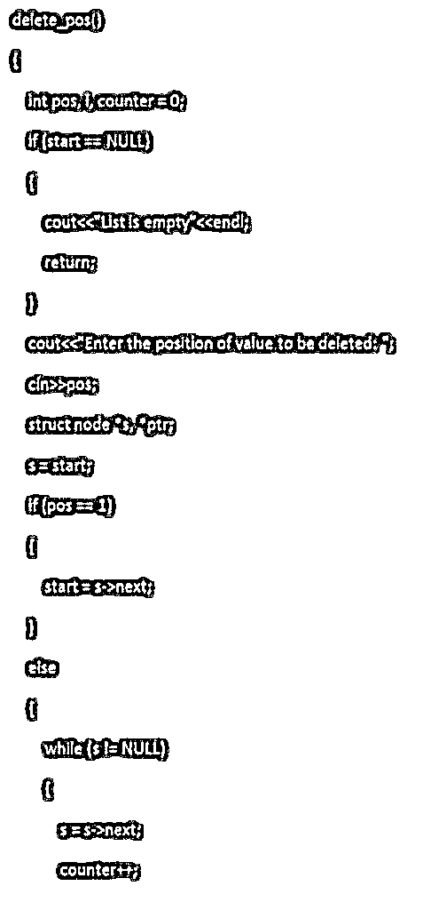

](https://cdn.educba.com/academy/wp-content/uploads/2015/08/Deleting-a-node-from-list-1.jpg) 

**用列表中的特定键(值)遍历节点**将从列表中搜索其信息与给定节点的键匹配的节点。下面的 C++代码将遍历一个列表。数据结构和算法 C++

 

[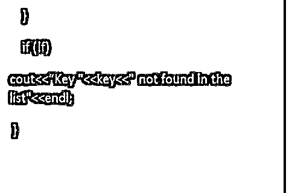

](https://cdn.educba.com/academy/wp-content/uploads/2015/08/Traversing-a-node-21.jpg) 

#### **# 3–堆栈**

堆栈是一个元素列表，其中一个元素只能在一端插入或删除，称为堆栈的顶部。考虑河内塔的例子。这里，当我们必须插入光盘时，我们必须仅从顶部插入，同样地，仅从顶部取出光盘。

 

堆栈使用 LIFO 原则，这意味着它以后进先出的顺序工作。也就是说，添加到堆栈中的最后一个元素是移除的第一个元素。因此，可以在堆栈上执行四种基本操作:

*   **Isempty:** 这个操作查看堆栈是否为空。
*   **Push** :该操作向堆栈中添加一个新项目。
*   **Pop:** 此操作从最近添加的堆栈项目中移除一个项目。
*   **Top:** 该操作返回最近添加到堆栈中的项目。

下图是堆栈的一个示例，其中项目从堆栈顶部插入堆栈和从堆栈中移除，而不是从其他地方。

[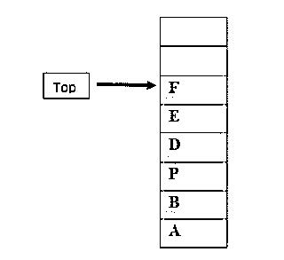

](https://cdn.educba.com/academy/wp-content/uploads/2015/08/Stack-2.jpg) 

**堆栈溢出**

试图将一个元素压入全栈时产生的状态。

**堆栈下溢**

试图弹出一个空栈时产生的状态。

这里我们展示了堆栈上的一些推送和弹出操作。假设最初堆栈是空的，然后我们添加 F，A，M，R，N，然后弹出两次并按下 N，H，B，T，K，O，p。

[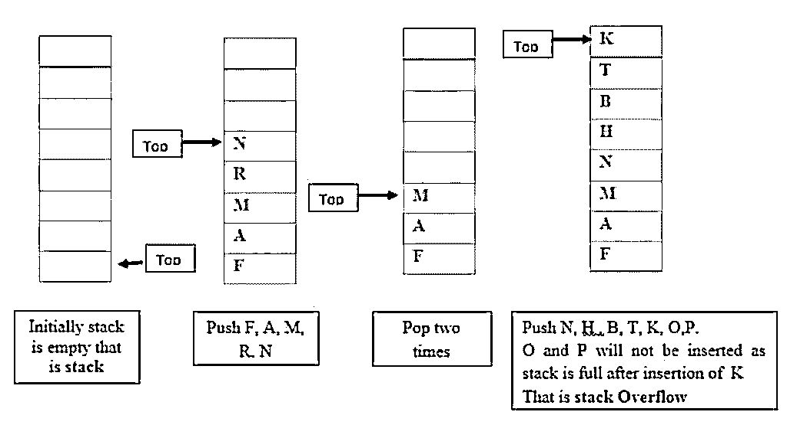

](https://cdn.educba.com/academy/wp-content/uploads/2015/08/Stack-3.jpg) 

**栈的实现**

它可以使用数组或链表来实现。

下面的代码描述了如何使用类在 C++中实现堆栈。这里定义了一个名为 stack 的类，其中创建了一个名为 stick 的数组，该数组具有动态大小和两个主要函数 push 和 pop。

堆栈溢出:当顶部> =大小-1 时

堆栈下溢:当 top <0 时

 

### **推荐文章**

这里有一些与 C++的数据结构和算法相关的文章，它们将帮助你获得更多关于 C++算法、数据结构和算法的细节，所以请浏览下面给出的链接。如果你喜欢数据结构和算法 C++这篇文章，请给我们你宝贵的意见。

1.  [C++面试问题](https://www.educba.com/c-plus-plus-interview-questions/)
2.  [数据结构与算法面试题](https://www.educba.com/data-structures-and-algorithms-interview-questions/)
3.  [算法和密码学](https://www.educba.com/algorithms-and-cryptography/)
4.  [算法面试问题](https://www.educba.com/algorithm-interview-questions/)

