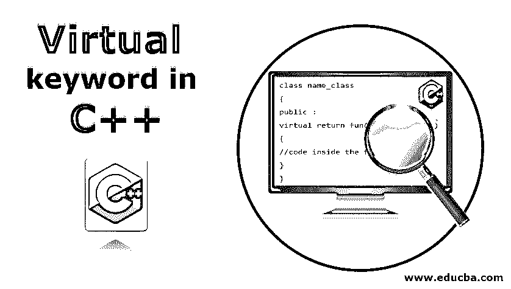

# C++中的虚拟关键字

> 原文：<https://www.educba.com/virtual-keyword-in-c-plus-plus/>




## C++中的虚拟关键字介绍

C++中的虚拟关键字用于创建 C++中的虚函数。虚函数是我们希望在子类中重新定义的父类函数。虚函数是用关键字 virtual 声明的。当我们定义虚函数时，关键字 virtual 将出现在函数的声明中。虚拟关键字告诉编译器对函数执行后期绑定或动态链接。

需要单个指针来引用不同类的所有对象。因此，在超类上创建指针来引用派生类的所有对象，然后超类指针包含派生类的对象的地址，总是运行超类函数。因此，为了解决这个问题，我们使用了虚拟函数。因此，当在超类中创建虚函数时，C++编译器识别哪个函数将在运行时执行，并且基于超类指针指向的对象类型来识别函数。

<small>网页开发、编程语言、软件测试&其他</small>

### 虚拟功能

语法的虚函数如下所示:

**语法**

```
class name_class
{
public :
virtual return fun(arg1, arg2, ..)
{
//code inside the function
}
}
```

与语法中一样，fun()通过[声明虚拟关键字](https://www.educba.com/virtual-keyword-in-c-sharp/)，这意味着子类可以重新定义相同的方法。

### C++中虚拟关键字的例子

下面是提到的例子:

#### 示例#1

**代码:**

```
#include <iostream>
using namespace std;
class A
{
public:
void disp()
{
cout << " Message from the class A\n ";
}
};
class B :public A
{
public:
void disp()
{
cout << "Message from the class B\n";
}
};
int main()
{
A* obj1;       // super class pointer
B obj2;     // child class object
obj1 = &obj2;
obj1-> disp();     // Late Binding Occurs
}
```

**输出:**


在上面的程序中，超类 A 具有函数 disp()，这是派生类 b 中的重写。在主函数中，disp()方法调用 obj1 对象(这是一个[动态绑定](https://www.educba.com/dynamic-binding-in-java/)或后期绑定。动态绑定是一个过程，在这个过程中，在运行时决定执行哪个特定的函数，并执行类 A 的 disp()函数。

#### 实施例 2

**代码:**

```
#include <iostream>
using namespace std;
class A
{
public:
virtual void disp()
{
cout << " Message from the class A \n ";
}
};
class B :public A
{
public:
void disp()
{
cout << "Message from the class B\n";
}
};
int main()
{
A* obj1;       // super class pointer
B obj2;     // child class object
obj1 = &obj2;
obj1-> disp();     // Dynamic Binding Ocuurs
}
```

**输出:**


上面的程序代码是程序 1 的修改，disp()函数用关键字 virtual 定义，现在当 obj1 调用 disp()函数时，子类 B 的 disp()函数被执行。

#### 实施例 3

**代码:**

```
#include <iostream>
using namespace std;
class A
{
public:
virtual void disp()
{
cout << " Message from the class A\n ";
}
};
class B :public A
{
public:
virtual void disp()
{
cout << "Message from the class B\n";
}
};
int main()
{
A* obj1;       // super class pointer
B obj2;     // child class object
obj1 = &obj2;
obj1-> disp();     //  Dynamic Binding Ocuurs
}
```

**输出:**


上面的程序代码是程序 2 的变更，disp()函数也在类 B 中用关键字 virtual 重新定义，现在当 obj1 调用 disp()函数时，执行子类 B 的 disp()函数。

接下来，我们为纯虚函数编写程序。纯虚函数是 don 没有实现的函数。纯虚函数也叫抽象虚函数。纯虚函数声明分配 0，如下面的代码所示

#### 实施例 4

**代码:**

```
#include <iostream>
using namespace std;
class A
{
public:
virtual void disp()=0;
};
class B :public A
{
public:
void disp()
{
cout << "Message from the class B\n";
}
};
int main()
{
A* obj1;       // super class pointer
B obj2;     // child class object
obj1 = &obj2;
obj1-> disp();     // Dynamic Binding Ocuurs
}
```

**输出:**


### 虚拟关键字在 C++中的优势

*   虚函数用于[实现运行时多态性](https://www.educba.com/runtime-polymorphism-in-java/)。
*   如果一个类是从一个具有虚函数的类派生出来的，那么函数定义可以在派生类中重新定义。

### C++中虚拟关键字的规则

*   虚拟关键字在 C++函数声明中的使用。
*   [虚函数](https://www.educba.com/virtual-functions-in-c-plus-plus/)必须是类成员。
*   通过对象指针访问的虚函数。
*   虚函数不能声明为静态的。
*   虚函数可以是另一个类的朋友。
*   如果虚函数没有在超类中使用，那么我们也可以在超类中定义它。
*   超类和子类的虚函数的签名应该相同，即所谓的[函数覆盖](https://www.educba.com/function-overriding-in-c-plus-plus/)，否则如果两个函数同名但签名不同，则被认为是 C++中的重载函数。
*   我们可以有虚析构函数，但不能有虚构造函数。

### 结论

*   C++中的虚拟关键字用于创建 C++中的虚函数。
*   虚函数是我们希望在子类中重新定义的父类函数。
*   需要单个指针来引用不同类的所有对象。
*   超类指针包含派生类的对象的地址，总是运行超类函数。
*   虚函数必须是类成员，必须是类成员，不能声明为静态，通过对象指针访问。
*   超类和子类的虚函数的签名应该是相同的，即所谓的函数重写，否则如果两个函数同名但签名不同，则被认为是 C++中的重载函数。

### 推荐文章

这是一个 C++中虚拟关键字的指南。这里我们讨论 C++中虚拟关键字的介绍和优点，以及它的虚函数语法。您也可以浏览我们推荐的其他文章，了解更多信息——

1.  [c#中的方法覆盖](https://www.educba.com/method-overriding-in-c/)
2.  [c#中的继承](https://www.educba.com/inheritance-in-csharp/)
3.  [C#命令](https://www.educba.com/c-sharp-commands/)
4.  [Java 命令](https://www.educba.com/java-commands/)


